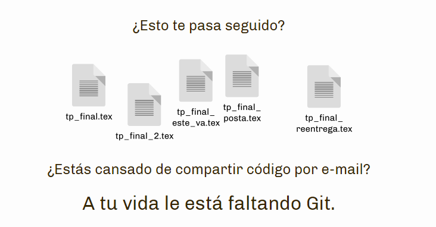

# GIT



## Definición

Git es un **sistema de control de versiones** distribuido, gratuito y de código abierto. Es decir, es un tipo de software pensando para hacer un seguimiento claro y ordenado de todos los cambios que vas haciendo en los archivos de un proyecto. Mejor todav�a, te permite hacerlo en equipo, de forma colaborativa.

Gracias al software de control de versiones, podés mantener tus archivos **organizados, coordinados y protegidos**, tanto de posibles eventos catastróficos como de los inevitables errores cometidos por tus compañeros de equipo (y bueno, también de los tuyos); si eso sucede es fácil solucionar el problema rescatando lo que haga falta de una versión anterior.

Git nació en **2005**, después de que se venga abajo la relación entre la comunidad que desarrollaba el núcleo de Linux y la compañía responsable de BitKeeper, el sistema de control de versiones que venían usando hasta entonces. A estos muchachos (y en particular a Linus Torvalds, el creador de Linux) se les ocurrió que la mejor forma de reemplazarla era desarrollando una herramienta propia. Desde entonces Git ha logrado evolucionar manteniendo su **diseño sencillo** y su tremenda **eficiencia**, incluso para manejar proyectos muy grandes.

## Lista comandos Git:

```bash
git init
```

Indicamos que el directorio donde nos encontramos comenzará a ser versionado bajo Git.

```bash
git status
```

Vemos el estado actual de nuestra carpeta versionada así como archivos que no están versionados, archivos modificados, archivos eliminados, etc. Los mensajes que podremos ver con este comando pueden ser los siguientes:
Untracked files: nos mostrar� todos los archivos que no han sido agregados al "Stage"
Changes to be committed: nos indica qu� archivos ser�n agregados a nuestro commit.

```bash
git add
```

Agrega los archivos que no están bajo versionamiento (los Untracked files que vimos anteriormente).

```bash
git commit -m "mensaje"
```

Confirma los cambios hechos con "git add" en una nueva versión del proyecto; con el parámetro -m le indicamos un mensaje para describir la razón del commit.

```bash
git remote add origin url_del_repositorio
```

Hasta ahora todos los comandos visto han sido puro trabajo local, con el comando git remote add agregamos nuestro repositorio a un servidor remoto; para hacerlo debemos tener ya creado nuestro repositorio en un servidor y este nos brindará la url.

```bash
git push -u origin master
```

Empujamos todo lo que tengamos en nuestros commits al repositorio remoto.

```bash
git pull
```

Trae los cambios que haya trabajado otra persona en el mismo repositorio, es recomendable siempre que trabajemos un repositorio que no hayamos iniciado nosotros hacer siempre un git pull primero antes de comenzar a trabajar en los archivos.

```bash
git remote -v
```

Nos muestra la url remota del repositorio en el que nos encontremos.

```bash
git clone url_del_repositorio nombre_local
```

Realiza una copia en nuestro directorio local de un repositorio existente.

```bash
git branch -all
```

En Git se trabaja con branches (ramas en español), originalmente se crea la master por defecto, a raíz de esto nosotros podemos crear nuestras propias ramas, siendo claro una copia de la master en primera instancia. Con este comando podemos ver todas las ramas que tenga el proyecto.

## Presentación:

Presentación hecha en Google -> [Git-Cheat Sheet](../assets/git/ppt/git-cheatSheet.pdf)

## Referencias:

- [Progit (La biblia)](https://git-scm.com/book/es/v1)
- [Git - la guía sencilla](http://rogerdudler.github.io/git-guide/index.es.html)
- [Introducción a Github](http://www.cristalab.com/tutoriales/introduccion-a-github-en-linux-ubuntu-c106086l)
