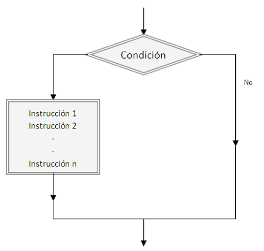

# JavaScript

## Estructuras de control

- Por medio de las estructuras de control podemos controlar el flujo de nuestro código y como queremos que se ejecute según se cumplan o no algunas condiciones
- Una de las estructuras más conocidas es el **if** y en español podemos reconocerlos como **si entonces**
- Esta estructura espera una condición **true** para que ingrese y ejecute el código que tiene dentro de su bloque



- Como vemos en esta imágen tenemos una condición que se va a resolver en true o false
- En caso de que la condición sea verdadera (true) se va a ejecutar las distintas instrucciones
- En caso de que la condición sea negativa (false) no se ejecutan las instrucciones declaradas dentro de esta estructura y el código sigue su flujo

**Ejemplo:**

```js
// Estructura básica de un if
if (condicion) {
  // Se ejecuta el código que se escriba en esta sección si la condición es verdadera.
}
```

```js
if (true) {
  console.log("Se muestra este texto ya que la condición es true");
}
```

- Como podemos ver en el ejemplo anterior siempre se va a mostrar el mensaje ya que la condición siempre va a ser **true**
- Podemos escribir distintas condiciones que nos permitan elegir si vamos a ejecutar el código dentro de la estructura o no
- Por ejemplo podemos preguntar **SI** el **numero** es mayor o igual que 2 **Entonces** mostrar un mensaje en consola

**Ejemplo:**

```js
const numero = 2;

// SI numero >= 2 ENTONCES mostrar en consola
if (numero >= 2) {
  console.log("El numero es mayor o igual a 2");
}
```

- El flujo del código se sigue ejecutando sin importar el resultado del if

**Ejemplo:**

```js
const numero = 1;

if (numero >= 2) {
  console.log("Este mensaje no se ve");
}

console.log("Este mensaje se ve siempre se cumpla o no la condición del if");
```

#### Prácticas

- [Ejercicio 49](../ejercicios/consignas/js/ej49.md)
- [Ejercicio 50](../ejercicios/consignas/js/ej50.md)
- [Ejercicio 51](../ejercicios/consignas/js/ej51.md)

### if/else

- También existe la estructura if/else que nos permite controlar que pasa si la condición es falsa
- Es decir que en caso de que la condición sea verdadera entra en una parte de la estructura
- En caso de ser falsa la condición entonces entra en la otra sección
- Utilizamos la palabra **SI NO** para el **else**


**Ejemplo:**

```js
if (condicion) {
  // Entra en esta sección si se cumple la condición
} else {
  // Entra en esta sección si no se cumple la condición
}
```

```js
const numero = 2;

if (numero === 2) {
  console.log("El número es 2");
} else {
  console.log("El número no es 2");
}
```

- Podemos leer este código de la siguiente manera: SI el número es igual a 2 entonces mostrar el mensaje 'El número es 2' SINO mostrar el mensaje 'El número no es 2'

#### Prácticas

- [Ejercicio 52](../ejercicios/consignas/js/ej52.md)
- [Ejercicio 53](../ejercicios/consignas/js/ej53.md)
- [Ejercicio 54](../ejercicios/consignas/js/ej54.md)

### Operador Ternario

- Existe una manera más corta de escribir un if/else y es por medio del operador ternario
- Se escribe de la siguiente manera: `(condicion) ? true : false`
- Es decir que dada una condición se ejecuta una parte o la otra

**Ejemplo:**

```js
let numero = 2;
let mensaje = numero === 2 ? "El numero es 2" : "El numero no es 2";
console.log(mensaje);
```

#### Prácticas

- [Ejercicio 55](../ejercicios/consignas/js/ej55.md)
- [Ejercicio 56](../ejercicios/consignas/js/ej56.md)
- [Ejercicio 57](../ejercicios/consignas/js/ej57.md)

### If Anidados

- Podemos anidar estructuras if/else/if para validar distintas condiciones

**Ejemplo:**

```js
if (condicion) {
  // primer condicion
} else if (otraCondicion) {
  // segunda condicion
} else {
  // Si no se cumplio ninguna de las anteriores ingresa acá
}
```

```js
const nombre = "Marta";

if (nombre === "Miriam") {
  console.log("El nombre de la usuaria es Miriam");
} else if (nombre === "Felipa") {
  console.log("El nombre de la usuaria es Felipa");
} else {
  console.log("El nombre de la usuaria no es Marta ni Felipa");
}
```

- Podemos ver en este ejemplo que podemos preguntar por distintas condiciones
- Utilizar muchos if's anidados no es una buena práctica

#### Prácticas

- [Ejercicio 58](../ejercicios/consignas/js/ej58.md)
- [Ejercicio 59](../ejercicios/consignas/js/ej59.md)
- [Ejercicio 60](../ejercicios/consignas/js/ej60.md)

### Switch

- En uno de los ejemplos anteriores necesitabamos mostrar un mensaje según el nombre del usuario

```js
const nombre = "Marta";

if (nombre === "Miriam") {
  console.log("El nombre de la usuaria es Miriam");
} else if (nombre === "Felipa") {
  console.log("El nombre de la usuaria es Felipa");
} else {
  console.log("El nombre de la usuaria no es Marta ni Felipa");
}
```

- En caso de querer seguir agregando condiciones para más nombres se nos puede volver medio caos el código

```js
const nombre = "Marta";

if (nombre === "Miriam") {
  console.log("El nombre de la usuaria es Miriam");
} else if (nombre === "Felipa") {
  console.log("El nombre de la usuaria es Felipa");
} else if (nombre === "Xime") {
  console.log("El nombre de la usuaria es Xime");
} else if (nombre === "Belu") {
  console.log("El nombre de la usuaria es Belu");
} else {
  console.log("El nombre de la usuaria no es Marta, Felipa, Xime o Belu");
}
```

- Existe otra forma de escribir esta estructura y que hace que sea más fácil leer e interpretar este código
- Esta estructura se conoce como **switch** y nos permite evaluar un valor con diferentes opciones
- Decimos SEGUN tal condicion ENTONCES hacemos tal o cual cosa

**Ejemplo:**

```js
const nombre = "marta";
let mensaje = null;

switch (nombre) {
  case "Miriam":
    mensaje = "El nombre de la usuaria es Miriam";
    break;
  case "Felipa":
    mensaje = "El nombre de la usuaria es Felipa";
    break;
  case "Xime":
    mensaje = "El nombre de la usuaria es Xime";
    break;
  case "Belu":
    mensaje = "El nombre de la usuaria es Belu";
    break;
  default:
    mensaje = "El nombre de la usuaria no es Marta, Felipa, Xime o Belu";
}

console.log(mensaje);
```

- Utilizamos **break** para decirle al **switch** que ya puede dejar de validar el resto de las condiciones y que su trabajo terminó.
- En este ejemplo podemos decir SEGUN el nombre ENTONCES mostra un mensaje personalizado SINO mostrar un mensaje que ninguno de los nombres es el correcto.

#### Prácticas

- [Ejercicio 61](../ejercicios/consignas/js/ej61.md)
- [Ejercicio 62](../ejercicios/consignas/js/ej62.md)
- [Ejercicio 63](../ejercicios/consignas/js/ej63.md)
