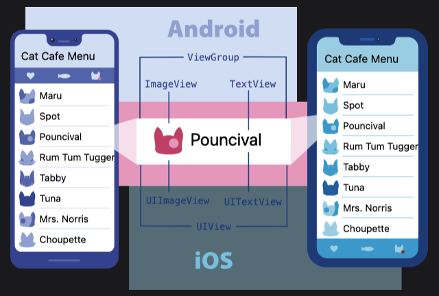
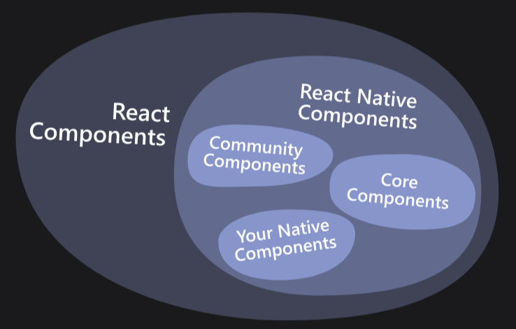
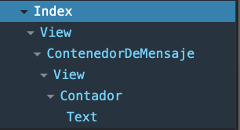
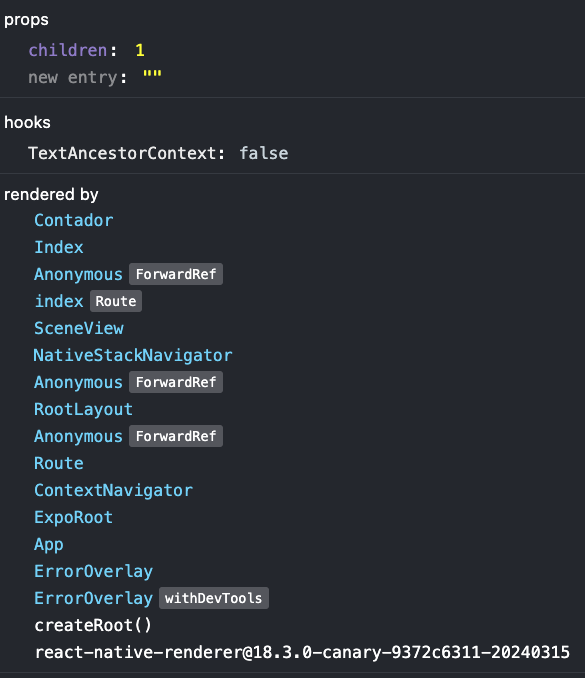
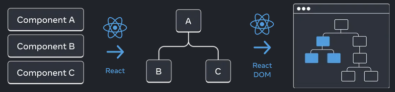

# React Native

## Aprendiendo React

- Meta creó una librería llamada React que es muy performante para renderizar o dibujar elementos en pantalla cuando el estado de la app cambia.
- Meta creó React Native para poder utilizar React en sus proyectos mobiles.
- React se usa para proyectos Web.
- React Native cambia la forma de renderizar components en la aplicación ya que necesita crear componentes nativos para iOS y Android en lugar de HTML como se hace para Web.
- Aprender las bases de React nos ayudan a aprender las bases de React Native.
- Mucho del código que vamos a escribir / utilizar puede ser adaptado o utilizado tanto en una App React como React Native.
- React Native permite a programadores Web que saben React pasar al mundo de Mobile.
- Vamos a utilizar un proyecto de React Native para ir viendo algunos conceptos de React que luego podemos utilizar en nuestras app React Native.

### Creando componentes de React y React Native

- Un componente es una parte de la Interfaz de Usuario (UI).
- Puede tener lógica o no.
- Puede tener su propio estilo y funcionalidad.
- Al crear un componente podemos pensar en algo tan pequeño como un texto o tan grande como toda una pantalla de nuestra aplicación.
- Los componentes en React son `funciones de JavaScript` que devuelven algo que va a ser renderizado en pantalla.

```javascript
function Mensaje() {
  return <Text>Bienvenidos a React Native</Text>;
}

<Mensaje>
```

- En este ejemplo vemos un componente simple de React que utiliza una `function` para definir que esto es un componente.
- Utilizamos el nombre de la función `Mensaje` como nombre del componente y en mayúscual porque es un componente de React.
- La función devuelve un `<Text>` con el mensaje `Bienvenidos a React Native` y finalmente hay una etiqueta de cerrado del texto `</Text>`.
- Los componentes pueden tener otros componentes anidados y se conocen como `child` o hijos.
- Un concepto que da mucho poder a importancia a las componentes es que se puede reutilizar.

```javascript
function Mensaje() {
  return <Text>Bienvenidos a React Native</Text>;
}
<>
  <Mensaje />
  <Mensaje />
  <Mensaje />
</>;
```

- Si ejecutaramos un código similar veríamos en pantalla el mensaje `Bienvenidos a React Native` 3 veces.
- Si queremos cambiar el texto, sólo lo tenemos que hacer en un lugar... el componente!
- React Native nos da un componente genérico que es una vista o contenedor `<View>`.
- Tanto `<Text>` como `<View>` hay que importarlos del módulo `react-native` para poder utilizarlos.

```javascript
import { Text, View } from "react-native";

function Mensaje() {
  return (
    <View>
      <Text>Bienvenidos a React Native</Text>
    </View>
  );
}

export default function Index() {
  return (
    <View>
      <Mensaje />
      <Mensaje />
      <Mensaje />
    </View>
  );
}
```

- En este código tenemos un componente llamado `Index` que funciona como pantalla o screen de nuestra app.
- Este componente `Index` es exportado por default y el router de `expo-router` lo renderiza como primer pantalla.
- Cuando React Native llama a renderizar este componente `Index` devuelve unos componentes anidados que tienen una vista o `<View>` y dentro de la vista hay 3 llamados al componente `<Mensaje />`.
- El resultado final va a ser ver 3 veces `Bienvenidos a React Native`.
- Si bien podemos definir más de un componente en un archivo, se recomienda tener un componente por archivo.
- Creamos una nueva carpeta en la raíz del proyecto con el nombre `components`.
- Dentro de la carpeta `components` creamos un nuevo archivo con el nombre `Mensaje.tsx`.
- Copiamos el código de la función `Mensaje` y lo pegamos dentro del archivo `Mensaje.tsx`.
- También vamos a tener que mover el import sino el componente no sabe de donde vienen `<Text> y <View>`.
- Dado que movimos este componente a su propio archivo también debemos exportarlo para luego poder importarlo desde el componente `Index`.

```javascript
//components/Mensaje.tsx
import { Text, View } from "react-native";

export function Mensaje() {
  return (
    <View>
      <Text>Bienvenidos a React Native</Text>
    </View>
  );
}

// app/index.tsx
import { View } from "react-native";
import { Mensaje } from "@/components/Mensaje";

export default function Index() {
  return (
    <View>
      <Mensaje />
      <Mensaje />
      <Mensaje />
    </View>
  );
}
```

- En este caso podemos ver que `<View>` contiene 3 componentes `<Mensaje />`.
- En este caso decimos que `<View>` es el padre de los componentes `<Mensaje />`.
- Cuando retornamos algunos componentes podemos utilizar `()` para mejorar la legibilidad sobre todo cuando utilizamos arrow functions.
- Llamamos a `<Mensaje />` componentes hijos o `children`.
- React entonces va a terminar teniendo lo que se conoce como un árbol de componentes donde hay un componente padre de la App y dentro del mismo hay muchos componentes hijos organizados con algún criterio en forma de componentes.
- React es muy rápido renderizando componentes y eso es lo que lo hace tan popular.
- Se dice que cuando un valor cambia o mejor dicho una propiedad cambia, React re-renderiza lo que necesita para reflejar ese cambio y lo hace de manera muy performante.
- Si se re-renderiza el componente padre se termina re-renderizando los hijos.

### Renderizando componentes

- React utiliza React DOM para renderizar elementos `HTML` en un documento web.
- Los componentes de React se diferencian de los de HTML por ejemplo utilizando Mayúscula para los nombres de componentes y minúscula para los elementos HTML.
- En React Native no utilizamos HTML.
- React Native utiliza otra forma de renderizar componentes utilizando la versión nativa para cada sistema operativo.
- React Native utiliza a React como librería para saber que tiene que renderizar pero luego llama a otro módulo para que lo renderize.
- Al programar de forma nativa (iOS y Android) el componente `view` es un componente básico para crear vistas.
- podemos pensar a las `vistas` como un cuadrado donde podemos utilizar textos o imágenes como contenido.
- Una vista puede tener otras vistas y de esta forma estar anidadas.
- Cuando se ejecuta el código de JavaScript en el sistema operativo (iOS o Android) hay una conversión del componente escrito en react como `<View>` por algo llamado `<ViewGroup>` en Android y `<UIView>` en iOS.
- En Web una `<View>` es un `div` que sería un contenedor genérico.
- En React Native podemos crear un `<Text>` y al correr la app se va a renderizar un `<TextView>` en Android, `<UITextView>` en iOS y `<p>` un párrafo en Web.
- Podemos ver de esta forma que React Native puede crear un componente `<View> o <Text>` que luego se convertira en un componente nativo de Android, iOS o Web.



- React Native permite crear aplicaciones nativas y por eso se siente como una aplicación 100% nativa porque en el fondo lo que los dispositivos ejecutan es código nativo.
- React Native trae algunos componentes que se conocen como `core components` que nos dan los bloques iniciales como para poder crear nuestros propios componentes y así lograr armar una App.
- Algunos de esos componentes son `View, Text, Image, ScrollView, TextInput`.
- Combinando estos componentes ya podemos ir armando otros componentes.
- React y React Native tienen la mejor comunidad y por ende el mejor soporte para crear aplicaciones Web o Mobile.
- Existen un montón de componentes que podemos utilizar con tan solo instalar un módulo de JavaScript con node y hacerlo parte de nuestra app.



- React Native tiene acceso al código nativo para poder comunicar el mundo de JS con el mundo nativo por medio de intercambiar mensajes a modo de promesas o `promises`. Esto se conoce como módulos nativos.
  Por medio de los módulos nativos es que React Native termina siendo super poderoso!


### JSX

- JSX? Qué es eso?
- JSX es una forma de escribir JavaScript como si fuera etiquetas como las que tenemos en HTML.
- Podemos utilizar JSX para escribir componente de React y React Native de manera más fácil.
- Para entender como funciona JSX primero vamos a ver como funciona React sin JSX.

```javascript
const element = createElement(type, props, ...children);
```

- React tiene una función llamada `createElement` que acepta 3 parámetros.
  - El primer parámetro es el tipo de componente que queremos construir.
  - El segundo son propiedades que le queremos pasar al componente. Podemos pensar como propiedades que le pasamos a una clase y la función `constructor`. Este valor suele ser un obejeto donde cada propiedad es una propiedad del componente.
  - El tercer parámetro es una colección de componentes hijos.

```javascript
import { createElement } from "react";

// Como crea React sus componentes:
function Mensaje({ name }) {
  return createElement("text", {}, "Bienvenidos a React Native");
}

// Como crear un componente de React con JSX
function Mensaje() {
  return (
    <View>
      <Text>Bienvenidos a React Native</Text>
    </View>
  );
}
```

- Posiblemente este código no funcione al 100% pero es para demostrar como sería llamar un componente usando React con funciones vs utilizar JSC con etiquetas.
- Queda claro que JSX es una forma más limpia y fácil de leer que utilizando `createElement`.
- Esto se ve todavía mejor cuando utilizamos propiedades y tenemos componentes hijos donde serían un montón de componentes que tenemos que pasar como parámetros.
- JSX tiene 2 formas de ser utilizado:
  - Con una etiqueta de apertura y cierre en el mismo tag: `<Mensaje />`.
  - Con una etiqueta de apertura y una etiqueta de cierre: `<Mensaje><Text>Más texto</Text></Mensaje>`.
- Vemos en la estructura `<Mensaje></Mensaje>` que `<Mensaje>` es la etiqueta de apertura y `</Mensaje>` es la etiqueta de cierre. Todo lo que va entre estas dos etiquetas es considerado un componente hijo.
- En el caso de `<Mensaje />` vemos que no tiene componentes hijos entonces podemos abrir y cerrar `/` la etiqueta en una sola.
- Cuándo utilizar cada una? va a depender si el componente acepta o no componentes hijos.
- JSX también nos permite utilizar propiedades.
- Para utilizar propiedades o properties utilizamos la siguiente forma:

  - `propiedad="valor"`: utilizamos el nombre de la propiedad, el igual y luego un valor entre comillas dobles cuando queremos utilizar un valor string.
  - `propiedad={valorNoString}`: utilizamos el nombre de la propiedad, el igual y luego llaves cuando queremos utilizar un valor que no sea un string.
  - `propiedad={{}}`: también podemos querer utilizar un objeto y en ese caso tenemos que poner doble `{{}}`. El primer set es por la propiedad y las segundas son porque esto es un objeto.
  - En los ejemplos anteriores estuvimos utilizando una propiedad sin saberlo: `<View style={{flex: 1}}>`.

```javascript
<View style={{flex: 1}}>
```

- En este ejmplo vemos que View tiene una propiedad que se llama `style` que nos permite establecer el estilo que queremos utilizar con este componente.
- Dado que el estilo se configura con un objeto de JavaScript `{flex: 1}` al utilizarlo para una propiedad queda como `style={{flex: 1}}`.
- Ahora que sabemos de propiedades podemos agreagar una propiedad a nuestro componente `Mensaje`

```javascript
function Mensaje(props) {
  return (
    <View>
      <Text>{props.mensaje}</Text>
    </View>
  );
}

export default function Index() {
  return (
    <View>
      <Mensaje mensaje="Bienvenidos" />
      <Mensaje mensaje="a" />
      <Mensaje mensaje="React Native" />
    </View>
  );
}
```

- En este ejemplo vemos que la función Mensaje (nuestro componente) recibe un parámetro que le pusimos el nombre de `prop`.
- JSX le pasa a cada componente un objeto de JavaScript que tiene dentro las propiedades: valores pasados al componente.
- En este caso `props` tiene una propiedad llamada `mensaje` con el valor que se le pasó a cada `<Mensaje mensaje="">`.
- El primer componente renderiza "Bienvenidos"
- El segundo "a"
- El tercero "React Native"
- Esto nos enseña que utilizando propiedades podemos hacer que los componentes de React Native sean reutilizables y customizables.
- Al ser `props` un objeto también podemos utilizar destructuring:

```javascript
function Mensaje({ mensaje }) {
  return (
    <View>
      <Text>{mensaje}</Text>
    </View>
  );
}

export default function Index() {
  return (
    <View>
      <Mensaje mensaje="Bienvenidos" />
      <Mensaje mensaje="a" />
      <Mensaje mensaje="React Native" />
    </View>
  );
}
```

- En este caso `{mensaje}` es como hacer destructuring sobre el objeto que nos pasan como parámetro.
- `<Text>{mensaje}</Text>` En el caso de las etiquetas podemos utiizar `{}` para decirle a React que en ese lugar vamos a utilizar código JavaScript.
- En el ejemplo `{mensaje}` significa que vamos a utilizar el valor de la variable mensaje.
- Podemos utilizar también propiedades como un número:

```javascript
function Mensaje({ mensaje, numero = 0 }) {
  return (
    <View>
      <Text>{mensaje + numero}</Text>
    </View>
  );
}

export default function Index() {
  return (
    <View>
      <Mensaje mensaje="Bienvenidos" numero={10} />
      <Mensaje mensaje="a" />
      <Mensaje mensaje="React Native" />
    </View>
  );
}
```

- En este ejemplo establecemos que `Mensaje` ahora acepta una propiedad con el nombre número.
- Al igual que con las funciones podemos establecer un valor por defecto para un parámetro que en este caso es una propiedad.
- `<Mensaje mensaje="Bienvenidos" numero={10} />` pasa el número 10 como propiedad.
- Los otros dos componentes no están pasando la propiedad numero por lo cual el componente utiliza el valor por defecto.
- También podemos pasar un valor Boolean como `true or false`.

```javascript
function Mensaje({ mensaje, numero = 0, mostrarNumero = false }) {
  return (
    <View>
      <Text>{mensaje}</Text>
      <Text>{numero}</Text>
      <Text>{mostrarNumero}</Text>
    </View>
  );
}

export default function Index() {
  return (
    <View>
      <Mensaje mensaje="Bienvenidos" numero={10} />
      <Mensaje mensaje="a" mostrarNumero />
      <Mensaje mensaje="React Native" mostrarNumero={false} />
    </View>
  );
}
```

- En este ejemplo vemos como al no pasar la propiedad `mostrarNumero` se utiliza el valor por defecto.
- Para los propiedades boolean podemos utilizar el nombre de la propiedad sólo y eso le pasa `true` al componente.
- También podemos pasar un valor `false o true` entre `{true}` or `{false}`.

### Reglas de JSX

- JSX es de gran ayuda pero tiene algunas reglas que debemos seguir para que no nos tire errores:

#### 1) Regresar un sólo elemento

- Los componentes sólo pueden retornar un elemento.
- Si queremos retornar más de un componente debemos rodearlo de otro componente padre.

```javascript
export default function Index() {
  return (
    // JSX Error: No se puede retornar múltiples componentes
    <Mensaje mensaje="Bienvenidos" numero={10} />
    <Mensaje mensaje="a" mostrarNumero />
    <Mensaje mensaje="React Native" mostrarNumero={false} />
  );
}


export default function Index() {
  return (
    // JSX válido
    <View>
      <Mensaje mensaje="Bienvenidos" numero={10} />
      <Mensaje mensaje="a" mostrarNumero />
      <Mensaje mensaje="React Native" mostrarNumero={false} />
    </View>
  );
}
```

- Hay un dicho viejo que dice.. `Hecha la ley, hecha la trampa` y escribiendo esto me acordé mucho de mi papá <3
- En el ejemplo válido vemos que retornamos un `<View>` como único componente que tiene otros componentes hijos.
- Si bien esto funciona, en algunos casos no vamos a querer utilizar un componente real porque agrega más elementos en nuestro arbol cuando no lo necesitamos.
- Existe un componente `<> </>` que nos permite rodear los componentes que queremos retornar sin tener que agregar un componente real.
- `<> </>` no crea un componente nuevo y de esta forma podemos retornar más componentes sin que JSX se queje sobre este tema.
- Este componente en React se llama [Fragment](https://react.dev/reference/react/Fragment).

```javascript
export default function Index() {
  return (
    <>
      <Mensaje mensaje="Bienvenidos" numero={10} />
      <Mensaje mensaje="a" mostrarNumero />
      <Mensaje mensaje="React Native" mostrarNumero={false} />
    </>
  );
}
```

- `Fragment` para React es un componente por más que no agregue nada al árbol de componentes.
- Podemos utilizar `<></>` o `<Fragment></Fragment>` y obtenemos el mismo resultado.
- La opción de `<Fragment></Fragment>` nos permite asignar propiedades al componente en caso de ser necesario.

```javascript
export default function Index() {
  return (
    <Fragment>
      <Mensaje mensaje="Bienvenidos" numero={10} />
      <Mensaje mensaje="a" mostrarNumero />
      <Mensaje mensaje="React Native" mostrarNumero={false} />
    </Fragment>
  );
}
```

- JSX tiene este problema ya que en el fondo utiliza funciones de `JavaScript` y como sabemos las funciones sólo pueden devolver un valor. Ahí cobra sentido esto.

#### 2) Cerrar todos los tags

- JSX necesita saber dónde inicial y termina la definición de un componente o tag.
- Para solucionar este problema podemos utilizar `<Component></Componente>` o `<Componente />` dependiendo el caso.
- Es importante para que JSX entienda nuestro código tener siempre `/` en algún lado del uso del componente.

```javascript
export default function Index() {
  return (
    <>
      <MiComponente />
      <Mensaje mensaje="Bienvenidos" numero={10} />

      <MiComponente>
        <Mensaje mensaje="Bienvenidos" numero={10} />
      </MiComponente>
    </>
  );
}
```

#### 3) Utilizar camelCase para definir las propiedades

- React nos permite asignar estilos a nuestros componentes para especificar cómo queremos que se vean (y los vamos a hacer bien lindos)
- Las propiedades de CSS por ejemplo pueden ser `background-color` utilizado en un contexto WEB.
- Dado que JSX es JavaScript en el fondo, no podemos utilizar `background-color` como propiedad de nuestro objeto `{background-color: 'grey'}`.
- En este caso podemos utilizar camelCase para definir las propiedades de nuestros componentes, por ejemplo `background-color` se transforma en ``backgroundColor` donde la `C` va a estar en mayúscula.
- Usando camelCase, JSX puede utilizar esta propiedad en JavaScript `{backgroundColor: 'grey'}`.

```javascript
function Mensaje({ mensaje }) {
  return (
    <View style={{ backgroundColor: "grey" }}>
      <Text style={{ fontWeight: "bold" }}>{mensaje}</Text>
    </View>
  );
}

export default function Index() {
  return (
    <View>
      <Mensaje mensaje="Bienvenidos" />
      <Mensaje mensaje="a" />
      <Mensaje mensaje="React Native" />
    </View>
  );
}
```

- Siguiendo estas reglas podemos utilizar JSX en nuestros proyectos y obtener todo su beneficio.

### Utilizar {} (llaves) en JSX

- Como ya vimos podemos utilizar `{}` en nuestos components ya sea para pasar valores de propiedades o algún contenido de JavaScript en nuestros componentes.

```javascript
function Mensaje({ mensaje }) {
  return (
    <View style={{ backgroundColor: "grey" }}>
      <Text style={{ fontWeight: "bold" }}>{mensaje}</Text>
    </View>
  );
}
```

- En este ejemplo tenemos dos casos diferentes:
- Usamos `{}` para las propiedades: `style={{ backgroundColor: "grey" }}`. Asignamos un objeto de JavaScript.
- También usamos `{}` como contenido de nuestro componente: `<Text>{mensaje}</Text>`. Acá estamos pasando una variable de JavaScript como contenido de nuestro componente y nos permite tener contenido dinámico.

```javascript
function Mensaje({ mensaje }) {
  const containerStyle = { backgroundColor: "grey" };
  const textStyle = { fontWeight: "bold" };

  return (
    <View style={containerStyle}>
      <Text style={textStyle}>{mensaje}</Text>
    </View>
  );
}
```

- También podríamos definir este componente de esta forma donde utilizamos variables para asignar objetos de JavaScript y luego usarlas como propiedades del componente.
- Por ahí escribir código de esta manera hace que la definición del componente sea más fácil de leer pero también es gusto personal.
- Dado que `{}` es como si le dijeramos a JSX `"Acá vas a ejecutar código JavaScript"` podemos hacer algo como:

```javascript
function Mensaje({ mensaje }) {
  return (
    <View>
      <Text>{mensaje.toUpperCase()}</Text>
      <Text>El resultado de 2 + 2 es: {2 + 2}</Text>
    </View>
  );
}
```

- Ahora nuestro componente `Mensaje` muestra la `propiedad mensaje` pasada como parámetro en mayúscula.
- También dado que `<Text>` puede mostrar un texto podemos combinar texto y código de JavaScript utilizando `{ codigo JavaScript}`.

### Pasando propiedades

- Ya vimos como pasar una propiedad o varias a un Componente.
- Sabemos que los componentes son una función de JavaScript.
- Como parámetro React le pasa a las funciones como parámetro un objeto de JavaScript que tiene `propiedad: valor` donde cada propiedad es el nombre del parámetro y el valor es el valor de la propiedad.
- Podemos decir que la propiedad del objeto es la propiedad del componente.
- También sabemos que podemos utilizar lo aprendido sobre Funciones como pasar valores por defecto `parametro=valor` y de esta forma si el componente no recibe ninguna propiedad utiliza los valores por defecto.
- Siguiendo con lo aprendido en funciones sabemos que podemos utilizar destructuring `{ propiedad }` en la definición de los parámetros como también asignar una variable `props` y de esta forma uso el objeto dentro del componente `props.propiedad`.
- Vamos viendo que sabemos un montón a esta altura pero todavía nos quedan ver algunos casos más.

```javascript
function Mensaje({ mensaje = "", numero = 0, mostrarNumero = false }) {
  return (
    <View>
      <Text>{mensaje}</Text>
      <Text>{numero}</Text>
      <Text>{mostrarNumero}</Text>
    </View>
  );
}
```

- En algunos casos podemos utilizar el concepto de `spread` para pasar múltiples propiedades de una vez a un componente

```javascript
export default function Index() {
  const propiedades = {
    mensaje: "Bienvenidos a React Native",
    numero: 20,
    mostrarNumero: true,
  };

  return (
    <View>
      <Mensaje {...propiedades} />
    </View>
  );
}
```

- Combinado lo aprendido podemos utilizar `{}` para decirle a JSX que vamos a utilizar código JavaScript en este lugar.
- `{...propiedades}` como ya sabemos los `...` son el operador `spread` y lo que hace es tomar las propiedades del objeto `propiedades`.
- También lo podemos hacer de la manera tradicional:

```javascript
export default function Index() {
  const propiedades = {
    mensaje: "Bienvenidos a React Native",
    numero: 20,
    mostrarNumero: true,
  };

  return (
    <View>
      <Mensaje
        mensaje={propiedades.mensaje}
        numero={propiedades.numero}
        mostrarNumero={propiedades.mostrarNumero}
      />
    </View>
  );
}
```

- Los dos ejemplos hacen exactamente lo mismo (como resultado final) pero usar el operador `...` nos ayuda a escribir menos código y hacer más fácil agregar o cambiar las propiedades.

```javascript
function Mensaje({
  mensaje = "",
  numero = 0,
  mostrarNumero = false,
  nuevaPropiedad,
}) {
  return (
    <View>
      <Text>{mensaje}</Text>
      <Text>{numero}</Text>
      <Text>{mostrarNumero}</Text>
      <Text>{nuevaPropiedad}</Text>
    </View>
  );
}

export default function Index() {
  const propiedades = {
    mensaje: "Bienvenidos a React Native",
    numero: 20,
    mostrarNumero: false,
    nuevaPropiedad: true,
  };

  return (
    <View>
      <Mensaje {...propiedades} />
    </View>
  );
}
```

- También como vimos podemos utilizar JSX para pasar componente a otros componentes creando un realción de Padre e Hijo.

```javascript
<ComponentePadre>
  <ComponenteHijo />
  <ComponenteHijo />
  <ComponenteHijo />
</ComponentePadre>
```

- Seguimos con nuestro ejemplo del componente `Mensaje` que al ser bien simple nos permite aprender todos estos conceptos.
- Podemos hacer un nuevo componente que sea un contenedor de Mensaje.

```javascript
function ContenedorDeMensaje({ children }: { children: React.ReactNode }) {
  return (
    <View style={{ padding: 10, borderWidth: 3, borderColor: "black" }}>
      {children}
    </View>
  );
}

export default function Index() {
  const propiedades = {
    mensaje: "Bienvenidos a React Native",
    numero: 20,
    mostrarNumero: true,
  };

  return (
    <View>
      <ContenedorDeMensaje>
        <Mensaje {...propiedades} />
      </ContenedorDeMensaje>
    </View>
  );
}
```

- En este ejemplo vemos que el componente `ContenedorDeMensaje` acepta como propiedad algo llamado `children` pero a la hora de utilizarlo no le pasamos ninguna propiedad `<ContenedorDeMensaje>` y funciona.
- En algun momento mencionamos que `<ContenedorDeMensaje> Acá van los children </ContenedorDeMensaje>` que entre etiqueta de apertura y cierre de un componente podemos definir los componentes hijos.
- `<Text>Hola</Text>` en el caso de Text por ejemplo JSX pasa un string con el valor `Hola` como hijo.
- Podemos pasar diferentes tipos de valores como hijos de un componente y como también funciones que al final terminan siendo componentes.
- Este concepto hace a React super poderoso ya que podemos crear nuevos componentes combiando otros.

```javascript
function ContenedorDeMensaje({ children }: { children: React.ReactNode }) {
  return (
    <View style={{ padding: 10, borderWidth: 3, borderColor: "black" }}>
      {children}
    </View>
  );
}

export default function Index() {
  const propiedades = {
    mensaje: "Bienvenidos a React Native",
    numero: 20,
    mostrarNumero: true,
  };

  return (
    <View>
      <ContenedorDeMensaje>
        <Mensaje {...propiedades} />
      </ContenedorDeMensaje>
      <ContenedorDeMensaje>
        <Text>
          Hola, otro componente con borde y sin tener que hacer mucho!!
        </Text>
      </ContenedorDeMensaje>
    </View>
  );
}
```

- En a documentación de React sugieren ver a la propiedad `children` como un agujero que se puede llenar con algo que le pasen ahí.
- Las propiedades de un componente son dynámicas y no estáticas. Esto significa que con el correr del tiempo de la ejecución de la aplicación las propiedades pueden tener el mismo valor siempre `(estáticas)` o puede cambiar `(dinámicas)`.
- Imaginemos un componente `Lista` que muestra una colección de Animales para seguir con el mismo tema.
- La lista inicial puede estar vacía, luego podemos crear de alguna forma un Animal y asignarlo.
- Al cambiar el valor de la propiedad, React re-renderiza los componentes para mostrar el nuevo estado.

```javascript
import React, { useState } from "react";
import { Button, View } from "react-native";
import { Mensaje } from "@/components/Message";

function ContenedorDeMensaje({ children }: { children: React.ReactNode }) {
  return (
    <View style={{ padding: 10, borderWidth: 3, borderColor: "black" }}>
      {children}
    </View>
  );
}

export default function Index() {
  const [valor, setValor] = useState("");

  return (
    <View>
      <ContenedorDeMensaje>
        <Mensaje mensaje={valor} numero={20} />
      </ContenedorDeMensaje>
      <Button
        title="Mostrar nuevo valor"
        onPress={() => {
          setValor("Cada día queremos más a React Native");
        }}
      />
    </View>
  );
}
```

- Este ejemplo agrega algunas cosas como `useState` y manejo de eventos como `onPress` pero vamos a aprender más sobre estos conceptos más adelante.
- Por ahora pensemos en lo que hace:
  - Inicialmente la propiedad valor está vacia.
  - Al presionar el botón que dice "Mostrar nuevo valor" se cambia el valor de la propiedad mensaje.
  - React detecta el cambio y re-renderiza el componente.
  - Ahora en esta nueva versión la propiedad `valor` ya no contiene `""` sino el valor "Cada día queremos más a React Native"
  - Esto demuestra que una `propiedad puede ser dinámica` y cambiar su valor en algún momento.
  - La propiedad numero tiene como valor 20 y ese valor `no va a cambiar por lo cual es un valor estático`.
- Las propiedades de un componente deberían ser inmutables, es decir que el componente no puede modificar esos valores.
- Para cambiar las propiedades de un componente, va a ser el componente padre quién las cambie.
- Dependiendo de lo que necesitemos hacer vamos a utilizar propiedades estáticas o dinámicas.

### Condicionales en JSX

- Sabemos que JavaScript tiene `if` statements o `if ternario` que nos permiten definir si ejecutamos un código u otro.
- Si la condición del `if` es verdadera (true) entonces entra en el cuerpo principal.
- En caso que la condición no sea verdadera podemos no ejecutar el cuerpo del `if` y también manejar esa opción con un `else` pero es opcional.
- En JSX también podemos necesitar renderizar o no un componente dependiendo alguna condición.

```javascript
export function Mensaje({ mensaje = "", numero = 10, color = "" }) {
  if (color === "rojo") {
    return (
      <View>
        <Text style={{ color: "red" }}>{mensaje}</Text>
        <Text style={{ color: "red" }}>{numero}</Text>
      </View>
    );
  }

  return (
    <View>
      <Text>{mensaje}</Text>
      <Text>{numero}</Text>
    </View>
  );
}
```

- En este ejemplo agregamos una propiedad color.
- Luego en el cuerpo del componente validamos si el valor pasado en la propiedad color es rojo, entonces devolvemos un componente con el texto en rojo.

```javascript
export default function Index() {
  return (
    <View>
      <ContenedorDeMensaje>
        <Mensaje mensaje="React Native <3" numero={20} color="rojo" />
        <Mensaje mensaje="React Native" numero={20} />
      </ContenedorDeMensaje>
    </View>
  );
}
```

- Usamos el componente de diferentes maneras.
- En un caso le pasamos la propiedad color con el valor rojo y el componente se renderiza con texto en rojo.
- En otro csao usamos el componente sin la propiedad color. Al estar definido como un string vacío la condición `if(color==='rojo')` es falsa entonces devuelve el otro bloque de código que no tiene el estilo rojo.
- Otro patrón puede ser utilizar `null` como valor de retorno cuando no queremos renderizar algo en caso de que no se cumpla alguna condición.

```javascript
export function Mensaje({
  mensaje = "Mensaje default",
  numero = 10,
  color = "",
}) {
  if (mensaje === "") {
    return null;
  }

  if (color === "rojo") {
    return (
      <View>
        <Text style={{ color: "red" }}>{mensaje}</Text>
        <Text style={{ color: "red" }}>{numero}</Text>
      </View>
    );
  }

  return (
    <View>
      <Text>{mensaje}</Text>
      <Text>{numero}</Text>
    </View>
  );
}
```

- Al llamar a este componente `<Mensaje />` sin pasar la propiedad `mensaje`, React detecta que devolvió `null` y no renderiza nada.
- Este caso es útil a la hora de validar algunas propiedades necesarias para renderizar el componente.
- En JSX también podemos utilizar el opeardor ternario para hacer alguna operación

```javascript
export function Mensaje({ mensaje }: { mensaje: string }) {
  return (
    <View>
      <Text>{mensaje === "React Native" ? mensaje + "<3" : mensaje}</Text>
    </View>
  );
}

export default function Index() {
  return (
    <View>
      <ContenedorDeMensaje>
        <Mensaje mensaje="React Native" />
        <Mensaje mensaje="Otro mensaje" />
      </ContenedorDeMensaje>
    </View>
  );
}
```

- Usando el operador ternario `(condicion) ? verdadero : falso;` podemos validar si la propiedad `mensaje` tiene el valor `React Native` para agregar un `<3` antes de mostrar el mensaje en pantalla.
- Si la condición no se da porque el texto no es el esperado entonces sólo mostramos el mensaje original que fue pasado como propiedad.
- También podemos utilizar el operador ternario para renderizar diferentes componentes según una condición:

```javascript
export function Mensaje({ mensaje }: { mensaje: string }) {
  return (
    <View>
      {mensaje === "React Native" ? (
        <Text style={{ color: "red" }}>{mensaje + "<3"}</Text>
      ) : (
        <Text>{mensaje}</Text>
      )}
    </View>
  );
}

export default function Index() {
  return (
    <View>
      <ContenedorDeMensaje>
        <Mensaje mensaje="React Native" />
        <Mensaje mensaje="Otro mensaje" />
      </ContenedorDeMensaje>
    </View>
  );
}
```

- `mensaje === "React Native"` es la condición
- `?` valida que la condición es `true` y devolvemos el componente `<Text style={{ color: "red" }}>{mensaje + "<3"}</Text>`.
- `:` valida la condición cuando es `false` y devuelve el componente `<Text>{mensaje}</Text>`.
- Los `()` se utilizan para agregar una especie de contexto de lo que se está renderizando.

### Usando el operador && (and)

- En muchos casos vamos a tener que validar si un valor es verdadero o falso y renderizar un componente según la condición.
- Es común tener que cargar algo en una aplicación y para eso mostramos un componente de carga o los datos.

```javascript
export function Mensaje({ mensaje, loading = false }) {
  return (
    <View>
      {loading && <Text>Cargando..</Text>}
      {!loading && <Text>{mensaje}</Text>}
    </View>
  );
}

export default function Index() {
  return (
    <View>
      <ContenedorDeMensaje>
        <Mensaje mensaje="React Native" loading />
        <Mensaje mensaje="Otro mensaje" />
      </ContenedorDeMensaje>
    </View>
  );
}
```

- En este ejemplo vemos como podemos utilizar una condición y el operador &&.
- Dado que la variable `loading` puede ser true or false lo utilizamos para validar el estado.
- Ahora bien, el componente `<Text>Cargando..</Text>` es una función por lo cual en JavaScript se convierte en un valor Truthy.
- Si la variable loading es true entonces se muestra el componente con el text cargando.
- Si la variable es false entonces `!loading` se transforma en true y también renderiza el componete con el mensaje.
- En este caso podríamos utilizar un if statement, un if ternario pero también podemos utilizar este concepto de `si esta variable es verdadera y hay algo para renderizar como un componente` utiliando &&.
- Esta técnica funciona bien principalmente con valores boolean. Con otros tipos de valores puede dar algún error o dolor de cabeza.

### Utilizar variables como componentes

- Dado que todo lo de React es JavaScript basicamente podemos utilizar variables para asignar componentes.

```javascript
const texto = <Text>Texto en una variable</Text>;

export default function Index() {
  return (
    <View>
      <ContenedorDeMensaje>{texto}</ContenedorDeMensaje>
    </View>
  );
}
```

- En este caso asignamos un componente a una variable y luego lo pasamos como hijo del componente ContendorDeMensaje.
- También podemos validar alguna condición y luego asignar un valor u otro dependiendo el caso.

```javascript
const valorAValidar = true;
const texto = valorAValidar ? (
  <Text>El valor es true</Text>
) : (
  <Text>El valor es false</Text>
);

export default function Index() {
  return (
    <View>
      <ContenedorDeMensaje>{texto}</ContenedorDeMensaje>
    </View>
  );
}
```

- Podemos cambiar el valor de la variable `valorAValidar` para ver como cambia el componente que es asignado a la variable texto.
- Entendiendo JavaScript podemos entender que es lo que está haciendo este código.
- JSX nos puede confundir pero siempre hay que recordar que es lo que se está ejecutando cuando corre el código para darle sentido a lo que estamos haciendo.

### Listas?

- En muchos casos nuestros componentes van a tener que mostrar datos en forma de Lista.
- React Native tiene un par de componentes básicos que son Listas y que se pueden utilizar de diferente maneras pero las vamos a ver un poco más adelante cuando aprendamos sobre los componentes básicos de React Native.
- Por ahora la idea es seguir usando JavaScript y lo que sabemos para manipular colecciones y poder simular como una lista.
- Lo aprendido en este módulo va a ser útila a la hora de mostrar datos en las listas de React Native, usar un filtro u ordernar una colección.
- En varias oportunidades vamos a tener que mostrar datos utilizando el mismo componente.
- Dado los datos por ahí podemos utilizar alguna propiedad u otra del componente pero en general vamos a utilizar un componente para mostrar los valores de la colección.
- JavaScript como sabemos tiene las funiones `map, filter, forEach, sort` que nos permiten iterar una colección.
- Por cada valor de la colección se llama un callback donde el parámetro es el valor de la colección actual.

```javascript
export default function Index() {
  const animales = ["Perro", "Gato", "Loro"];
  const componentes = animales.map((animal) => <Text>{animal}</Text>);

  return (
    <View>
      <ContenedorDeMensaje>{componentes}</ContenedorDeMensaje>
    </View>
  );
}
```

- En este ejemplo tenemos una colección animales (volvió!!!).
- Si queremos mostrar los nombres de los animales que están en la colección podemos recorrer la lista y crear un componente por cada uno de ellos y guardarlo en la variable `componentes`.
- Vale recordar que `map` retorna un nuevo array con los valores alterados de la forma que nosotros queremos.
- Dentro del callback de `map` nosotros creamos un compnente `<Text>` y le asignamos el texto del animal.
- Dado que componentes termina siendo un Array de componentes lo podemos pasar como hijos del componente `<ContenedorDeMensaje>`.
- Podemos pensar como si esto fuera:

```javascript
export default function Index() {
  const animales = ["Perro", "Gato", "Loro"];

  const componentes = [
    <Text>{animales[0]}</Text>,
    <Text>{animales[1]}</Text>,
    <Text>{animales[2]}</Text>,
  ];

  return (
    <View>
      <ContenedorDeMensaje>{componentes}</ContenedorDeMensaje>
    </View>
  );
}
```

- Ojalá que esta forma ayude a entender que es lo que hicimos usando `map` antes.
- Está claro que usando `map` esto se transforma de forma más dinámica y podemos mostrar todos los elementos que tenga la colección.
- En este ejemplo estamos forzando que sean sólo 3 elementos y en el orden que nosotros queremos por hacer la asignación de manera estática y no dinámica.
- Es posible que VS Code les esté mostrando un error relacionado a una `key` que no está por ningún lado.
- Al trabajar con colecciones React necesita una forma única de identificar un componente.
- Si algo cambia y React tiene el valor único entonces puede saber qué tiene que cambiar.
- Es por esto que React pide el concepto de una `key` que sea un valor único dentro de esa colección para poder llevar track de los cambios y así poder identintificarlos.
- En este caso podríamos utilizar el valor de la colección como key.

```javascript
export default function Index() {
  const animales = ["Perro", "Gato", "Loro"];
  const componentes = animales.map((animal) => (
    <Text key={animal}>{animal}</Text>
  ));

  return (
    <View>
      <ContenedorDeMensaje>{componentes}</ContenedorDeMensaje>
    </View>
  );
}
```

- También podríamos utilizar el `index` que nos da `map` como parámetro del callback.
- Puede no ser la mejor opción pero es mejor que nada.

```javascript
export default function Index() {
  const animales = ["Perro", "Gato", "Loro"];
  const componentes = animales.map((animal, index) => (
    <Text key={index}>{animal}</Text>
  ));

  return (
    <View>
      <ContenedorDeMensaje>{componentes}</ContenedorDeMensaje>
    </View>
  );
}
```

- Muchas veces vamos a trabajar con alguna colección de objetos donde tengan la propiedad ID y podemos utilzar ese valor como key ya que en nuestro sistema es un valor único.
- Dado que ahora la colección animales tiene objetos como items, tenemos que actualizar el resto del código para obtener los valores de otra forma.

```javascript
export default function Index() {
  const animales = [
    { id: 1, nombre: "Perro" },
    { id: 2, nombre: "Gato" },
    { id: 3, nombre: "Loro" },
  ];
  const componentes = animales.map((animal) => (
    <Text key={animal.id}>{animal.nombre}</Text>
  ));

  return (
    <View>
      <ContenedorDeMensaje>{componentes}</ContenedorDeMensaje>
    </View>
  );
}
```

- Otra opción puede ser utilizar algún módulo que nos de valores únicos como puede ser [uuid](https://github.com/uuidjs/uuid)
- La propiedad `key` es sólo utilizada por React para manejo interno.
- Si necesitamos que un `id` llegue como valor al componente, debemos utilizar otra propiedad que no sea `key`.
- Dos conceptos importantes es que las `key` tienen que ser únicas por colección y también no deben cambiar.
- Siguiendo este concepto también podríamos utilizar `filter` para filtrar una colección.

```javascript
export default function Index() {
  const animales = [
    { id: 1, nombre: "Perro", muerde: false },
    { id: 2, nombre: "Gato", muerde: false },
    { id: 3, nombre: "Loro", muerde: true },
  ];

  const animalesQueNoMuerden = animales.filter((animal) => !animal.muerde);

  const componentes = animalesQueNoMuerden.map((animal, index) => (
    <Text key={animal.id}>{animal.nombre}</Text>
  ));

  return (
    <View>
      <ContenedorDeMensaje>{componentes}</ContenedorDeMensaje>
    </View>
  );
}
```

- Ahora sólo mostramos los animales que no muerden y el Loro se quedó afuera de nuestra app solamente por portarse mal.

### Componentes puros

- En programación funcional se conoce como función pura a aquella función que dado el ingreso de algún parámetro siempre devuelve lo mismo.

```javascript
function sumar(numero1, numero2) {
  return numero1 + numero2;
}

sumar(2, 2);
```

- En este caso la función `sumar` es pura ya que si la llamamos con los valores `2, 2` siempre va a retornar 4.
- No existe ningúna otra forma de que esta función al pasar 2, 2 no devuelva 4.
- Alguien puede decir.. le paso un string.. y ahí es diferente porque ya no son el mismo valor aún si lo "parecen".
- Podemos ver de esta forma que llamar a esta función no tiene ningún efecto colateral.
- React fué creado pensando de esta forma donde cada componente que escribimos es una función pura.
- Es decir que React espera que si creamos un componente con unas propiedades definidas, el retorno de esa función / componente sea siempre la misma.
- En el caso del componente `<Mensaje mensaje="algo" />` siempre va a retornar el `<Text>{mensaje}` como tenemos definido.
- No hay alteración de la respuesta y si la propiedad mensaje tiene el valor `algo` la respuesta siempre es la misma.
- React compara esto a estar cocinando con una receta. Mientras sigas al pie de la letra.. deberías obtener el mismo resultado siempre.

#### Efectos colaterales:

- Una función que no es pura es considerada `impura`.. Ahí te veo Harry Potter function.

```javascript
export default function Index() {
  let contador = 0;

  function Contador() {
    contador += 1;
    return <Text>{contador}</Text>;
  }

  return (
    <View>
      <ContenedorDeMensaje>
        <Contador />
        <Contador />
        <Contador />
        <Contador />
      </ContenedorDeMensaje>
    </View>
  );
}
```

- En este ejemplo el componente `Contador` es considerado impuro.
- Está usando valores que están fuera de su scope (global) y no sabemos nunca al llamarlo que valor va a renderizar.
- Esto se arregla fácilmente pasando el valor como propiedad y retornando el mensaje esperado.

```javascript
export default function Index() {
  function Contador({ contador }: { contador: number }) {
    return <Text>{contador}</Text>;
  }

  return (
    <View>
      <ContenedorDeMensaje>
        <Contador contador={1} />
        <Contador contador={2} />
        <Contador contador={3} />
        <Contador contador={4} />
      </ContenedorDeMensaje>
    </View>
  );
}
```

- De esta forma es fácil saber que va a retornar el componente en cada momento.
- Si necesito usar el concepto de contador lo puedo hacer por fuera del componente.
- Una parte del código se ocupa del contador en si pero el componente sólo renderiza lo que se le pasó por propiedades.
- Al llamar 2 veces al mismo componente con los mismos valores de propiedades debemos obtener el mismo resultado.
- El mayor problema que tiene el ejemplo del contador donde la función es `impura` es que accede al ámbito global y genera un dependencia más un efecto colateral si usamos contador que cambió de valor cuando se llamó al componente.
- Las funciones puras pueden utilizar variables internas, hacer cálculos y todo lo que necesiten siempre y cuando sigan la regla de que si entra un mismo valor, obtenemos la misma respuesta.

#### Cómo manejar efectos secundarios o side effects:

- React maneja los efectos secundarios de diferentes manera.
- Una puede ser por medio de eventos. Cuando pasa algún evento entonces se ejecuta alguna mutación o cambio.
- La otra opción es utilizar algo llamado `useEffect` que nos especifíca que algo va a cambiar en la función y que es un efecto secundario.
- Especificando eventos y el uso de `useEffect` es que podemos entender de manera fácil porque algún valor cambia.
- De no mantener las funciones puras y trabajar con funciones impuras podemos terminar pasandola mal a la hora de entender porque un valor cambió en algún momento.
- Dada la naturaleza de como funciona React para renderizar componentes necesitamos que cada función sea pura y se pueda renderizar a si misma sin depender de otro scope o componente.
- También las funciones puras ayudan a React a hacer optimizaciones a la hora de renderizar componentes en pantalla.
- React native al ser nativo renderiza el componente Button según el sistema operativo. Se puede ver diferente entre Android y iOS por ejemplo.
- Vamos a aprender más de manejo de eventos y `useEffect` en otra sección.

### Entendiendo el árbold de componentes de React.



- En el último código que ejecutamos tenemos la siguiente estructura:

```javascript
<Index>
  <View>
    <Contador>
      <Text />
    </Contador>
  </View>
<Index>
```

- Index termina siendo un componente que funciona como raíz de nuestro proyecto.
- Después tenemos un componente `<View>` que contiene al `<Contador>`.
- `<Contador>` devuelve un componente `<Text>`.
- React arma un árbol de dependencia / relación entre los componentes.
- En la imágen podemos ver cómo React arma esta dependencia usando las herramientas de debug.



- En esta imágen vemos las propiedades que tiene el componente `<Text>`.
- Es un objeto que tiene la propiedad `children` y como valor tiene `1`.
- `rendered by` muestra la cadena de renderizado hasta llegar a este componente.
- Vemos que va desde `App => Route => Index => Contador`.



- La representación de árboles de compponentes es el resultado final de un render de React.
- Si el código tiene condicionales entonces el árbol puede cambiar en otra pasada o render.

### Respondiendo a eventos

- En React los datos que cambian a lo largo del tiempo se llaman estado (state).
- En muchos casos como vimos la idea es modificar el estado por medio de eventos y no por los componentes mismos.
- Existen componentes que no tienen / necesitan estado y otros que si.
- La idea es crear componentes y si necesitan estado poder actualizarlo / cambiarlo cuando es necesario.
- Con el cambio de estado el componente puede renderizar diferentes cosas.
- React Native tiene un componente básico llamado `<Button>` que nos permite manejar el evento cuando el usuario apreta el botón.
- React nos permite utilizar manejadores de eventos o event handlers para manejar los eventos que se disparan cuando pasa algo específico.
- Los event handlers nos permiten pasar una función o callback que podemos utilizar para saber que se disparó un evento espécifico.
- Decimos eventos específico porque dependiendo del componente podemos controlar cosas como apretar un botón, apretar durante más tiempo, cambio de valor de un campo de texto y muchos más.
- El componente `<Button>` tiene una propiedad llamada `onPress` que acepta como valor una función, es decir un callback.
- También tiene otra propiedad `title` que nos permite pasarle un string como valor para mostrar un texto en el cuerpo del botón.
- Por ejemplo podemos utilizar un botón de la siguiente manera:

```javascript
<Button title="Apretame" onPress={() => {}} />
```

- También podemos utilizar una función definida fuera del componente

```javascript
const handlePress = () => {};

<Button title="Apretame" onPress={handlePress} />;
```

- Cuando definimos un event handler de esta manera, React va a llamar al callback pasado como propiedad.
- En este caso podemos leer esto como que `cuando el usuario presione el botón "Apretame" se ejecuta el código en la función handlePress`.
- En estos ejemplos el `handlePress` no está haciendo nada.
- `handlePress` es un event handler.

```javascript
export default function Index() {
  function Contador({ contador }: { contador: number }) {
    return <Text>{contador}</Text>;
  }

  const handlePress = () => {
    console.log("botón apretado");
  };

  return (
    <View>
      <ContenedorDeMensaje>
        <Contador contador={1} />
      </ContenedorDeMensaje>
      <Button title="Apretame" onPress={handlePress} />
    </View>
  );
}
```

- Ahora al apretar el botón se va a ver en consola el mensaje "botón apretado"
- Como el event handler es una función y tiene acceso al scope del componente, podemos definir variables y fuera del event handler y tener acceso a ellas.

```javascript
export default function Index() {
  let contador = 0;

  function Contador({ contador }: { contador: number }) {
    return <Text>{contador}</Text>;
  }

  const pressHandler = () => {
    console.log(contador);
  };

  return (
    <View>
      <ContenedorDeMensaje>
        <Contador contador={1} />
      </ContenedorDeMensaje>
      <Button title="Apretame" onPress={pressHandler} />
    </View>
  );
}
```

- Por convención las propiedades relacionadas con eventos se nombran empezando con `on`.
- Si creamos un componente y este maneja eventos deberíamos nombrarlos como `onPress, onOpen, onClose, onPlay, onStop`.
- Podemos ver que parámetro recibe el callback cuando se presiona el botón.
- React Native tiene un objeto del tipo [PressEvent object](https://reactnative.dev/docs/pressevent).

```javascript
const pressHandler = (event) => {
  console.log(event.nativeEvent.locationX);
  console.log(event.nativeEvent.locationY);
};
```

- En este ejemplo podemos ver en que parte del botón se hizo el evento Press.

### Estado
