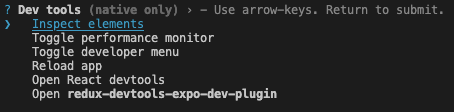

# React Native

## Principios de Redux - Manejo de estado

- `Redux` es una librería para manejo de estado global de una aplicación de forma predecible.
- Sigue tres principios básicos:
  - **Una única fuente de verdad**: El estado global se almacena en un único objeto JavaScript llamado store.
  - **El estado es de sólo lectura**: El estado sólo puede cambiarse enviando acciones.
  - **Los cambios se realizan con funciones puras**: Los reductores son funciones puras que toman el estado actual y una acción, y devuelven un nuevo estado.
- Dentro de estos conceptos Redux va a utilizar un objeto para representar el estado de nuestra aplicación y va a ser la fuente única para acceder o modificar el estado.
- Para poder cambiar el estado, un componente va a hacer un `dispatch` de una acción y alguna función `reducer` va a manejar esa accción utilizando el `tipo de acción`.
- Una `acción` no es más que un objeto de JavaScript que tiene una propiedad con el nombre `type` que nos permite en las funciones reductoras (reducers) saber si el reducer tiene que hacer alguna operación para devolver un nuevo estado.
- El estado va a tener un estado inicial con el que se inicia hasta que alguna acción haga que un reducer lo cambie.
- Una sección del estado se conoce como `slice` o una porción del estado.
- Vamos a crear un ejemplo de contador utilizando Redux.

### Instalar dependencias

- El equipo de Redux recomienda utilizar `@reduxjs/toolkit` para estructurar nuestro project.
- También necesitamos instalar `react-redux` ya que vamos a integrarlo con React (React Native).
- Ejecutamos el siguiente comando para instalar las dependencias necesarias:

```bash
npx expo install @reduxjs/toolkit react-redux
```

### Crear un Slice

- `@reduxjs/toolkit` tiene una función `createSlice` que nos permite crear una porción del estado que queremos manejar.
- `createSlice` es una función que acepta un `estado inicial`, un objeto de `funciones reductoras (reducers)` y un `nombre de estado` y genera automáticamente unas funciones que se encargan de crear `acciones` y `tipos de acciones` que se corresponden con los `reducers` y el `estado`.
- Para organizar nuestro código mejor vamos a crear una carpeta con el nombre `redux` y adentro vamos a crear otro archivo con el nombre `counterSlice.ts`.

```typescript
import { createSlice } from "@reduxjs/toolkit";

const counterSlice = createSlice({
  name: "counter",
  initialState: { value: 0 },
  reducers: {
    increment: (state) => {
      state.value += 1;
    },
    decrement: (state) => {
      state.value -= 1;
    },
    incrementByAmount: (state, action) => {
      state.value += action.payload;
    },
  },
});

export const { increment, decrement, incrementByAmount } = counterSlice.actions;
export default counterSlice.reducer;
```

- En este ejemplo estamos creando un `slice` con el nombre de `counter` que tiene un estado inicial `{value: 0}` representado por un objeto con la propiedad value y el valor en 0.
- Esto hace que el slice counter tenga su estado inicial en 0.
- Otra de las propiedades de este slice es `reducers` que hacepta un objeto donde cada propiedad es una función que se encarga de hacer una operación y devolver un nuevo estado.
- Esta librería utiliza algo llamado [Immer](https://redux-toolkit.js.org/usage/immer-reducers) que se encarga de modifciar el valor del estado por nosotros y devolver una nueva instancia sin que lo tengamos que hacer a mano.
- Redux mantiene el concepto de React donde el estado tiene que ser inmutable y siempre tenemos que utilizar un nuevo estado (objetos y arrays como vimos).
- Dado que estamos usando Redux Toolkit nos permite hacer todo esto de una manera más simple.
- En los reducers hay una función `increment` que incrementa el valor del estado en 1.
- Otra de las funciones se llama `decrement` y reduce el valor del estado (value) en 1.
- Finalmente tenemos una acción que incrementa por un monto especial variable que se llama `incrementByAmount`.
- Todas las funciones reciben `state` como primer parámetro que representan el estado actual.
- `incrementByAmount` también recibe un segundo parámetro que es la acción que se despachó. Esta acción tiene una propiedad con el nombre de `payload` de donde podemos acceder al valor que cambió.
- Es decir que si una función reducer no necesita un valor externo para modificar el estado lo puede hacer como hacen `increment y decrement` sin necesidad de acceder a la acción.
- En el caso de necesitar hacer llegar un valor al reducer para hacer alguna operación y luego devolver el nuevo estado podemos pasarle valores usando la propiedad `payload` del action.
- Al `action` lo podemos pensar como un objeto con la siguiente forma: `{ type: 'incrementByAmount', payload: 2}`.
- `counterSlice.actions` retorna un objeto con todos los `actions` que tiene definido el slice y los exportamos para poder utilizarlos desde otro lado.
- `counterSlice.reducer` retorna los reducers que luego vamos a utilizar para crear el store de Redux.
- Ahora que sabemos como funciona `createSlice`, `actions` y `reducers` podemos crear el `store` de Redux.

### Crear el Store de Redux

- `@reduxjs/toolkit` nos da otra función con el nombre de `configureStore` que crea un `store` de Redux que contiene el árbol de estado completo de tu aplicación.
- Una de las reglas de Redux es que sólo debe haber un único almacén en tu aplicación.
- Dentro de la carpeta `redux` creamos otro archivo con el nombre `store.ts` y agregamos el siguiente código:

```typescript
import { configureStore } from "@reduxjs/toolkit";
import counterReducer from "./counterSlice";

export const store = configureStore({
  reducer: {
    counter: counterReducer,
  },
});
```

- Creamos un nuevo `store` que va a almacenar el estado de nuestra app.
- En este caso sólo tiene un reducer con el nombre `counter` y le asignamos el `slice` que creamos en `redux/counterSlice.ts`.

### Relacionar la App con el Store

- Hasta acá tenemos configurado Redux por medio de crear un slice que luego asignamos al store.
- Para que los componentes puedan acceder al estado tenemos primero que envolver la App utilizando un Provider que va a tener el `store`. Es de alguna forma como cuando usamos Context.
- Modificamos `app/_layout.tsx` para que utilize el Provider y así darle acceso a los componentes.

```typescript
import { Stack } from "expo-router";
import { Provider } from "react-redux";

import { store } from "@/redux/store";

export default function RootLayout() {
  return (
    <Provider store={store}>
      <Stack>
        <Stack.Screen name="index" />
      </Stack>
    </Provider>
  );
}
```

- Como el Provider envuelve al Stack de navegación significa que en todas las pantallas podríamos acceder al estado.
- Le pasamos al Provider una propiedad con el nombre `store` y le asignamos la variable `store` que creamos en la sección anterior.
- De esta forma exponemos el store a todos los componentes que lo quieran consumir ya sea para leer o hacer dispatch de actions.

### Usar Redux desde los componentes

- Vamos a modificar el archivo `app/index.tsx` para crear un contador usando el estado.

```typescript
import { Text, View, StyleSheet, Button } from "react-native";
import { useSelector, useDispatch } from "react-redux";
import { RootState } from "@/redux/store";
import { increment, decrement, incrementByAmount } from "@/redux/counterSlice";

export default function Index() {
  const count = useSelector((state: RootState) => state.counter.value);
  const dispatch = useDispatch();

  return (
    <View style={styles.container}>
      <Text style={styles.text}>Contador: {count}</Text>
      <View style={styles.row}>
        <Button title="-" onPress={() => dispatch(decrement())} />
        <Button title="+" onPress={() => dispatch(increment())} />
      </View>
      <Button
        title="Incrementar en 5"
        onPress={() => dispatch(incrementByAmount(5))}
      />
    </View>
  );
}

const styles = StyleSheet.create({
  container: {
    flex: 1,
    justifyContent: "center",
    alignItems: "center",
  },
  row: {
    flexDirection: "row",
  },
  text: {
    fontSize: 24,
    marginBottom: 10,
  },
});
```

- Primero vamos a importar `useSelector y useDispatch` de `react-redux`.
- `useSelector` nos permite pasar una función que recibe como primer parámetro el estado de nuestra aplicación.
- Un selector es una función que nos permite acceder al estado y retornar una sección o valor.
- En este caso vamos a utilizar el selctor para obter el valor del slice `counter.value`.
- `useDispatch` nos va a retornar una función `dispatch` que nos va a permitir emitir o dispatchear acciones.
- Importamos los actions creators `increment, decrement, incrementByAmount` para poder interactuar con el slice.
- Al presionar alguno de los botones hacemos `dispatch(actionCreator())` para emitir una acción.

```javascript
console.log(decrement()); // {"payload": undefined, "type": "counter/decrement"}
console.log(increment()); // {"payload": undefined, "type": "counter/increment"}
console.log(incrementByAmount(5)); // {"payload": 5, "type": "counter/incrementByAmount"}
```

- Al hacer console.log de los action creators vemos que no hacen más que crear un objeto que tienen una propiedad `type` con el valor `counter/action` donde `counter` viene del nombre que le pusimos al slice.
- Los actions tienen un payload que en algunos casos tienen el valor undefined ya que no lo estamos usando y para incrementByAmount tiene el valor de 5 ya que es el valor que le pasamos al crear el action.
- Podemos instalar un plugin para poder ver el estado utilizando una dev tool.

### Instalar Redux Dev Tools

- [Expo tiene un componente para utilizar Dev Tools](https://docs.expo.dev/debugging/devtools-plugins/) que son herramientas que nos ayudan para trabajar.
- Redux tiene un plugin que se llama `redux-devtools-expo-dev-plugin`.
- Instalamos la herramienta:

```bash
$ npx expo install redux-devtools-expo-dev-plugin
```

- Una vez instalado el módulo necesitamos configurarlo de la siguiente manera:

```typescript
// redux/store.ts;
import { configureStore } from "@reduxjs/toolkit";
import devToolsEnhancer from "redux-devtools-expo-dev-plugin";

import counterReducer from "./counterSlice";

export type RootState = ReturnType<typeof store.getState>;

export const store = configureStore({
  reducer: {
    counter: counterReducer,
  },
  devTools: false,
  enhancers: (getDefaultEnhancers) =>
    getDefaultEnhancers().concat(devToolsEnhancer()),
});
```

- Por último necesitamos re iniciar el servidor de metro `npx expo start` y cuando la app esté corriendo presionar en la consola `shift+m` para que Expo nos muestre más herramientas de desarrollo.



- Seleccionamos la opción `Open redux-devtools-expo-dev-plugin` y se debería abrir una ventana con una aplicación que nos permite ver el estado de nuestra App.
- Del lado izquierdo vamos a ver las acciones que se emiten.
- Del lado derecho tenemos `Action` para ver la acción, `State` para ver el estado, `Diff` para ver como la acción cambia al estado.
- Si ejecutamos algunas acciones luego podemos presionar el botón de play que está abajo a la izquierda y Redux reproduce los cambios en tiempo real y podemos viajar en el tiempo.

## Agregando un TODO list

- Ahora vamos a agregar una lista de tareas usando redux.
- Lo primero que vamos a hacer es crear un nuevo slice llamado `redux/postSlice.ts`.
- Agregamos el siguiente código:

```typescript
import { createSlice } from "@reduxjs/toolkit";

const todoSlice = createSlice({
  name: "todos",
  initialState: {
    data: [], // Store list of todos
  },
  reducers: {
    setTodos: (state, action) => {
      state.data = action.payload;
    },
    addTodo: (state, action) => {
      state.data.push({ id: Date.now(), text: action.payload });
    },
    updateTodo: (state, action) => {
      const { id, newText } = action.payload;
      const todo = state.data.find((todo) => todo.id === id);
      if (todo) {
        todo.text = newText;
      }
    },
    deleteTodo: (state, action) => {
      state.data = state.data.filter((todo) => todo.id !== action.payload);
    },
  },
});

export const { setTodos, addTodo, updateTodo, deleteTodo } = todoSlice.actions;
export default todoSlice.reducer;
```

- En este caso creamos el slice con el nombre `todos`.
- Inicializamos el estado con un objeto que tiene una propiedad con el nombre `data` y un array vacio.
- Agregamos un reducer y acciones para establecer (`setTodos`) los `todos`.
- También tenemos acciones para agregar (`addTodo`), actualizar (`updateTodo`) y borrar (`deleteTodo`) `todos`.
- Exportamos por default el reducer y también todas las actions.
- Ahora tenemos que modificar el store para que use el nuevo slice.
- Modificamos el archivo `redux/store.ts` para agregar el nuevo slice:

```typescript
import { configureStore } from "@reduxjs/toolkit";
import devToolsEnhancer from "redux-devtools-expo-dev-plugin";

import counterReducer from "./counterSlice";
import todoReducer from "./todoSlice";

export type RootState = ReturnType<typeof store.getState>;

export const store = configureStore({
  reducer: {
    counter: counterReducer,
    todos: todoReducer,
  },
  devTools: false,
  enhancers: (getDefaultEnhancers) =>
    getDefaultEnhancers().concat(devToolsEnhancer()),
});
```

- Agregamos el nuevo reducer con el nombre `todos` y le asignamos el nuevo slice.
- Ahora nos queda crear la pantalla.
- Primero vamos a hacer un pequeño refactor.
- Cambiamos el nombre de `app/index.tsx` por `app/contador.tsx`.
- Cambiamos el nombre del componente de `Index` a `Contador`.
- Creamos un nuevo `app/index.tsx` para nuestro nuevo componente.

```typescript
// app/index.tsx
import React, { useEffect, useState } from "react";
import {
  View,
  Text,
  TextInput,
  Button,
  FlatList,
  StyleSheet,
  SafeAreaView,
  Pressable,
} from "react-native";
import { useSelector, useDispatch } from "react-redux";
import {
  setTodos,
  addTodo,
  updateTodo,
  deleteTodo,
  Todo,
} from "@/redux/todoSlice";
import { RootState } from "@/redux/store";
import { router } from "expo-router";

const API_URL = "https://jsonplaceholder.typicode.com/todos?_limit=5";

interface TodoListitemProps {
  todo: Todo;
  isEditing: boolean;
  onDelete: (id: number) => void;
  onSetEditMode: (id: number) => void;
  onSave: ({ id, text }: Todo) => void;
}

interface TodoData {
  completed: boolean;
  id: number;
  title: string;
  userId: number;
}

const TodoListItem = ({
  todo,
  isEditing,
  onDelete,
  onSetEditMode,
  onSave,
}: TodoListitemProps) => {
  const [editText, setEditText] = useState(todo.text);

  const onDeleteHandler = () => {
    onDelete(todo.id);
  };

  const onEditPressHandler = () => {
    onSetEditMode(todo.id);
  };

  const onSaveHander = () => {
    if (editText.trim()) {
      onSave({
        id: todo.id,
        text: editText,
      });
    }
  };

  return (
    <Pressable
      style={styles.todoItem}
      onPress={() =>
        router.navigate({ pathname: "/todo", params: { id: todo.id } })
      }
    >
      <View style={styles.row}>
        {isEditing ? (
          <TextInput
            style={styles.input}
            value={editText}
            onChangeText={(text) => {
              setEditText(text);
            }}
          />
        ) : (
          <Text style={styles.todoText}>{todo.text}</Text>
        )}
      </View>
      <View style={styles.buttonContainer}>
        {isEditing ? (
          <Button title="Salvar" onPress={onSaveHander} />
        ) : (
          <Button title="Editar" onPress={onEditPressHandler} />
        )}
        <Button title="Borrar" color="red" onPress={onDeleteHandler} />
      </View>
    </Pressable>
  );
};

export default function Index() {
  const dispatch = useDispatch();
  const todos = useSelector((state: RootState) => state.todos.data);
  const [input, setInput] = useState("");
  const [editId, setEditId] = useState<number | null>(null);

  useEffect(() => {
    const fetchTodos = async () => {
      const response = await fetch(API_URL);
      const data: TodoData[] = await response.json();
      const formattedTodos = data.map((item) => ({
        id: item.id,
        text: item.title,
      }));
      dispatch(setTodos(formattedTodos));
    };

    fetchTodos();
  }, []);

  const handleAddTodo = () => {
    if (input.trim()) {
      dispatch(addTodo(input));
      setInput("");
    }
  };

  const handleUpdateTodo = ({ id, text }: Todo) => {
    dispatch(updateTodo({ id, newText: text }));
    setEditId(null);
  };

  const handleDeleteTodo = (id: number) => {
    dispatch(deleteTodo(id));
  };

  const handleSetEditMode = (id: number) => {
    setEditId(id);
  };

  return (
    <SafeAreaView style={styles.safeArea}>
      <View style={styles.container}>
        <View style={styles.inputContainer}>
          <TextInput
            style={styles.input}
            placeholder="Ingrese un nuevo Todo"
            value={input}
            onChangeText={setInput}
          />
          <Button title="Agregar" onPress={handleAddTodo} />
        </View>

        <FlatList
          data={todos}
          keyExtractor={(item) => item.id.toString()}
          renderItem={({ item }) => (
            <TodoListItem
              todo={item}
              isEditing={editId === item.id}
              onDelete={handleDeleteTodo}
              onSetEditMode={handleSetEditMode}
              onSave={handleUpdateTodo}
            />
          )}
        />
      </View>
    </SafeAreaView>
  );
}

const styles = StyleSheet.create({
  safeArea: {
    flex: 1,
  },
  container: {
    flex: 1,
    padding: 20,
  },
  inputContainer: {
    flexDirection: "row",
    marginVertical: 10,
    alignItems: "center",
  },
  input: {
    flex: 1,
    borderBottomWidth: 1,
    padding: 8,
    marginRight: 10,
  },
  todoItem: {
    flexDirection: "row",
    justifyContent: "space-between",
    alignItems: "center",
    backgroundColor: "#fff",
    marginVertical: 5,
    borderRadius: 5,
    elevation: 3,
  },
  todoText: {
    fontSize: 14,
  },
  buttonContainer: {
    flexDirection: "row",
    justifyContent: "flex-end",
    gap: 5,
    width: "40%",
  },
  row: {
    paddingLeft: 10,
    width: "60%",
  },
});
```

- En este componente pasa de todo!! buscá 🍿 y 🥤.
- Inicialmente importamos todo lo que necesitamos. Varios componentes de `react-native`, `useSelector` y `useDispatch` de `react-redux` para poder interactuar con el estado, las acciones que definimos en el slice `@/redux/todoSlice` y finalmente `router` de `expo-router` para poder navegar a otra pantalla desde este componente.
- En esta pantalla tenemos definido 2 componentes. Por un lado el contenido de la pantalla en sí, más un componente `TodoListItem` que es lo que vamos a renderizar para cada `Todo`.
- Por ahora nos enfocamos en el componente `Index` para ver el contenido de la pantalla.

```typescript
useEffect(() => {
  const fetchTodos = async () => {
    const response = await fetch(API_URL);
    const data: TodoData[] = await response.json();
    const formattedTodos = data.map((item) => ({
      id: item.id,
      text: item.title,
    }));
    dispatch(setTodos(formattedTodos));
  };

  fetchTodos();
}, []);
```

- Usamos `useEffect` con dependencia vacía para que se ejecute una vez.
- Inicialmente cargamos unos Todo's de un sitio remoto que está definido en la variable `API_URL`.
- Una vez obtenidos los valores que queremos los seteamos en el estado que creamos con Redux usando la función `dispatch` para emitir una acción `setTodos` usando los Todos que obtuvimos haciendo `fetch`.
- El estado inicial lo definimos como `[]` con un array vacío.
- Cuando se ejecuta esta acción el reducer de `redux` toma los datos y los asigna al estado.
- Una vez ejecutado esto la variables `todos` tiene una colección de `todos`.

```typescript
const dispatch = useDispatch();
const todos = useSelector((state: RootState) => state.todos.data);
const [input, setInput] = useState("");
const [editId, setEditId] = useState<number | null>(null);
```

- Después de definir el componente Index usamos `useDispatch` para acceder a la función `dispatch`.
- `useSelector` nos permite acceder al estado que creamos en el slice de los todos.
- `state.todos.data` tiene inicialmente el array vacío que definimos como estado inicial y luego de cargar los datos tiene la colección de Todo's que obtuvimos de manera remota.
- Luego utilizamos 2 veces `useState` para crear variables de estado de `solo` este componente.
- Es decir que tenemos un `estado global` para nuestra app `usando redux` y un `estado local` de los componentes que necesitan tener estado `usando useState`.
- Ahora nos enfocamos en lo que estamos renderizando:

```typescript
  return (
    <SafeAreaView style={styles.safeArea}>
      <View style={styles.container}>
        <View style={styles.inputContainer}>
          <TextInput
            style={styles.input}
            placeholder="Ingrese un nuevo Todo"
            value={input}
            onChangeText={setInput}
          />
          <Button title="Agregar" onPress={handleAddTodo} />
        </View>

        <FlatList
          data={todos}
          keyExtractor={(item) => item.id.toString()}
          renderItem={({ item }) => (
            <TodoListItem
              todo={item}
              isEditing={editId === item.id}
              onDelete={handleDeleteTodo}
              onSetEditMode={handleSetEditMode}
              onSave={handleUpdateTodo}
            />
          )}
        />
      </View>
    </SafeAreaView>
  );
}
```

- SafeAreaView para mantener el contenido en un espacio de la pantalla visible.
- Tenemos una especie de encabezado que tiene un TextInput para ingresar un texto. Al cambiar el texto se ejecuta setInput para establecer el estado de ese texto.
- Como valor del input usamos la variable `input` que creamos en el estado. De esta forma usando `setInput` e `input` controlamos el valor que el usuario ingresa en el campo de texto.
  La función `onChangeText` se encarga de cambiar el estado cada vez que el usuario ingresa o modifica el texto.
- Luego tenemos un `Button` con el texto `Agregar` que al ser presionado llama a la función `handleAddTodo`.
- En este momento tenemos que agregar un nuevo Todo a la lista.

```javascript
const handleAddTodo = () => {
  if (input.trim()) {
    dispatch(addTodo(input));
    setInput("");
  }
};
```

- `handleAddTodo` verifica que el texto no esté vacío usando `input.trim`.
- Si hay un texto entonces hace dispatch del action `addTodo` pasando el texto de este todo.
- Luego limpiamos el valor del estado usando `setInput` así el campo de texto se ve vacío.
- Ahora analicemos la lista de todos:

```typescript
<FlatList
  data={todos}
  keyExtractor={(item) => item.id.toString()}
  renderItem={({ item }) => (
    <TodoListItem
      todo={item}
      isEditing={editId === item.id}
      onDelete={handleDeleteTodo}
      onSetEditMode={handleSetEditMode}
      onSave={handleUpdateTodo}
    />
  )}
/>
```

- Usamos un FlatList para mostrar los todos.
- Le pasamos `todos` a la propiedad data para que la lista sepa cual es la colección con la que estamos trabajando y que valores tiene que usar para cada item de la lista.
- Usamos `keyExtractor` para decirle a React como poder saber cuando cambia un item.
- Finalmente usamos `renderItem` para renderizar cada item de la colección que para nosotros es un todo.
- Para no tener un código muy largo en la lista podemos usar un componente para renderizar cada todo.

```typescript
<TodoListItem
  todo={item}
  isEditing={editId === item.id}
  onDelete={handleDeleteTodo}
  onSetEditMode={handleSetEditMode}
  onSave={handleUpdateTodo}
/>
```

- `TodoListItem` tiene varias propiedades:

  - `todo={item}`: Le pasamos la propiedad todo que es cada item de la colección de la lista que viene del estado todos.
  - `isEditing={editId === item.id}`: Este componente necesita saber si está en modo edit o solo mostrando el contenido. Si la variable editId tiene seteado el valor de `item.id` esta comparación se transforma en `true` por ende seteando el componente en modo edición en lugar de sólo mostrar el valor del todo.
  - `onDelete={handleDeleteTodo}`: este es un callback que el componente va a llamar a cuando el usuario presione el botón de borrar el todo. Dado que queremos que el estado lo maneje la pantalla y no el componente tenemos que manejar la interación con este componente.
  - `onSetEditMode={handleSetEditMode}`: al presionar `Editar` necesitamos poner el componente en modo edit. Para eso seteamos el valor de estado editId y con eso logramos que al re-renderizar la propiedad `isEditing` se tranforme en true.
  - `onSave={handleUpdateTodo}`: maneja cuando el usuario presiona el botón Salvar.

- Ahora que sabemos todas las propiedades que usa el componente `TodoListItem` podemos ver como se renderiza:

```typescript
const TodoListItem = ({
  todo,
  isEditing,
  onDelete,
  onSetEditMode,
  onSave,
}: TodoListitemProps) => {
  const [editText, setEditText] = useState(todo.text);

  const onDeleteHandler = () => {
    onDelete(todo.id);
  };

  const onEditPressHandler = () => {
    onSetEditMode(todo.id);
  };

  const onSaveHander = () => {
    if (editText.trim()) {
      onSave({
        id: todo.id,
        text: editText,
      });
    }
  };

  return (
    <Pressable
      style={styles.todoItem}
      onPress={() =>
        router.navigate({ pathname: "/todo", params: { id: todo.id } })
      }
    >
      <View style={styles.row}>
        {isEditing ? (
          <TextInput
            style={styles.input}
            value={editText}
            onChangeText={(text) => {
              setEditText(text);
            }}
          />
        ) : (
          <Text style={styles.todoText}>{todo.text}</Text>
        )}
      </View>
      <View style={styles.buttonContainer}>
        {isEditing ? (
          <Button title="Salvar" onPress={onSaveHander} />
        ) : (
          <Button title="Editar" onPress={onEditPressHandler} />
        )}
        <Button title="Borrar" color="red" onPress={onDeleteHandler} />
      </View>
    </Pressable>
  );
};
```

- Este componente necesita tener su estado propio mientras está en modo edición. Para eso creamos un estado usando `  const [editText, setEditText] = useState(todo.text)`.

```typescript
const onDeleteHandler = () => {
  onDelete(todo.id);
};

const onEditPressHandler = () => {
  onSetEditMode(todo.id);
};

const onSaveHander = () => {
  if (editText.trim()) {
    onSave({
      id: todo.id,
      text: editText,
    });
  }
};
```

- Definimos varias funciones que van a manjar la interación entre los eventos del componente y lo que tiene que hacer con las propiedades que le pasaron como parámetro.
- `onDeleteHandler` llama a `onDelete` pasandole el id del todo que queremos borrar. Después la pantalla se ocupa de manejar el estado general y que se re-renderize la lista.
- `onEditPressHandler`: establece cual es el `id` del todo que queremos editar. Esto modifica el estado y finalmente nuestro componente recibe la propiedad `isEditing` en true. Con esto vamos a poder validar / mostrar el modo edición.
- `onSaveHander`: es el que se encarga de decirle a la pantalla que el todo que fué editado está listo para salvar los datos. Usa el id del todo original y como texto pasamos el texto editado que está en el componente. Al llamar a `onSave` la pantalla va a actualizar el estado de redux usando el nuevo texto.
- Cada item usa un componente `Pressable` para navegar de manera dinámica a otra pantalla que ya vamos a crear con el nombre de `todo` que es un detalle del todo.
- Para saber que todo tiene que mostrar en la pantalla `todo.tsx` le pasamos un parámetro con el valor del id del todo presionado:

```javascript
<Pressable
  style={styles.todoItem}
  onPress={() =>
    router.navigate({ pathname: "/todo", params: { id: todo.id } })
  }
>
```

- usamos `router.navigate` para navegar a la otra pantalla usando `todo` como pathname y params con un objecto con el id del id del todo.

```javascript
<View style={styles.row}>
  {isEditing ? (
    <TextInput
      style={styles.input}
      value={editText}
      onChangeText={(text) => {
        setEditText(text);
      }}
    />
  ) : (
    <Text style={styles.todoText}>{todo.text}</Text>
  )}
</View>
```

- Esta sección maneja si muestra un campo de edición del todo o sólo el texto.
  - Si el modo `isEditing` es verdadero entonces muestra el campo de texto.
  - Si el modo `isEditing` es false entonces muestra el texto del todo original.
- En caso de estar en modo edición entonces tenemos que mostrar el valor de la variable de estado que va a manejar los cambios. Por eso pasamos `editText` como valor inicial. Esta variable al renderizar el componente siempre usa el valor del texto del todo como valor inicial.
- Usamos `onChangeText` del input para poder saber cuando el usuario cambia un valor en el campo de texto. En ese caso modificamos el valor de la variable del estado y de esa forma conseguimos mostrar el texto editado en lugar del texto original.
- Ahora que sabemos esto necesitamos saber como se cambia de estado a edit y como se salva!.

```javascript
<View style={styles.buttonContainer}>
  {isEditing ? (
    <Button title="Salvar" onPress={onSaveHander} />
  ) : (
    <Button title="Editar" onPress={onEditPressHandler} />
  )}
  <Button title="Borrar" color="red" onPress={onDeleteHandler} />
</View>
```

- Esta parte del componente renderiza botones.
- Los botones cambian según si el componente está en modo edit o no.
- Siempre muestra un botón de `Borrar` que al presionarlo llama a la función onDeleteHandler.
- En caso de estar editando mostramos un botón con el mensaje `salvar` y llamamos a la función `onSaveHandler`.
- Si queremos establecer el modo edit entonces usamos el botón que dice `Editar` y que llama a `onEditPressHandler`.
- Lo que falta ver es que hace la pantalla con todos estos callbacks.

```javascript
const handleAddTodo = () => {
  if (input.trim()) {
    dispatch(addTodo(input));
    setInput("");
  }
};

const handleUpdateTodo = ({ id, text }: Todo) => {
  dispatch(updateTodo({ id, newText: text }));
  setEditId(null);
};

const handleDeleteTodo = (id: number) => {
  dispatch(deleteTodo(id));
};

const handleSetEditMode = (id: number) => {
  setEditId(id);
};
```

- Como ya vimos estas funciones están haciendo dispatch de los diferentes actions que maneja el slice de los todos.
- Al crear un todo hacemos dispatch de la acción `addTodo` y le pasamos el valor de un campo de texto.
- Al hacer update de un todo le tenemos que pasar el `id` del todo que queremos actualizar y el nuevo texto haciendo dispatch del action `updateTodo`.
- Para borrar un todo necesitamos saber el `id` y hacer dispatch de la acción `deleteTodo`.
- Finalmente si estamos editando un todo en este caso no necesitamos modificar el estado global sino el estado local del componente.
- Ahora es un buen momento de ir a ver / analizar que hacen los reducers cuando se llaman a estas actions, abramos el archivo del slice de todos.

```javascript
setTodos: (state, action) => {
  state.data = action.payload;
},
```

- Cuando se ejecuta un action `setTodos` se asigna el valor pasado como `payload` al estado que tiene la variable `data`.
- Como esto usa un módulo llamado Immer no tenemos que preocuparmos de manejar que los array sean instancias nuevas y todo eso que aprendimos porque para eso tenemos a este modulo que nos simplifica nuestro trabajo.

```javascript
addTodo: (state, action) => {
  state.data.push({ id: Date.now(), text: action.payload });
},
```

- addTodo action le asigna un `id` random y un text usando el texto que pasamos como payload.
- Luego toma ese nuevo valor y lo agrega a la colección del estado.
- Internamente Immer se encarga de crear un nuevo array y todo lo que ya sabemos.

```javascript
updateTodo: (state, action) => {
  const { id, newText } = action.payload;
  const todo = state.data.find((todo) => todo.id === id);
  if (todo) {
    todo.text = newText;
  }
},
```

- Actualizar un todo es un poco más complicado.
- Primero tomamos los datos del payload para saber el `id` del todo que necesitamos modificar y el `newText` que es el valor del nuevo texto.
- Luego buscamos el todo en la colección usando `find`.
- Una vez encontrado el todo podemos usar la propiedad `text` para modificar ese todo.
- De nuevo, gracias al módulo que usa redux no tenemos que ocuparnos de re-crear todos los items del array, hacer spread y todo eso y nos enfocamos sólo en lo que queremos cambiar.

```javascript
deleteTodo: (state, action) => {
  state.data = state.data.filter((todo) => todo.id !== action.payload);
},
```

- Por último usamos filter para buscar el todo que queremos borrar de la lista y creamos un nuevo estado sin ese elemento.
- Podemos ver todas estas cosas en el devtools para ver como se emiten las acciones, que valores se pasan como parámetro y también como se actualiza el estado.
- Ahora terminemos la app. Primero a definir la pantalla `app/todo.tsx`:

```javascript
import { View, Text, StyleSheet } from "react-native";
import { useLocalSearchParams } from "expo-router";
import { useSelector } from "react-redux";
import { RootState } from "@/redux/store";

const Todo = () => {
  const todos = useSelector((state: RootState) => state.todos.data);
  const { id } = useLocalSearchParams();
  const todo = todos.find((todoItem) => parseInt(id) === todoItem.id);

  return (
    <View style={styles.container}>
      {todo && <Text style={styles.text}>ID: {todo.id}</Text>}
      {todo && <Text style={styles.text}>Text: {todo.text}</Text>}
    </View>
  );
};

export default Todo;

const styles = StyleSheet.create({
  container: {
    flex: 1,
    justifyContent: "center",
    alignItems: "center",
  },
  text: {
    fontSize: 24,
  },
});
```

- Esta pantalla recibe el parámetro id y usa un selector como para encontrar el todo en el estado.
- También podemos modificar `app/_layout.tsx` para manejar las rutas:

```javascript
import { Link, Stack } from "expo-router";
import { Provider } from "react-redux";

import { store } from "@/redux/store";

export default function RootLayout() {
  return (
    <Provider store={store}>
      <Stack>
        <Stack.Screen
          name="index"
          options={{
            title: "Todos",
            headerRight: () => <Link href="/contador">Ir a Contador</Link>,
          }}
        />
        <Stack.Screen name="contador" options={{ title: "Contador" }} />
        <Stack.Screen name="todo" options={{ title: "Todo Detail" }} />
      </Stack>
    </Provider>
  );
}
```

- En este caso le asignamos un title a cada ruta para que sea más descriptivo.
- También le agregamos un encabezado derecho a la pantalla index para poder navegar al contador.
- Con esto cerramos nuestra app de redux!
- Otro logro más, felicitaciones! ahora aprendiste las bases de Redux.


[App de ejemplo](https://github.com/nisnardi/redux-basics)
