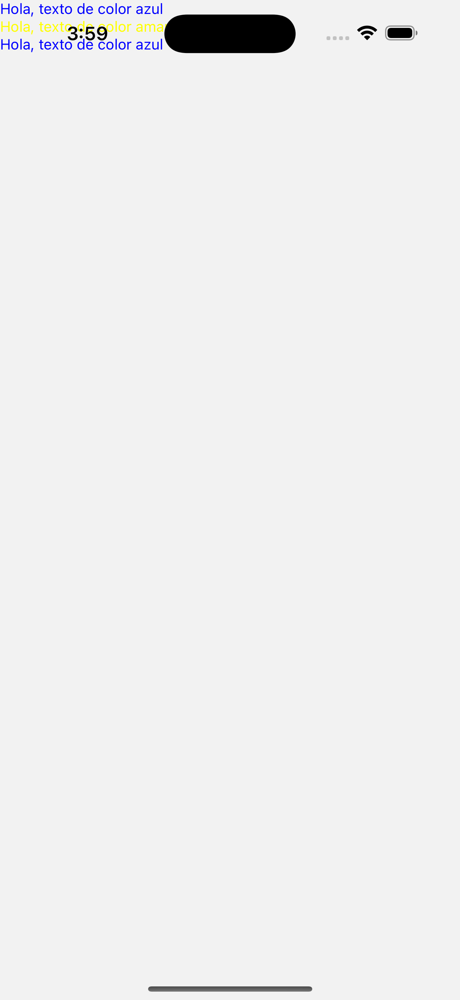
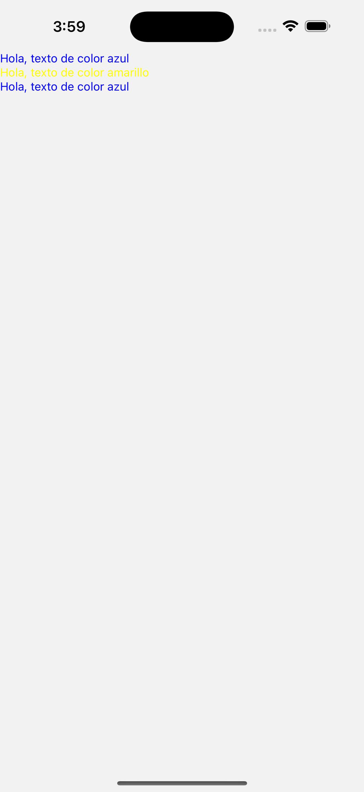

# React Native

## Componentes básicos de React Native

- React Native nos da algunos componentes básicos que podemos utilizar para crear nuestras aplicaciones.
- Estos componentes nos permiten escribir en JavaScript y luego React Native se encarga de comunicarse con el sistema operativo para crear vistas nativas.
- Dentro de los componentes básicos se encuentran `View, Text, Image, TextInput, ScrollView y Stylesheet`.
- Cada uno de ellos nos permiten hacer diferentes cosas:
  - `View`: es el componente fundamental para para construir vistas. Es un contenedor como podría ser un div en HTML.
  - `Text`: es un componente que permite pasarle un texto como hijo para mostrar en pantalla.
  - `Image`: es un componente para mostrar imagenes locales o remotas.
  - `TextInput`: es un componente campo de texto.
  - `ScrollView`: es un component que es una vista con scroll y puede renzerizar otros componentes adentro.
  - `StyleSheet`: es una abstracción que permite crear estilos como si fuera una hoja de estilos.
- Todos estos componentes se pueden importar del módulo `react-native`

### View

- Es el componente fundamental para poder crear UI.
- Se puede agregar estilos con la propiedad `style` usando `flexbox`.
- Maneja algunos eventos.
- Provee propiedades para soportar accesibilidad.
- Está preparada para tener 0 o muchos componentes hijos.

```javascript
<View style={{ backgroundColor: "#ccc" }}></View>
```

- Podes aprender más sobre `View` leyendo la [documentación](https://reactnative.dev/docs/view)

### Text

- `Text` es un component para mostrar texto.
- Se puede tener componentes `Text` o strings como hijos.
- También se puede utilizar estilos para declarar como se debe ver el texto.

```javascript
<Text>Texto de ejemplo</Text>

<Text>Texto de <Text>ejemplo con otro componente</Text></Text>
```

- Por medio de la propiedad `style` podemos establecer estilos de texto.
- Los estilos se pasan del componente padre a los componentes hijos.

```javascript
<Text style={{color: 'blue'}}>Texto de color azul</Text>
<Text>style={{color: 'yellow'}}Texto de color amarillo</Text>
<Text style={{color: 'blue'}}>Texto de azul</Text>
```

- También `Text` puede manejar eventos como por ejemplo si el usuario presiona sobre el texto utilizando la propiedad `onPress`.

```javascript
const onPressHandler = () => {
  console.log("El texto fué presionado!");
};

<Text onPress={onPressHandler}>Apretame</Text>;
```

- Los otros componentes no pueden tener texto como hijos.
- Es por esto que siempre vamos a utilizar un componente `Text` como hijo de otros componentes que tengan que mostrar un texto.

```javascript
<View>Esto es un error!</View>

<View>
  <Text>Esto está muy bien!</Text>
</View>
```

- Podes aprender más sobre el componente `Text` leyendo la [documentación](https://reactnative.dev/docs/text).

### Image

- `Image` es un componente que nos permite mostrar imágenes de diferente estilos.
- El componente puede utilizar assets locales o remotos (externos al proyecto).
- Usando la propiedad `source` podemos establecer que imágen queremos mostrar.
- Para assets locales utilizamos la palabra reservada `require('path')`.
- `require` es la forma en que React Native puede obtener un asset local.
- `path` es la dirección donde se encuentra el asset que queremos mostrar.
- `@/` Expo utiliza un alias de TypeScript para poder importar archivos utilizando `@`.

```javascript
<Image source={require("../assets/images/react-logo.png")} />
<Image source={require("@/assets/images/react-logo.png")} />
```

- También utilizando `source` podemos cargar imágenes remotas.
- En el caso de imágenes remotas no podemos utilizar require sino que utilizamos un [objeto de configuración o ImageSource](https://reactnative.dev/docs/image#imagesource).
- El objeto tiene que tener una propiedad `uri` que establece la dirección de donde queremos tomar la imágen.
- Dato que la imágen es remota, React Native no sabe que tan grande o chica es la imágen.
- Debemos establecer las propiedades de estilo `width y height`.
- De no utilizar las propiedades React Native no muestra la imágen.

```javascript
const image =
  "https://miro.medium.com/v2/resize:fit:640/format:webp/1*R8uVk4fP4ViCvQGw7z411Q.jpeg";

<Image source={{ uri: image }} style={{ width: 200, height: 200 }} />;
```

- Podes aprender más sobre el componente `Image` leyendo la [documentación](https://reactnative.dev/docs/image).

### TextInput

- El componente `TextInput` nos permite ingresar textos utilizando el teclado.
- Por medio de sus propiedades podemos configurar varias cosas como auto-corrección, placeholder para mostrar cuando no hay texto y diferentes tipos de teclado dependiendo del valor que el usuario deba ingresar.

```javascript
<TextInput placeholder="Ingrese su nombre" />
```

- Para poder manejar el texto que se ingresa por medio del TextInput tenemos que utilizar la propiedad `value`.
- Esta propiedad nos permite establecer un valor que se va a mostrar en el TextInput pero no se pude modifcar.
- Para poder modificar el valor debemos utilizar el event handler `onChageText`.
- Esta propiedad acepta un callback que va a ser llamado cada vez que el usuario cambie el texto ya sea ingresando o borrando un valor.
- Para poder llevar los cambios de valores del texto del TextInput debemos utilizar `useState`.

```javascript
export default function Index() {
  const [nombre, setNombre] = useState("");

  const onChangeTextHandler = (nuevoValor: string) => {
    setNombre(nuevoValor);
  };

  return (
    <View>
      <TextInput
        placeholder="Ingrese su nombre"
        onChangeText={onChangeTextHandler}
        value={nombre}
      />
    </View>
  );
}
```

- En este ejemplo vemos como podemos crear una variable del estado que se llame `nombre` y que es del tipo string.
- Inicialmente tiene el valor `""` por lo cual está vacío.
- El componente `TextInput` utiliza la propiedad `value` para establecer el valor del texto del input.
- Le asignamos a value el valor de la propiedad nombre que inicialmente está vacio.
- Cuando el usuario ingresa algún valor se llama al event handler `onChangeText` que a su vez ejecuta o llama a la función `onChangeTextHandler` pasandole como parámetro el nuevo texto que tiene el input.
- Dado que el valor cambia debemos establecer el nuevo estado llamando a la función `setNombre`.
- Ahora que React se da cuenta que hay un cambio en el estado, renderiza la pantalla mostrando el nuevo valor del estado en el input.
- Dado que los `TextInput` no tienen mucho estilo establecido agregarle algunos estilos.

```javascript
export default function Index() {
  const [nombre, setNombre] = useState("");

  const onChangeTextHandler = (nuevoValor: string) => {
    setNombre(nuevoValor);
  };

  return (
    <View>
      <TextInput
        placeholder="Ingrese su nombre"
        onChangeText={onChangeTextHandler}
        value={nombre}
        style={{
          backgroundColor: "white",
          padding: 10,
          borderColor: "black",
          borderWidth: 1,
        }}
      />
    </View>
  );
}
```

- Sin saber mucho de estilos podemos ver que estamos asignando un color de fondo usando `backgroundColor`, un poco de aire dentro del border para separar el contenido del borde con la propiedad `padding` y finalmente agregamos un borde para poder ver mejor al componente con las propiedades `borderColor y borderWidth` para establecer el color y ancho del borde respectivamente.
- En iOS podemos utilizar la propiedad `clearButtonMode` para mostrar una x y que se borre el contenido del input al presionarlo.
- Esta propiedad acepta diferentes valores: `'never', 'while-editing', 'unless-editing', 'always'`
- Podes aprender más sobre el componente `TextInput` leyendo la [documentación](https://reactnative.dev/docs/textinput).

### ScrollView

- `ScrollView` nos permite tener una sección con scroll en caso de que el contenido sea más largo que el alto de la pantalla.
- Esta lista necesita poder calcular la altura por lo cual debemos asegurarnos que le llegue la propiedad `flex:1` con el valor necesario.
- ScrollView renderiza todos los componentes hijos de una sola vez aún si no se ven en la pantalla.
- Esto hace que no sea super performante y que lo tengamos que utilizar para pocos componentes.

```javascript
export default function Index() {
  return (
    <View style={{ flex: 1 }}>
      <ScrollView>
        <Image source={require("@/assets/images/react-logo.png")} />
        <Text>React Native</Text>
        <Image source={require("@/assets/images/react-logo.png")} />
        <Text>React Native</Text>
        <Image source={require("@/assets/images/react-logo.png")} />
        <Text>React Native</Text>
        <Image source={require("@/assets/images/react-logo.png")} />
        <Text>React Native</Text>
        <Image source={require("@/assets/images/react-logo.png")} />
        <Text>React Native</Text>
        <Image source={require("@/assets/images/react-logo.png")} />
        <Text>React Native</Text>
        <Image source={require("@/assets/images/react-logo.png")} />
        <Text>React Native</Text>
        <Image source={require("@/assets/images/react-logo.png")} />
        <Text>React Native</Text>
        <Image source={require("@/assets/images/react-logo.png")} />
        <Text>React Native</Text>
        <Image source={require("@/assets/images/react-logo.png")} />
        <Text>React Native</Text>
        <Image source={require("@/assets/images/react-logo.png")} />
        <Text>React Native</Text>
        <Image source={require("@/assets/images/react-logo.png")} />
        <Text>React Native</Text>
        <Image source={require("@/assets/images/react-logo.png")} />
        <Text>React Native</Text>
        <Image source={require("@/assets/images/react-logo.png")} />
        <Text>React Native</Text>
        <Image source={require("@/assets/images/react-logo.png")} />
        <Text>React Native</Text>
        <Image source={require("@/assets/images/react-logo.png")} />
        <Text>React Native</Text>
        <Image source={require("@/assets/images/react-logo.png")} />
        <Text>React Native</Text>
      </ScrollView>
    </View>
  );
}
```

- También podemos utilizar `ScrollView` de manera horizontal utilizando la propiedad `horizontal` y el valor `true`.

```javascript
<View style={{ flex: 1 }}>
  <ScrollView horizontal={true}>
    <Image source={require("@/assets/images/react-logo.png")} />
    <Text>React Native</Text>
    <Image source={require("@/assets/images/react-logo.png")} />
    <Text>React Native</Text>
    <Image source={require("@/assets/images/react-logo.png")} />
    <Text>React Native</Text>
    <Image source={require("@/assets/images/react-logo.png")} />
    <Text>React Native</Text>
    <Image source={require("@/assets/images/react-logo.png")} />
    <Text>React Native</Text>
    <Image source={require("@/assets/images/react-logo.png")} />
    <Text>React Native</Text>
    <Image source={require("@/assets/images/react-logo.png")} />
    <Text>React Native</Text>
    <Image source={require("@/assets/images/react-logo.png")} />
    <Text>React Native</Text>
    <Image source={require("@/assets/images/react-logo.png")} />
    <Text>React Native</Text>
  </ScrollView>
</View>
```

- Podes aprender más sobre el componente `ScrollView` leyendo la [documentación](https://reactnative.dev/docs/scrollview).

### StyleSheet

- Hasta ahora venimos utilizando la propiedad `style` para establecer los estilos de cada componente.
- React Native nos da `StyleSheet` para poder crear el concepto de nuestras hojas de estilo.
- `StyleSheet` nos permite `crear` una hoja de estilo para nuestro componente utilizando la propiedad `create`.
- `create` acepta un objeto de JavaScript donde las propiedades son los nombres de los estilos y las propiedades van a ser otros objetos que tengan propiedades de CSS.
- Esto favorece leer el código de una manera más simple.
- Podemos ponerle nombre a los estilos para agregar contexto.

```javascript
<View style={{ flex: 1, justifyContent: "center", alignItems: "center" }}>
  <Text style={{ color: "blue" }}>Hola, texto de color azul</Text>
  <Text style={{ color: "yellow" }}>Hola, texto de color amarillo</Text>
  <Text style={{ color: "blue" }}>Hola, texto de color azul</Text>
</View>
```

- Usando `StyleSheet` podemos pasar de algo como esto a algo un poco mejor:

```javascript
import { Text, View, StyleSheet } from "react-native";

export default function Index() {
  return (
    <View style={styles.container}>
      <Text style={styles.textoAzul}>Hola, texto de color azul</Text>
      <Text style={styles.textoAmarillo}>Hola, texto de color amarillo</Text>
      <Text style={styles.textoAzul}>Hola, texto de color azul</Text>
    </View>
  );
}

const styles = StyleSheet.create({
  container: { flex: 1, justifyContent: "center", alignItems: "center" },
  textoAzul: { color: "blue" },
  textoAmarillo: { color: "yellow" },
});
```

- Podemos utilizar `StyleSheet` con el método `create` pasandole un objeto con los estilos que vamos a utilizar.
- Al asignar los estilos a la variable `styles` podemos utilizarlo dentro de nuestro componente.
- Dentro de los estilos sólo ponemos definición de estilos.
- Una vez definido el estilo podemos usar la variable `styles` en la propidad `style` de los componentes.
- Dato que son estilos también lo podemos re-utilizar.
- Es una buena práctica poner los estilos utilizando `StyleSheet`.
- Podes aprender más sobre el componente `StyleSheet` leyendo la [documentación](https://reactnative.dev/docs/stylesheet).

## Other Components

### SafeAreaView

- Cuando trabajamos con iOS puede pasar que los dispositivos tengan navegación, toolbars u otras cosas que bloqueen a nuestra app.
- React Native nos da `SafeAreaView` que es un componente que podemos utilizar para evitar este problema.
- Usamos `SafeAreaView` como contenedor de nuestros componentes y de esta forma evitar el problema.
- Funciona para iOS 11 en adelante.
- También existe una versión de Expo y otros paquetes similares.
- Dado que muchas veces funciona como contenedor podemos utilizar el estilo `{flex: 1}` para decirle a la app que tome todo el lugar que puede.

```javascript
import { Text, StyleSheet, SafeAreaView } from "react-native";

export default function Index() {
  return (
    <SafeAreaView style={styles.container}>
      <Text style={styles.textoAzul}>Hola, texto de color azul</Text>
      <Text style={styles.textoAmarillo}>Hola, texto de color amarillo</Text>
      <Text style={styles.textoAzul}>Hola, texto de color azul</Text>
    </SafeAreaView>
  );
}

const styles = StyleSheet.create({
  container: { flex: 1 },
  textoAzul: { color: "blue" },
  textoAmarillo: { color: "yellow" },
});
```




- Podes aprender más sobre el componente `SafeAreaView` leyendo la [documentación](https://reactnative.dev/docs/safeareaview).

### Button

- React Native tiene muchas maneras de manjar el evento Press.
- `Button` es uno de los componentes simples que podemos utilizar y que se ve bien tanto en Android como en iOS sin tener que modificar nada.
- Para mostrar el texto del botón podemos utilizar la propiedad `title` y asignar un string.
- También podemos utilizar la propiedad `color` para asignarle un color diferente.
- Utilizando el event handler `onPress` podemos pasar un callback que se va a llamar cuando el botón sea presionado.

```javascript
import { StyleSheet, SafeAreaView, Button } from "react-native";

export default function Index() {
  const onPressHandler = () => {
    console.log("Apretaste el boton");
  };

  return (
    <SafeAreaView style={styles.container}>
      <Button title="Apretame" onPress={onPressHandler} color="red" />
    </SafeAreaView>
  );
}

const styles = StyleSheet.create({
  container: { flex: 1 },
});
```

- Button es de la clase de componentes que se va a ver de manera diferente entre iOS y Android respetando el diseño y funcionalidad de cada sistema operativo.
- Podes aprender más sobre el componente `Button` leyendo la [documentación](https://reactnative.dev/docs/button).

### ActivityIndicator

- El componente `ActivityIndicator` muestra un indicador como cuando el sistema operativo está cargando algo.
- Utilizando este indicador le damos a entender al usuario que algo está tardando y que hay alguna operación en curso.
- Podemos utilizar la propiedad `size` para mostrar un indicador `large` o `small`.
- También podemos establecer el color utilizando la propiedad `color`.

```javascript
import { StyleSheet, SafeAreaView, ActivityIndicator } from "react-native";

export default function Index() {
  const isLoading = true;

  return (
    <SafeAreaView style={styles.container}>
      {isLoading && <ActivityIndicator size="small" color="#0000ff" />}
    </SafeAreaView>
  );
}

const styles = StyleSheet.create({
  container: { flex: 1, justifyContent: "center", alignItems: "center" },
});
```

- Podes aprender más sobre el componente `ActivityIndicator` leyendo la [documentación](https://reactnative.dev/docs/activityindicator).

### Alert

- `Alert` no es un componente pero nos permite mostrar un cartel con un mensaje.
- Alert utiliza el método `alert` para mostrar el mensaje.
- `alert` acepta como primer parámetro un string que es el título.
- El segundo parámetro es el mensaje del cuerpo de la alerta.

```javascript
import { StyleSheet, SafeAreaView, Alert, Button } from "react-native";

export default function Index() {
  const onAlertaComunPress = () => {
    Alert.alert("Titulo", "Mensaje del Alert");
  };

  return (
    <SafeAreaView style={styles.container}>
      <Button title="Mostrar Alerta común" onPress={onAlertaComunPress} />
    </SafeAreaView>
  );
}

const styles = StyleSheet.create({
  container: { flex: 1, justifyContent: "center", alignItems: "center" },
});
```

- También se pueden configurar botones y por default utiliza el `Ok`.

```javascript
import { StyleSheet, SafeAreaView, Alert, Button } from "react-native";

export default function Index() {
  const botones = [
    {
      text: "Cancelar",
      onPress: () => console.log("Se apretó el botón cancel"),
    },
    { text: "OK", onPress: () => console.log("Se apretó el botón OK") },
  ];
  const onAlertaConBotonesPress = () => {
    Alert.alert("Titulo", "Mensaje del Alert", botones);
  };

  return (
    <SafeAreaView style={styles.container}>
      <Button
        title="Mostrar Alerta con botones"
        onPress={onAlertaConBotonesPress}
      />
    </SafeAreaView>
  );
}

const styles = StyleSheet.create({
  container: { flex: 1, justifyContent: "center", alignItems: "center" },
});
```

- Vemos en este ejemplo que el tercer parámetro es un array o colección de objetos que permiten configurar el botón.
- Podes aprender más sobre el componente `ActivityIndicator` leyendo la [documentación](https://reactnative.dev/docs/alert).

### Modal

- Modal permite mostrar un contenido sobre otra vista.
- Nosotros tenemos que crear el contenido del Modal.
- El modal tiene una propiedad `visible` que acepta un valor boolean para establecer si está visible o no.
- También podemos customizar cómo se muestra el modal por medio de la propiedad `animationType` y acepta los siguientes valores: `'none', 'slide', 'fade'`

```javascript
import { useState } from "react";
import {
  StyleSheet,
  SafeAreaView,
  Button,
  Modal,
  View,
  Text,
} from "react-native";

export default function Index() {
  const [isModalVisible, setIsModalVisible] = useState(false);

  const onMostrarModalHandler = () => {
    setIsModalVisible(true);
  };

  return (
    <SafeAreaView style={styles.container}>
      <Modal visible={isModalVisible} animationType="slide">
        <SafeAreaView style={styles.container}>
          <View>
            <Text>Contenido del modal</Text>
            <Button title="Cerrar" onPress={() => setIsModalVisible(false)} />
          </View>
        </SafeAreaView>
      </Modal>
      <Button
        title="Mostrar Alerta con botones"
        onPress={onMostrarModalHandler}
      />
    </SafeAreaView>
  );
}

const styles = StyleSheet.create({
  container: { flex: 1, justifyContent: "center", alignItems: "center" },
});
```

- Existen otras alternativas a este Modal y hasta podemos utilizar `expo-router` para construir pantallas que naveguen como modal.
- Podes aprender más sobre el componente `Modal` leyendo la [documentación](https://reactnative.dev/docs/modal).

### StatusBar

- StatusBar es un componente que maneja el status bar del dispositivo.
- Podemos utilizar la propiedad `barStyle` para definir si queremos que se vea light or dark dependiendo de nuestro diseño.
- Los valores pueden ser: `'default', 'light-content' o 'dark-content'`.

```javascript
import { StyleSheet, SafeAreaView, StatusBar } from "react-native";

export default function Index() {
  return (
    <SafeAreaView style={styles.container}>
      <StatusBar barStyle="light-content" />
    </SafeAreaView>
  );
}

const styles = StyleSheet.create({
  container: {
    flex: 1,
    justifyContent: "center",
    alignItems: "center",
    backgroundColor: "black",
  },
});
```


- Podes aprender más sobre el componente `StatusBar` leyendo la [documentación](https://reactnative.dev/docs/statusbar).
