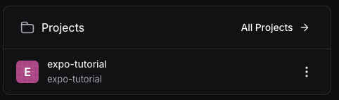
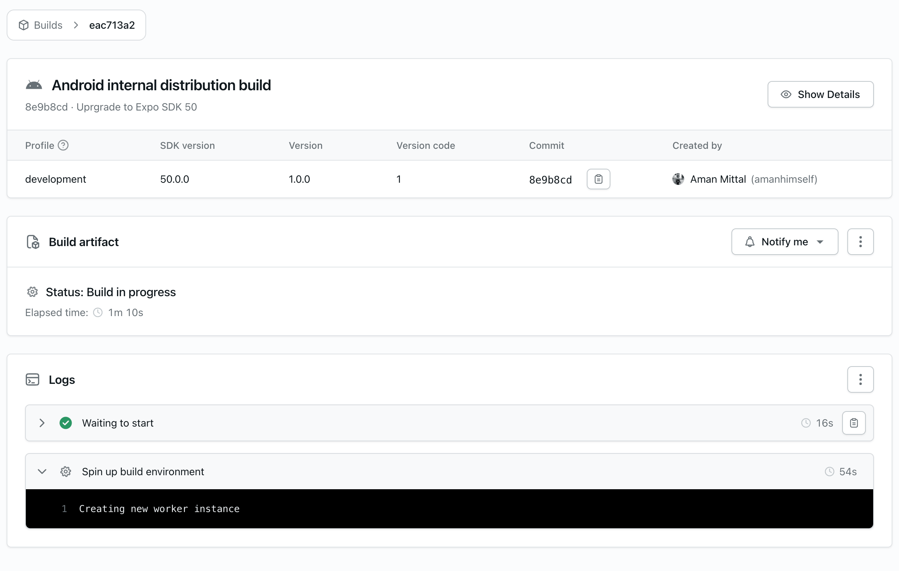
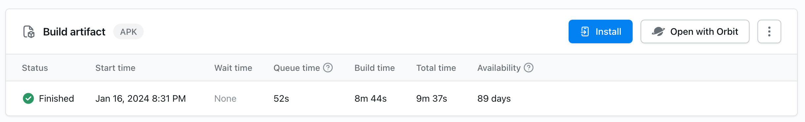

# React Native

## Ahora a distribuir y publicar nuestra App

- A lo largo de este viaje aprendimos un montón de cosas sobre React Native y Expo.
- Después de tanto trabajo llega el momento de aprender como distribuir o publicar nuestro trabajo para compartir con otros.
- Al publicar una App con React Native al final estamos publicando una aplicación iOS o Android pero si usamos Expo al mismo tiempo podemos publicar un sitio web.
- Para iOS la aplicación se distribuye usando el store de Apple y para Android se usa el store de Google Play.
- A la hora de testear la App antes de publicarla podemos usar `Testflight` para iOS y `Google Play Console` para Android. Esto significa que podemos tener un grupo de testeo que reciba una notificación que hay una nueva versión de la App para testear.
- Para lograr testear, distribuir y publicar una App tenemos que configurar diferentes servicios y certificados entre otras cosas.
- Dado que usamos React Native publicamos la aplicación de forma nativa (iOS o Android) pero también tenemos la posibilidad de hacer updates sólo a la parte que corre JavaScript (bundle). Antes podíamos usar `Codepush de Microsoft` pero ese proyecto dejó de funcionar.
- A esta altura podemos ver que hay muchas cosas que considerar, que puede llevar bastante trabajo armar todo y que ya no podemos hacer updates `over the air` al bundle de JavaScript.
- Acá es donde entra Expo y nos da la posibilidad de simplificar todo este proceso utilizando sus servicios.
- Expo creó algo llamado `EAS (Expo Application Services)` que nos permite de manera muy fácil publicar nuestras apps tanto en el Google play store como en el Apple store.
- También tiene una opción para hacer updates `over the air` para publicar cambios que son sólo del lado de JavaScript sin tener que pasar por los stores nativos que puede ser un proceso más lento ya que necesitamos compilar la app y también obtener aprovación por parte de Google y Apple (tarda un poco más).
- Es importante saber que EAS no es gratis al 100% y que existen opciones para poder hacer un build, distribute y publicar una App sin pagar por este servicio. Hasta se puede construir la App localmente en tu máquina y subir a mano la App a los stores.
- Para poder utilizar los servicios de Apple y iOS hay que pagar una subscripción anual de $100 (Apple Developer Program Enrollment). También apple cobra un % de las ganancias que genera la App.
- Google sólo cobra un fee por publicación por lo cual a la larga es más barato publicar para Android que para iOS.

## Tutorial: Using React Native and Expo

- En esta sección vamos a aprender a utilizar EAS siguiendo el [tutorial que nos da Expo](https://docs.expo.dev/tutorial/introduction).
- Este tutorial te permite aprender a dominar los servicios básicos de `Expo Application Services (EAS)`: Crear, Enviar y Actualizar. Cuando termine el tutorial, sabrá cómo configurar una integración continua (CI) / desarrollo continuo (CD) móvil profesional para tus proyectos individuales y de equipo.
- Este tutorial cubre los siguientes temas:
  - Utilizar EAS Build para crear e instalar un `development build` y a continuación, ejecutar en un dispositivo, emulador o simulador.
  - Experimentar las ventajas de utilizar un `development build` en lugar de usar `Expo Go`.
  - Implementar flujos de trabajo para compartir `development build` con el equipo o partes interesadas.
  - Incrementar automáticamente la version de la aplicación.
  - Instalar en un dispositivo diferentes variantes de la aplicación, como `development` y `preview`.
  - Utilizar EAS Update para `crear y deployar` actualizaciones rápidamente durante la fase de desarrollo.
  - Automatizar el `build process` integrado con un repositorio de GitHub.
- Estos temas nos dan la base necesaria para utilizar `EAS` de manera efectiva y poder aprender temas más avanzados cuando sea necesario.

### Requisitos previos

- Este tutorial está pensado de manera práctica y diseñado para poder completarlo en unas dos horas.
- Podes usar el proyecto `Sticker Smash` creado anteriormente o podes descargar el project del [repo de Github](https://github.com/expo/examples/tree/master/stickersmash).
- Otra opción es crear un proyecto Expo nuevo.

### Herramientas

- Podemos utilizar [Expo Orbit](https://expo.dev/orbit) para gestionar y lanzar `builds` con un solo clic en macOS o Windows.
- Si quieres instalar y ejecutar el build localmente en tu máquina de forma simultánea, podes utilizar el [emulador de Android](https://docs.expo.dev/workflow/android-studio-emulator/) o [simulador de iOS](https://docs.expo.dev/workflow/ios-simulator/).

## Configurar un `development build` en la nube

- Vamos a configurar un development build usando EAS para nuestra aplicación.

### Entender los development builds

- Un `development builds` es una versión de nuestro proyecto en modo `debug` (depuración).
- Utiliza la librería `expo-dev-client`, para crear unos projectos nativos (Android y iOS).
- De esta manera podemos integrar cualquier módulo nativo o cambiar el código código fuente nativo también.
- Una de las diferencias fáciles de ver es que cuando ejecutamos la app en `Expo Go` se abre esa aplicación y son limitadas las cosas que podemos hacer.
- Al correr la app en modo `development builds` se instala la app (fuera de Expo Go) como aplicación individual.
- También se van a crear carpetas iOS o Android con el proyecto adentro donde podemos ver todo el código nativo de la aplicación.
- Expo usa `expo-dev-client` que es un ambiente de desarrollo para crear estas aplicaciones nativas y también agrega herramientas que nos ayuden durante el desarrollo.

### Highlights

#### Development builds

- **Fase de desarrollo**: Permite iterar rápido, similar a como es la experiencia para al desarrollar aplicaciones Web pero para Mobile.
- **Colaboración**: Facilita testeo en equipo con un entorno de ejecución nativo compartido.
- **Bibliotecas de terceros**: Es compatible con cualquier biblioteca de terceros, incluidas las que requieren código nativo personalizado.
- **Personalización**: Es personalizable con plugins y acceso directo al código nativo.
- **Uso previsto**: Ideal para desarrollo de aplicaciones que van a salir a producción, ya que ofrece un entorno y herramientas de desarrollo completos.

#### Expo Go

- **Uso previsto**: Ideal para aprender, crear prototipos y experimentar. No se recomienda para aplicaciones de producción.

### Instalar la librería expo-dev-client

- Lo primero que necesitamos para crear un development build es entrar dentro de la carpeta de nuestro proyecto e instalar el módulo `expo-dev-client`.

```bash
$ npx expo install expo-dev-client
```

### Inicial el servidor de desarrollo

- Ejecutamos `npx expo start` para levantar el servidor de desarrollo.

```bash
$ npx expo start
```

- Este comando levanta el servidro de Metro para generar el bundle the JS que luego corre en la aplicación. Pensamos esto como un servidor local de desarrollo.
- Vemos que Metro está esperando en una dirección `exp+nombre-proyecto://expo-development-client/` usando expo-development-client.
- También hay un QR para abrir la dirección. Al scanear el código podemos abrir la aplicación en un dispositivo o utilizar las letras de siempre para correr el proyecto en un simulador o emulador.
- Como no tenemos una development build instalado en nuestros dispositivos o emulador/simulador, no podemos ejecutar nuestro proyecto aún.
- Presionar `s` nos permite cambiar entre Expo Go y develompent build.

```bash
› Switching to --dev-client
› Using development build

› Switching to --go
› Using Expo Go
```

- Estas frases nos informan si lo que está corriendo está preparado para correr en la app de Expo Go o en una aplicación instalada en los dispositivos.
- Esto cambia como el development server funciona si es para development build o uso en Expo Go.

### Inicializar un development build

- Para poder correr la aplicación ahora necesitamos instalar el development build app en un dispositivo o simulador.
- Antes Expo nos pedía instalar Expo Go para poder ver la app.
- Instalamos `eas-cli` que es un command line interface (CLI) que nos permite ejecutar tareas relacionadas a usar EAS como servicio.
- Dado que es algo que podemos correr para muchos proyectos necesita ser instalado de manera global (-g).
- También notamos que no depende de la versión de Expo ya que lo instalamos usando `npm` y no `npx expo install`.

```bash
npm install -g eas-cli
```

### Expo Log In

- EAS es un servicio de Expo externo.
- Si bien nos deja hacer cosas localmente también nos pide que tengamos un usuario identificado a la hora de trabajar con un proyecto.
- Dado que vamos a necesitar una [cuenta de Expo]() podemos crearla en caso de que no tengas una.
- Una vez creada la cuenta la utilizamos para hacer login utilizando el siguiente comando:

```bash
$ eas login
```

- Este comando nos va a pedir el email y el password para logearnos.
- Luego que el comando termina podemos ver el usuario logeado usando el siguiente comando:

```bash
eas whoami
```

- Si estas logeado al servicio deberías ver tu nombre de usuario en consola.
- También podemos deslogear un usuario usando el siguiente comando:

```bash
eas logout
```

- Si intentamos ver el usuario logeado ahora nos va a mostrar el mensaje `Not logged in`.

### Inicializar y vincular el proyecto a EAS

- Para cualquier proyecto nuevo, el primer paso es inicializarlo y vincularlo a los servidores EAS.
- Ejecutamos el siguiente comando:

```bash
$ eas init
```

- Este comando nos pide verificar la cuenta usando las credenciales de nuestra cuenta Expo y pregunta si queremos crear un nuevo proyecto EAS.

```bash
✔ Would you like to create a project for @usuario/proyecto? … yes
✔ Created @usuario/proyecto
✔ Project successfully linked (ID: id) (modified app.json)
```

- Genera un projectId único y vincula este proyecto EAS a nuestra app en nuestra máquina de desarrollo. También el usuario al que pertenece.
- También crea el proyecto EAS y nos da un link al dashboard de ese proyecto para que abramos en el panel Expo.
- Vemos que modifica el archivo `app.json` donde Expo configura todo lo de nuestra app.

```json
"extra": {
  "router": {
    "origin": false
  },
  "eas": {
    "projectId": "ID"
  }
},
"owner": "usuario"
```



- Si entramos al proyecto vamos a ver un mensaje tipo: `Create your first build to get started.` porque no tenemos ningún build todavía.

- **¿Qué es projectId en app.json?** : Cuando ejecutamos `eas init`, asocia un identificador único para nuestro proyecto en app.json en la propiedad `extra.eas.projectId`. El valor de esta propiedad se utiliza para identificar nuestro proyecto en los servidores EAS.

### Configurar el proyecto para EAS Build

- Para configurar nuestro proyecto para EAS Build, ejecute el siguiente comando:

```bash
$ eas build:configure
```

- Al ejecutar este comando nos pide que seleccionemos la plataforma que puede ser all, iOS o Android.
- Crea un nuevo archivo llamado `eas.json` con la configuración por defecto.

```json
{
  "cli": {
    "version": ">= 14.2.0",
    "appVersionSource": "remote"
  },
  "build": {
    "development": {
      "developmentClient": true,
      "distribution": "internal"
    },
    "preview": {
      "distribution": "internal"
    },
    "production": {
      "autoIncrement": true
    }
  },
  "submit": {
    "production": {}
  }
}
```

```bash
✔ Which platforms would you like to configure for EAS Build? › All / Android / iOS

✔ Generated eas.json. Learn more

🎉 Your project is ready to build.

- Run eas build when you are ready to create your first build.
- Once the build is completed, run eas submit to upload the app to app stores.
- Learn more about other capabilities of EAS Build
```

- `eas.json` es una colección de perfiles.
- Define la versión acutal de `eas-cli` y agrega 3 perfiles `development, preview y production`.
- Cada perfil está adaptado con distintas configuraciones para configurar la app para compicar de manera específica.
- Estos perfiles también pueden incluir configuraciones específicas de plataforma para Android o iOS.
- **Development**: es para desarrollo local.
- **Preview**: es para compartir y probar cosas.
- **Production**: es la versión final que va a ser publicada en los stores.
- Ahora nos estamos enfocando en `development` ya que estamos construyendo un `development build`.
- Tiene 2 propiedades:
  - `"developmentClient": true`: esto le dice a EAS que vamos a crear una versión de la app con debug y carga la app usando `expo-dev-client` que nos da herramientas de desarrollo y genera un `artifact` que se puede instalar en los dispositivos o simulador/emulado. Nos permite actualizar el código y ver el resultado automáticamente.
  - `"distribution": "internal"`: esto le permite saber a EAS que esta distribución es sólo interna y no va a ser subida a los stores.
- Estas configuraciones se pueden configurar como necesitamos.
- Podemos aprender más sobre las diferentes opciones para build leyendo la [documentación oficial](https://docs.expo.dev/build/eas-json/#build-profiles).
- Excelente pudemos inicializar eas cli y preparar el development build.

### Crear y correr un build de la nuve para Android

- En esta sección vamos a crear un development build para instalarlo en Android usando EAS build.
- El proceso es el mismo que vimos hasta ahora sólo que cambiar la parte de instalación.

#### Crear una versión usando el perfil de development

- Para Android el development build tiene que ser un archivo `.apk` mientras que el formato por default para Android es `.aab` ya que es el ideal para distribución en el store de Google Play, pero no puede ser instalado en dispositivos o emuladores.

#### Para crear el .apk:

- En el archivo `eas.json` tenemos que asegurarnos qeu tenemos `developmentClient` seteado en `true` para el perfil de `build.development`.
- Corremos el comando `eas build` seleccionando `android` como plataforma y `development` como perfil.

```bash
$ eas build --platform android --profile development
```

- Este comando nos va a hacer 2 preguntas:
- **What would you like your Android application id to be?** En este caso podemos aprentar enter para usar el valor por defecto. Esto agrega el valor de `android.package` al archivo `app.json`.
- **Generate a new Android Keystore?** seleccionamos Y para establecer que Android use keys encriptadas para hacer que sea más difícil robarlas de un dispositivo.
- Una vez ejecutado el comando se inicia el proceso de compilación y se pone en una cola de proceso esperando nuestro turno para ejecutarlo.
- Podemos seguir el progreso a través de un enlace proporcionado por la CLI de EAS en el panel de control de la Expo.
- Si navegamos al link podemos ver todo el proceso de compilación y obtener información importante sobre el proceso.



#### ¿Qué información contiene la página de detalles de compilación?

- La página de detalles de la compilación muestra el tipo de compilación, el perfil, la versión del SDK de Expo, la versión de la aplicación, el código de versión, el hash de la última confirmación y la identidad del desarrollador o del propietario de la cuenta que inició la compilación.
- En la imagen anterior, el estado actual del artefacto de compilación muestra que la compilación está en curso. Una vez completada, esta sección ofrecerá una opción para descargar la compilación.
- Los registros describen cada paso realizado durante el proceso de compilación de Android en EAS Build.
- Podemos aprender más sobre el proceso de compilación de Android leyendo la [documentación oficial](https://docs.expo.dev/build-reference/android-builds/).

#### ¿Qué es el ID de una aplicación Android?

- Conocido como package name (nombre de paquete), almacena el valor de DNS (com.owner.appname) en formato de notación inversa.
- Cada componente de esta notación debe comenzar con una letra minúscula.
- Por ejemplo, nuestra aplicación de ejemplo tiene `com.owner.project` donde `com.owner` es el dominio y `project` es el nombre de nuestra aplicación.

### Android device

#### Instalar el development build

- Una vez que finaliza el proceso de compilación, se actualiza la sección de Build artifact, indicando que la compilación se ha completado.



- Esta sección proporciona los métodos disponibles para ejecutar el development build en un dispositivo Android:
  - Expo Orbit
  - Botón de instalación
- `Expo Orbit` permite instalar sin problemas el development build en un dispositivo Android.
  - Para utilizar este método:
    - Descargar [Expo Orbit](https://expo.dev/orbit).
    - Conectar nuestro dispositivo Android a nuestra máquina local mediante USB.
    - Abrir la aplicación de la barra de menú de Orbit.
    - Seleccionar el Dispositivo en la app Orbit.
    - En el dashboard de Expo debemos hacer click en `Open with Orbit`.
- Una vez instalada la nueva versión la app de Orbit va a lanzar el development build por nosotros en el dispositivo.
- Otra opción es usar el QR para instalar la app en nuestro dispositivo (ahora si debería andar).
  - Si presionamos `install` en el dashboard vamos a ver un código QR que podemos scanear para instalar la app en nuestro dispositivo.
- Dependiendo la versión de Android que tenemos por ahí hay que hacer algún paso extra como explica el Modal de instalación de Expo.
- También podemos utilizar la opción `Install and run the Android build on an emulator?` que nos da en la consola al terminar el proceso. Nos va a pedir cuál es el emulador que queremos usar.
- Para poder usar la app tenemos que correr el server local con `npx expo start`.

```bash
$ npx expo start
```
