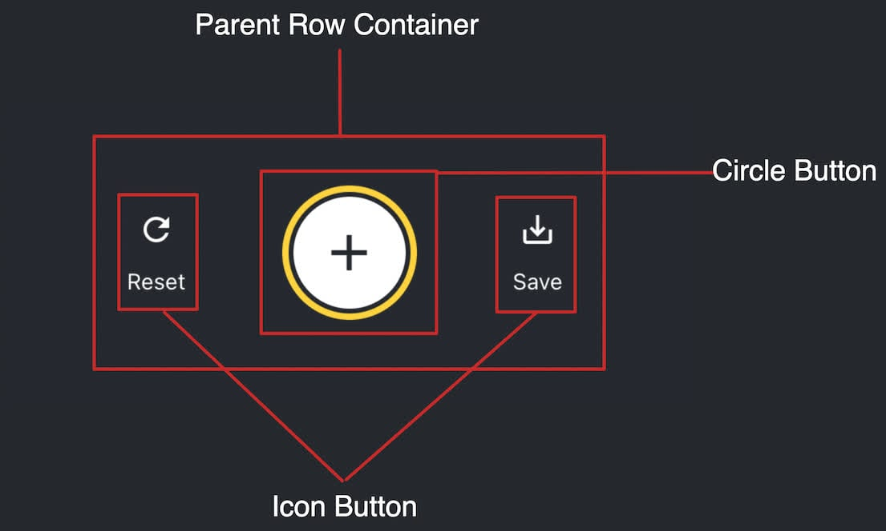

# React Native

- Esta sección del curso está basada en el [tutorial StickerSmash de la documentación de Expo](https://docs.expo.dev/tutorial/introduction/).
- Al completarlo nos va a dar una mejor idea de como utilizar algunas funcionalidades de `Expo` y `React Native`.
- Todas las imágenes y videos que vas a ver son propiedad de Expo (por las dudas).

## StickerSmash - Tutorial: Using React Native and Expo

- Estamos a punto de embarcarnos en un viaje donde construiremos una aplicacion universales.
- En este tutorial, vamos a crear una aplicación Expo que se ejecuta en `Android, iOS y web`; todo con el mismo código.

### Sobre el tutorial de React Native y Expo

- El objetivo de este tutorial es tener un conocimiento básico de Expo y familiarizarse con el SDK.
- Cubre los siguientes temas:
  - Crear una aplicación utilizando el template por defecto con TypeScript habilitado.
  - Implementar un diseño de tabs en dos pantallas utilizando [Expo Router](https://docs.expo.dev/router/introduction).
  - Descomponer el diseño de la aplicación e implementarlo con flexbox.
  - Utilizar la IU del sistema de cada plataforma para seleccionar una imagen de la biblioteca multimedia.
  - Crear un modal de stickers utilizando los componentes <Modal> y <FlatList> de React Native.
  - Añadir gesture táctiles para interactuar con un sticker.
  - Utilizar módulos de terceros para capturar una pantalla y guardarla en el disco.
  - Manejar las diferencias entre Android, iOS y Web.
  - Por último, pasar por el proceso de configuración de una barra de estado, una pantalla de bienvenida, y un icono para completar la aplicación.
- Estos temas proporcionan una base para aprender los fundamentos creando una aplicación Expo.
- Este tutorial está dividido en nueve capítulos.
- Cada capítulo contiene el código necesarios para completar los pasos, así que puedes seguirlo creando una aplicación desde cero.
- Antes de empezar, echa un vistazo a lo que vamos a construir. Es una aplicación llamada [StickerSmash que funciona en Android, iOS y la web](https://docs.expo.dev/static/videos/tutorial/final.mp4)

### Crear la app

- Usamos `create-expo-app` para crear una nueva Expo app con el nombre `StickerSmash`

```bash
npx create-expo-app@latest StickerSmash && cd StickerSmash
```

- Este template tiene el código esencial y las librerías necesarias para construir nuestra aplicación, incluyendo Expo Router.
- Ventajas de utilizar el template por defecto:
  - Crea un nuevo proyecto React Native con el paquete expo instalado.
  - Incluye herramientas recomendadas como Expo CLI.
  - Incluye un navegador de Tabs de Expo Router.
  - Configurado automáticamente para ejecutar un proyecto en múltiples plataformas: `Android, iOS y web`.
  - TypeScript viene configurado por defecto.
- También necesitamos resetear el proyecto para sacar todo el código inicial que agrega Expo como demo.

```bash
npm run reset-project
```

- [Descarga los assets](../assets/react-native/sticker-smash-assets.zip) iniciales que vamos a utilizar a lo largo del tutorial.
- Una vez descargado el archivo tenes que descomprimirlo y reemplazar los archivos en el directorio que utiliza Expo por defecto `/assets/images`.

#### Correr el proyecto en dispositibos móbiles y web

- En el directorio del proyecto, ejecuta el siguiente comando para iniciar el servidor de desarrollo desde el terminal

```bash
npx expo start
```

- Después de ejecutar el comando se iniciará el servidor de desarrollo y verás un código QR dentro de la terminal.
- Escaneá ese código QR para abrir la aplicación en el dispositivo.
  - En Android, utiliza la opción `Expo Go > Escanear código QR`.
  - En iOS, utiliza la aplicación de cámara predeterminada.
  - Para ejecutar la aplicación Web, pulsa `w` en el terminal. Se abrirá la aplicación web en el navegador web predeterminado.
- Una vez ejecutada en todas las plataformas, la aplicación se debería ver así:


#### Editar la pantalla de index

- El archivo `app/index.tsx` define el texto que se muestra en la pantalla de la app.
- Es el `punto de entrada de nuestra app` y se ejecuta cuando se inicia el servidor de desarrollo.
- Utiliza componentes de React Native como <View> y <Text> para mostrar el fondo y el texto.
- Los estilos aplicados a estos componentes utilizan objetos JavaScript en lugar de CSS, que se utiliza en la web. Sin embargo, muchas de las propiedades te resultarán familiares si ya has usado CSS en web.
- La mayoría de los componentes de React Native aceptan una propiedad de estilo que acepta un objeto JavaScript como valor.
- Vamos a modificar la pantalla `app/index.tsx`:

  - Importar `StyleSheet` de react-native y crear un objeto styles para definir nuestros estilos personalizados.
  - Durante este tutorial si decimos que agregamos un estilo tipo `styles.container.backgroundColor` significa que vamos a crear una variable con el nombre `styles` y le vamos a crear una propiedad con el nombre `container` y le asignamos la propiedad `backgroundColor` con el valor que describa. Esto luego se utiliza en el componente como `<Componente style={styles.container}>`.
  - Agregamos una propiedad `styles.container.backgroundColor` a <View> con el valor `#25292e`. Esto cambia el color de fondo.
  - Cambiá el valor por defecto de <Text> por `Home screen`.
  - Agregamos una propiedad `styles.text.color` a <Text> con el valor `#fff` (blanco) para cambiar el color del texto.

```javascript
import { Text, View, StyleSheet } from "react-native";

export default function Index() {
  return (
    <View style={styles.container}>
      <Text style={styles.text}>Home screen</Text>
    </View>
  );
}

const styles = StyleSheet.create({
  container: {
    flex: 1,
    backgroundColor: "#25292e",
    alignItems: "center",
    justifyContent: "center",
  },
  text: {
    color: "#fff",
  },
});
```

- React Native utiliza el mismo formato de color que la web.
- Admite colores hexadecimales, rgba, hsl y colores con nombre, como red, green, blue, peru y papayawhip.Para más información, consulta [Colores en React Native](https://reactnative.dev/docs/colors).
- Estos cambios se reflejan automáticamente en todas las plataformas.


### Agregar navegación

- En este sección vamos a aprender los fundamentos de Expo Router para crear una navegación `Stack` y una barra inferior con dos Tabs.

#### Conceptos básicos de Expo Router

- Expo Router es un framework de navegación basado en archivos para construir aplicaciones Universales (iOS, Android, Web).
- Gestiona la navegación entre pantallas y utiliza los mismos componentes en múltiples plataformas.
- Para empezar, necesitamos conocer las siguientes convenciones:
  - `Directorio app`: Es un directorio especial que contiene sólo rutas (Pantallas) y sus diseños. Cualquier archivo añadido a este directorio se convierte en una pantalla dentro de nuestra app nativa y en una página en la web.
  - `Layout raíz`: El archivo `app/_layout.tsx`. define los elementos compartidos de la UI, como los headers y los Tabs, para que sean coherentes entre las distintas rutas.
  - `Convención de nombres de archivo`: Los nombres de archivos de `index`, como `index.tsx`, coinciden con su directorio principal y no añaden un segmento de ruta.
    - Por ejemplo, si tenemos `app/index.tsx` expo router toma indes como raiz de la ruta como en web sería `/`.
    - Si tenemos una carpeta `app/usuario/index.ts` esta ruta se transforma en `usuario/` ya que index es la raíz de esta carpeta y es la pantalla principal.
  - `Rutas`: Un archivo de ruta exporta un componente React como valor predeterminado. Puede utilizar la extensión .js, .jsx, .ts o .tsx.
  - Android, iOS y la web comparten una estructura de navegación unificada.

#### Agregar una nueva pantalla Stack

- Vamos a crear un nuevo archivo nuevo llamado `about.tsx` dentro de la carpeta `app`. Muestra el nombre de la pantalla cuando el usuario navega a la ruta `/about`.

```javascript
// app/about.tsx
import { Text, View, StyleSheet } from "react-native";

export default function AboutScreen() {
  return (
    <View style={styles.container}>
      <Text style={styles.text}>About screen</Text>
    </View>
  );
}

const styles = StyleSheet.create({
  container: {
    flex: 1,
    backgroundColor: "#25292e",
    justifyContent: "center",
    alignItems: "center",
  },
  text: {
    color: "#fff",
  },
});
```

- Expo router puede detectar que hay un archivo nuevo dentro de `app` y con eso sabe que hay una ruta nueva.
- Igual vamos a modificar el archivo `app/_layout.tsx` para establecer con un componente que hay una nueva ruta.
- Cuando apenas creamos la aplicación expo en su template tiene que `_layout.tsx` sólo tiene un componente `<Stack/>`.
- Ahora tenemos que agregar la definición para `index` y para `about`.
- Hacer los siguientes cambios en el archivo `_layout.tsx`:
  - Vamos a agregar dentro de `<Stack> </Stack>` dos nuevos componentes que son del tipo `<Stack.Screen />`.
  - Este componente tiene una propiedad `name` que acepta un string con el nombre de la ruta. En este caso es el mismo que los archivos `index y about`.
  - Agregamos a cada componente una propiedad `options` que acepta como valor un objeto de configuración.
  - El objeto de configuración tiene una propiedad `title` que acepta un string para definit el título de cada pantalla en lugar de mostrar el nombre del archivo.
  - Establecemos a cada componente su título utilizando `options={{title: ''}}` y asignando el valor `Home` para la ruta index y `About` para `about`.

```javascript
import { Stack } from "expo-router";

export default function RootLayout() {
  return (
    <Stack>
      <Stack.Screen name="index" options={{ title: "Home" }} />
      <Stack.Screen name="about" options={{ title: "About" }} />
    </Stack>
  );
}
```

- `¿Qué es Stack?` Es un tipo de navegación para navegar entre las diferentes pantallas de una app.
- En Android, una ruta Stack tiene una animación en la parte superior de la pantalla actual.
- En iOS, una ruta Stack tiene una animación de derecha hacia izquierda.
- Expo Router proporciona un componente Stack para crear una pila de navegación para añadir nuevas rutas.

#### Navegar entre pantallas

- Para navegar de una pantalla a otra podemos utilizar el componente `Link` de Expo router.
- De esta manera podemos navegar desde `index` a `about`.
- `Link` es un componente React que renderiza un <Text> con un propiedad `href` con el valor de la pantalla o ruta a la que queremos navegar.
- Importamos el componente `Link` de `expo-router` dentro de archivo `index.tsx`.
- Agrega un componente `Link` después del componente `<Text>` y le pasamos como propiedad href el valor `/about`.
- Agregamos el siguiente estilo al componente `Link`.

```javascript
 button: {
  fontSize: 20,
  textDecorationLine: 'underline',
  color: '#fff',
},
```

- El componente debe quedar de la siguiente manera:

```javascript
import { Text, View, StyleSheet } from "react-native";
import { Link } from "expo-router";

export default function Index() {
  return (
    <View style={styles.container}>
      <Text style={styles.text}>Home screen</Text>
      <Link href="/about" style={styles.button}>
        Go to About screen
      </Link>
    </View>
  );
}

const styles = StyleSheet.create({
  container: {
    flex: 1,
    backgroundColor: "#25292e",
    alignItems: "center",
    justifyContent: "center",
  },
  text: {
    color: "#fff",
  },
  button: {
    fontSize: 20,
    textDecorationLine: "underline",
    color: "#fff",
  },
});
```

- Para que la navegación funcione por ahí tenes que recargar el servidor Metro que es lo que está corriendo cuando ejecutamos `npx expo`. Puede presionar `r`.
- Presiona en el componente Link para navegar a la pantalla `/about`.

#### Agregar Ruta no encontrada

- En una app mobile es poco común que un usuario trate de navegar a una pantalla que no existe en la aplicación.
- Dado que Expo y Expo router soportan aplicaciones universales que incluyen a Web podemos crear un documento en caso de que el usuario quiera navegar a una ruta que no existe.
- Expo router utiliza el conecpto de `+not-found.tsx` que es un documento que se va a mostrar cuando la pantalla / ruta no exista.
  Expo Router utiliza un archivo especial +not-found.tsx para gestionar este caso.
- Crear un nuevo archivo `+not-found.tsx` dentro del directorio `app` y creamos un componente `NotFoundScreen`.
- Agregamos como parte del contenid un componente `Stack.Screen` con la propiedad options con el valor `{ title: 'OOpss} Not FOund`.
- Podemos agregar un componente `Link` para que el usuario pueda navegar a la pantalla `Home`.

```javascript
// app/+not-found.tsx
import { View, StyleSheet } from "react-native";
import { Link, Stack } from "expo-router";

export default function NotFoundScreen() {
  return (
    <>
      <Stack.Screen options={{ title: "Oops! Not Found" }} />
      <View style={styles.container}>
        <Link href="/" style={styles.button}>
          Go back to Home screen!
        </Link>
      </View>
    </>
  );
}

const styles = StyleSheet.create({
  container: {
    flex: 1,
    backgroundColor: "#25292e",
    justifyContent: "center",
    alignItems: "center",
  },

  button: {
    fontSize: 20,
    textDecorationLine: "underline",
    color: "#fff",
  },
});
```

- En este componente vemos como podemos utilizar `Stack.Screen` aún dentro de un componente para configurar o sobrescribir las propiedades de la pantalla. Acá estamos sobrescribiendo la propiedad `title` para mostrar otro título.
- Para probar esto lo más fácil es abrir la app en el navegador (browser) y traar de ir a una URL que no existe como: `http:localhost:8081/123`.
- La aplicación debería mostrar el componente `NotFoundScreen`.

### Agregar tabs

- En este estado, la estructura de archivos de nuestra aplicación tiene el siguiente aspecto:

```bash
/app
  |_ _layout.tsx # Root layout
  |_ index.tsx # Coincide con la ruta '/'
  |_ about.tsx # Coincide con la ruta '/about'
  |_ +not-found.tsx # Coincide con cualquier ruta que de 404
```

- Ahora vamos a agregar un sistema de navegación utilizando `Tabs` que es una barra inferior de nuestra app que permite a los usuarios presionar un botón con un icon y navegar a otra pantalla.
- Este es un patrón de navegación bastante utilizado en aplicaciones mobile.
- También vamos a seguir utilizando el sistema de navegación `Stack` para la ruta no encontrada (404).
- Dentro del directorio `app`, agregamos un subdirectorio con el nombre `(tabs)`.
- Este directorio es especial y utiliza para agrupar/mostrar rutas en un formato de barra de navegación `Tabs`.
- Creamos un archivo dentro del directorio `(tabs)` con el nombre de `_layout.tsx`.
- Este archivo se utiliza para definir el diseño de los Tabs, que es independiente del diseño de la raíz principal (`Stack`).
- Mové los archivos `index.tsx` y `about.tsx` existentes dentro del directorio `(tabs)`.
- La estructura del directorio de la aplicación será la siguiente:

```bash
/app
  |_ _layout.tsx # Root layout
  |_ +not-found.tsx # Coincide con cualquier ruta que de 404
  (tabs)
    |_ _layout.tsx # Tab layout
    |_ index.tsx # Coincide con la ruta '/'
    |_ about.tsx # Coincide con la ruta '/about'
```

- Actualizamos el archivo `_layout.tsx` principal para añadir una ruta utilizando Tabs.

```javascript
// app/_layout.tsx
import { Stack } from "expo-router";

export default function RootLayout() {
  return (
    <Stack>
      <Stack.Screen name="(tabs)" options={{ headerShown: false }} />
      <Stack.Screen name="+not-found" />
    </Stack>
  );
}
```

- En este layout estamos especificando que hay unas rutas que utilizan `Tabs` y luego el archivo `+not-found` para las rutas que no existen en la app.
- Ahora vamos a crear el contenido del documento `app/(tabs)/_layout.tsx` para establecer cuales son las rutas que se van a mostrar en los Tabs.

```javascript
// app/(tabs)/_layout.tsx
import { Tabs } from "expo-router";

export default function TabLayout() {
  return (
    <Tabs>
      <Tabs.Screen name="index" options={{ title: "Home" }} />
      <Tabs.Screen name="about" options={{ title: "About" }} />
    </Tabs>
  );
}
```

- Reiniciamos el servidor Metro para ver el cambio realizado.
- Ahora la app debería mostrar el contenido de la pantalla `index o Home` y en la parte inferior de la pantalla 2 Tabs con el texto `Index` y `About`.
- Al presionar los `Tabs` deberían navegar a la pantalla seleccionada.
- Y así como si nada.. tenemos un sistema de navegación con Tabs.
- Expo router nos permite establecer como queremos que se vean los Tabs y sus iconos.

#### Actualizar como se ven los Tabs

- En este momento los Tabs tienen un diseño que se ve igual para todas las plataformas pero no tiene nada que ver con el diseño de nuestra app.
- Por ejemplo, la barra de Tabs o la cabecera no muestran un icono personalizado, y el color de fondo de la pestaña inferior no coincide con el color de fondo de la aplicación. Vamos a cambiarlo!
- Vamos a modificar el archivo `(tabs)/_layout.tsx` para agregar iconos a la barra de Tabs.

```javascript
import { Tabs } from "expo-router";

import Ionicons from "@expo/vector-icons/Ionicons";

export default function TabLayout() {
  return (
    <Tabs
      screenOptions={{
        tabBarActiveTintColor: "#ffd33d",
      }}
    >
      <Tabs.Screen
        name="index"
        options={{
          title: "Home",
          tabBarIcon: ({ color, focused }) => (
            <Ionicons
              name={focused ? "home-sharp" : "home-outline"}
              color={color}
              size={24}
            />
          ),
        }}
      />
      <Tabs.Screen
        name="about"
        options={{
          title: "About",
          tabBarIcon: ({ color, focused }) => (
            <Ionicons
              name={
                focused ? "information-circle" : "information-circle-outline"
              }
              color={color}
              size={24}
            />
          ),
        }}
      />
    </Tabs>
  );
}
```

- Primero tenemos que importar los iconos que queremos utilizar, en este caso vamos a usar `Ionicons` de `'@expo/vector-icons/Ionicons`.
- Luego podemos agregar la propiedad `screenOptions` del componente `Tabs` y pasarle el valor `{ tabBarActiveTintColor: '#ffd33d' }` para establecer el color del Tab que está activo.
- Para mostrar el icono debemos utilizar la propiedad `tabBarIcon` de los componentes `Tabs.Screen`. Esta propiedad acepta una función como valor que debe retornar el icono que queremos utilizar.
- La función que pasamos como valor recibe 2 parámetros `color y focused` para saber si el tab tiene que tener un color y también si es el Tab que está activo.

```javascript
tabBarIcon: ({ color, focused }) => (
  <Ionicons name={focused ? 'home-sharp' : 'home-outline'} color={color} size={24} />
),
```

- En este ejemplo vemos como podemos utilizar `focused` para saber si el Tab está activo o no para mostrar un icono con color de fondo lleno o sólo lineas.
- Le pasamos el color obtenido al icono para que se muestre de ese color y también podemos establecer el tamaño por medio la propiedad size.
- Agregamos los iconos `'home-sharp' y 'home-outline'` al componente `Tab.Screen` de la pantalla `index`.
- Agregamos los iconos `'information-circle' : 'information-circle-outline'` al componente `Tab.Screen` de la pantalla `about`.

```javascript
import { Tabs } from "expo-router";

import Ionicons from "@expo/vector-icons/Ionicons";

export default function TabLayout() {
  return (
    <Tabs
      screenOptions={{
        tabBarActiveTintColor: "#ffd33d",
      }}
    >
      <Tabs.Screen
        name="index"
        options={{
          title: "Home",
          tabBarIcon: ({ color, focused }) => (
            <Ionicons
              name={focused ? "home-sharp" : "home-outline"}
              color={color}
              size={24}
            />
          ),
        }}
      />
      <Tabs.Screen
        name="about"
        options={{
          title: "About",
          tabBarIcon: ({ color, focused }) => (
            <Ionicons
              name={
                focused ? "information-circle" : "information-circle-outline"
              }
              color={color}
              size={24}
            />
          ),
        }}
      />
    </Tabs>
  );
}
```

- Al hacer este cambio vemos iconos en nuestros Tabs y también utilizan un color más acorde al diseño de la app.
- También podemos customizar más opciones de la Barra de Tabs de la siguiente manera.

```javascript
<Tabs
  screenOptions={{
    tabBarActiveTintColor: '#ffd33d',
    headerStyle: {
      backgroundColor: '#25292e',
    },
    headerShadowVisible: false,
    headerTintColor: '#fff',
    tabBarStyle: {
    backgroundColor: '#25292e',
    },
  }}
>
```

- `tabBarActiveTintColor: "#ffd33d"`: establece el color activo de los tabs.
- `headerShadowVisible: false`: saca la sombra que utiliza el `header` para diferenciarse del contenido.
- `headerTintColor: "#fff"`: nos permite establecer el color de texto del header. En este caso usa el color blanco.
- `tabBarStyle`: acepta un objeto para configurar los estilos de los Tabs. En este caso estamos utilizando `{ backgroundColor: "#25292e" }` para cambiar el color de fondo.
- `headerStyle`: acepta un objeto para configurar el `header`. ` { backgroundColor: "#25292e" }` En este caso también le asigna un color para establecer el color de fondo.
- Con todos estos cambios nuestra aplicación empieza a tener un diseño propio y toda la pantalla quedó unificada aún si sigue manteniendo el header y la barra de navegación inferior con los Tabs.
- Hasta acá le agregamos un sistema de navegación `Stack` y otro `Tabs` a nuestra aplicación.

### Creando la primer pantalla

- En esta sección vamos a crear la primer pantalla de la aplicación.


- Esta pantalla muestra una imagen y dos botones.
- El usuario puede seleccionar una imagen utilizando uno de los dos botones.
- El primer botón permite al usuario seleccionar una imagen de su dispositivo.
- El segundo botón permite al usuario continuar con una imagen predeterminada proporcionada por la aplicación.

#### Analizando la pantalla

- Antes de escribir código, vamos a desglosarl algunos elementos esenciales.
- Hay dos elementos esenciales:
  - Una gran imagen en el centro de la pantalla.
  - Dos botones en la mitad inferior de la pantalla.
- El primer botón contiene varios componentes. Tiene un borde amarillo, con un icono y un componente de texto dentro de una fila.
- Ahora que dividimos la UI en partes más pequeñas, estamos listos para empezar a programar.

#### Mostrar la imagen

- En este tutorial vamos a usar el módulo `expo-image` para mostrar imagenes.
- Este módulo proporciona un componente `<Image>` multiplataforma para cargar y renderizar una imagen.
- Para poder utilizarlo debemos instalar el módulo `expo-image`.
- Si está corriendo `Metro` debemos primero frenar el server con `Ctrl + c` y luego ejecutar:

```bash
$ npx expo install expo-image
```

- Este comando instala la librería y la añadirá a las dependencias del proyecto en package.json.
- Al utilizar `expo` para instalar el módulo nos ayuda detectando la versión de Expo que utilizamos y se encarga de instalar la versión del módulo correspondiente.
- El componente `Imagen` acepta como propiedad `source` la ruta a la imagen que queremos mostrar.
- La fuente puede ser un asset o una URL.
- Por ejemplo, los assets dentro del directorio assets/images son estáticos.
- También podemos obtener una imágen de la red utilizando el valor uri.
- Utilizamos el componente `Image` en el archivo `app/(tabs)/index.tsx` de la siguiente manera:
  - Importamos `Image` del módulo `expo-image`.
  - Creamos una variable `PlaceholderImage` para utilizar el archivo `assets/images/background-image.png` como propiedad de origen en el componente Image.

```javascript
// app/(tabs)/index.tsx
import { View, StyleSheet } from "react-native";
import { Image } from "expo-image";

const PlaceholderImage = require("@/assets/images/background-image.png");

export default function Index() {
  return (
    <View style={styles.container}>
      <View style={styles.imageContainer}>
        <Image source={PlaceholderImage} style={styles.image} />
      </View>
    </View>
  );
}

const styles = StyleSheet.create({
  container: {
    flex: 1,
    backgroundColor: "#25292e",
    alignItems: "center",
  },
  imageContainer: {
    flex: 1,
  },
  image: {
    width: 320,
    height: 440,
    borderRadius: 18,
  },
});
```

- Si agregamos los assets iniciales a la carpeta `/assets/images/` podemos ver la ímagen que agregamos en el centro de la pantalla.
- Al agregar la imágen también agregamos nuevos estilos.
- Utilizamos `width y height` para establecer el ancho y alto de la imagen y un `borderRadius` para redondear los bordes.
- La imágen tiene un `View` con la propiedad `flex:1` para tomar todo el espacio disponible.
- El contenedor principal `container` centra el contenido con `alignItems: 'center'`.
- La variable `PlaceholderImage` está importando una imágen de la carpeta assets/images para mostrar por defecto cuando el usuario todavía no seleccionó ninguna imágen.

#### Dividiendo la aplicación en componentes

- Vamos a dividir el código en varios archivos a medida que añadimos más componentes a esta pantalla.
- A lo largo de este tutorial, utilizaremos el directorio `components` para crear componentes personalizados.
- Crea una carpeta con el nombre `componentes` al nivel de `app` y un archivo con el nombre `ImageViewer.tsx`.
- Mové el código para mostrar la imagen en este archivo junto con los estilos de la imagen.

```javascript
// components/ImageViewer.tsx
import { StyleSheet } from "react-native";
import { Image, type ImageSource } from "expo-image";

type Props = {
  imgSource: ImageSource,
};

export default function ImageViewer({ imgSource }: Props) {
  return <Image source={imgSource} style={styles.image} />;
}

const styles = StyleSheet.create({
  image: {
    width: 320,
    height: 440,
    borderRadius: 18,
  },
});
```

- Dado que `ImageViewer` es un componente personalizado, lo colocamos en un directorio separado en lugar del directorio `app`.
- Cada archivo dentro del directorio `app` es un archivo de layout o un archivo de ruta.
- En este componente estamos utilizando TypeScript para definir que este compomente acepta una propiedad que se llama `imgSource` y que es del tipo `ImageSource` que podemos importar de `expo-image`.
- También estamos creando un tipo de dato `Props` utilizando `type`.
- Ahora tenemos que importar `ImageViewer` y úsalo en `app/(tabs)/index.tsx`.

```javascript
// app/(tabs)/index.tsx
import { StyleSheet, View } from "react-native";

import ImageViewer from "@/components/ImageViewer";

const PlaceholderImage = require("@/assets/images/background-image.png");

export default function Index() {
  return (
    <View style={styles.container}>
      <View style={styles.imageContainer}>
        <ImageViewer imgSource={PlaceholderImage} />
      </View>
    </View>
  );
}

const styles = StyleSheet.create({
  container: {
    flex: 1,
    backgroundColor: "#25292e",
    alignItems: "center",
  },
  imageContainer: {
    flex: 1,
  },
});
```

- `¿Qué significa @ en la sentencia import?`: El símbolo `@` es un `alias` de ruta personalizado para importar componentes personalizados y otros módulos en lugar de rutas relativas. Expo CLI lo configura automáticamente en `tsconfig.json`. (Es un alias de TS)

#### Crear botones usando Pressable

- React Native tiene diferentes maneras de manejar los eventos táctiles pero se recomienda utilizar `Pressable` por su flexibilidad.
- Puede detectar toques simples, pulsaciones largas, desencadenar eventos separados cuando el botón se presiona y se suelta, y más.
- En el diseño, hay dos botones que tenemos que crear.
- Cada uno tiene un estilo y una etiqueta diferentes.
- Vamos a empezar por crear un componente reutilizable para estos botones.
- Cree un archivo `Button.tsx` dentro del directorio `components` con el siguiente código:

```javascript
// components/Button.tsx
import { StyleSheet, View, Pressable, Text } from "react-native";

type Props = {
  label: string,
};

export default function Button({ label }: Props) {
  return (
    <View style={styles.buttonContainer}>
      <Pressable
        style={styles.button}
        onPress={() => alert("You pressed a button.")}
      >
        <Text style={styles.buttonLabel}>{label}</Text>
      </Pressable>
    </View>
  );
}

const styles = StyleSheet.create({
  buttonContainer: {
    width: 320,
    height: 68,
    marginHorizontal: 20,
    alignItems: "center",
    justifyContent: "center",
    padding: 3,
  },
  button: {
    borderRadius: 10,
    width: "100%",
    height: "100%",
    alignItems: "center",
    justifyContent: "center",
    flexDirection: "row",
  },
  buttonLabel: {
    color: "#fff",
    fontSize: 16,
  },
});
```

- Este componente utiliza una función para manejar el evento `onPress` y mostrar un mensaje en pantalla.
- Luego aplicamos algunos estilos al botón que ya conocemos.
- La aplicación muestra una alerta cuando el usuario pulsa cualquiera de los botones de la pantalla.
- Esto sucede porque `Pressable` llama a `alert()` en su propiedad `onPress`.
- Vamos a importar este componente en el archivo `app/(tabs)/index.tsx` y añadir estilos para la `View` que encapsula estos botones.

```javascript
import { View, StyleSheet } from "react-native";

import Button from "@/components/Button";
import ImageViewer from "@/components/ImageViewer";

const PlaceholderImage = require("@/assets/images/background-image.png");

export default function Index() {
  return (
    <View style={styles.container}>
      <View style={styles.imageContainer}>
        <ImageViewer imgSource={PlaceholderImage} />
      </View>
      <View style={styles.footerContainer}>
        <Button label="Choose a photo" />
        <Button label="Use this photo" />
      </View>
    </View>
  );
}

const styles = StyleSheet.create({
  container: {
    flex: 1,
    backgroundColor: "#25292e",
    alignItems: "center",
  },
  imageContainer: {
    flex: 1,
    paddingTop: 28,
  },
  footerContainer: {
    flex: 1 / 3,
    alignItems: "center",
  },
});
```

- Agregamos dos botones con el texto `Choose a photo` para que el usuario elija una foto y `Use this photo` para utilizar la imagen seleccionada.
- El contenedor de los botones tiene el estilo `footerContainer: { flex: 1 / 3, alignItems: "center" }` que establece que el alto del componente es 1/3 de la pantalla y que los botones tienen que estar centrados.
- Recordá que podes utilizar un color de fondo de este componente para ver el tamaño real que ocupa.
- Es un buen momento para revisar como se ve nuestra app en iOS, Android y también Web.
- Vemos que el segundo botón con la etiqueta `Use this photo` se parece al botón del diseño. Sin embargo, el primer botón necesita más estilo para ajustarse al diseño.

#### Mejorar el botón reutilizable

- El botón `Choose a photo` requiere un estilo diferente al del botón `Use this photo`, por lo que vamos a agregar una nueva propiedad al componente `Button` que nos permitirá aplicar un theme principal.
- Este botón también tiene un icono antes de la etiqueta.
- Vamos a agregar un icono `FontAwesome` del módulo `@expo/vector-icons`.
- Modificamos el componente `Button.tsx`:

```javascript
// components/Button.tsx
import { StyleSheet, View, Pressable, Text } from "react-native";
import FontAwesome from "@expo/vector-icons/FontAwesome";

type Props = {
  label: string,
  theme?: "primary",
};

export default function Button({ label, theme }: Props) {
  if (theme === "primary") {
    return (
      <View
        style={[
          styles.buttonContainer,
          { borderWidth: 4, borderColor: "#ffd33d", borderRadius: 18 },
        ]}
      >
        <Pressable
          style={[styles.button, { backgroundColor: "#fff" }]}
          onPress={() => alert("You pressed a button.")}
        >
          <FontAwesome
            name="picture-o"
            size={18}
            color="#25292e"
            style={styles.buttonIcon}
          />
          <Text style={[styles.buttonLabel, { color: "#25292e" }]}>
            {label}
          </Text>
        </Pressable>
      </View>
    );
  }

  return (
    <View style={styles.buttonContainer}>
      <Pressable
        style={styles.button}
        onPress={() => alert("You pressed a button.")}
      >
        <Text style={styles.buttonLabel}>{label}</Text>
      </Pressable>
    </View>
  );
}

const styles = StyleSheet.create({
  buttonContainer: {
    width: 320,
    height: 68,
    marginHorizontal: 20,
    alignItems: "center",
    justifyContent: "center",
    padding: 3,
  },
  button: {
    borderRadius: 10,
    width: "100%",
    height: "100%",
    alignItems: "center",
    justifyContent: "center",
    flexDirection: "row",
  },
  buttonIcon: {
    paddingRight: 8,
  },
  buttonLabel: {
    color: "#fff",
    fontSize: 16,
  },
});
```

- Agregamos el icono `FontAwesome` que vamos a utilizar.
- Agregamos una propiedad con el nombre `theme` para establecer que tipo de botón queremos utilizar.
- En la definición de tipo de TypeScript establecemos que el theme puede utilizar un valor literal con el valor `primary`.
- Dentro del componente utilizamos el theme para renderizar un botón diferente según si `theme` es `primary` o no.
- Si el theme no es primary entonces el componente sigue retornando el diseño de botón que retornaba anteriormente.
- En cambio si el theme es primary retorna algo diferente:

```javascript
if (theme === "primary") {
  return (
    <View
      style={[
        styles.buttonContainer,
        { borderWidth: 4, borderColor: "#ffd33d", borderRadius: 18 },
      ]}
    >
      <Pressable
        style={[styles.button, { backgroundColor: "#fff" }]}
        onPress={() => alert("You pressed a button.")}
      >
        <FontAwesome
          name="picture-o"
          size={18}
          color="#25292e"
          style={styles.buttonIcon}
        />
        <Text style={[styles.buttonLabel, { color: "#25292e" }]}>{label}</Text>
      </Pressable>
    </View>
  );
}
```

- Ambos botones utilizan el estilo en común definido en `styles.buttonContainer` pero si el theme es primary entonces agrega o sobrescribe algunas propiedades de estilo `{ borderWidth: 4, borderColor: "#ffd33d", borderRadius: 18 }`.
- Este botón utiliza un icono como hijo y también un texto.
- Al tener que utilizar otros estilos en este tutorial vemos como utilizando `style={[]}` podemos pasar un array de estilos.
- El primer estilo que pasamos es el `'base'` que luego podemos modificar en el segundo estilo. Ejemplo `style={[ {color: 'white'}, {color: 'blue'} ]}`.
- React Native crea un estilo con toda esta definición y se aplicará el resultado de hacer un merge entre todos los objetos. En caso de existir propiedades en común entre los objetos, RN va a utilizar las últimas propiedades.
- Usar estilo en la propiedad `style` se conoce como `inline style`.
- Ahora, modificamos el archivo `app/(tabs)/index.tsx` para utilizar la propiedad `theme="primary"` en el primer botón.

```javascript
<View style={styles.footerContainer}>
  <Button label="Choose a photo" theme="primary" />
  <Button label="Use this photo" />
</View>
```

- Excelente, la pantalla nos va quedando como estaba definido en el diseño inicial.
- Al presionar cualquiera de los botones se muestra una alerta con un mensaje.
- Esta pantalla se puede ver bien en iOS, Android y Web.

### Usar un selector de imágenes

- React Native proporciona componentes como `<View>, <Text> y <Pressable>`.
- Estamos construyendo una feature para seleccionar una imagen de la galería multimedia del dispositivo.
- Esto no es posible con los componentes básicos de React Native y necesitaremos un módulo para añadir esta funcinalidad en nuestra aplicación.
- Vamos a utiliza `expo-image-picker`, un módulo de Expo SDK.
- `expo-image-picker` proporciona acceso a la UI del sistema operativo para seleccionar imágenes y vídeos de la biblioteca del dispositivo.

#### Instalar expo-image-picker

- Para instalar este módulo ejecutamos el siguiente comando:

```bash
$ npx expo install expo-image-picker
```

- `Consejo`: Cada vez que instalemos una nueva librería en nuestro proyecto, es conveniente detener el servidor de desarrollo pulsando `Ctrl + c` en la terminal y a continuación ejecutemos el comando de instalación.
- Una vez finalizada la instalación, podemos volver a iniciar el servidor de desarrollo ejecutando `npx expo` desde la misma ventana de terminal.

#### Elige una imagen de la biblioteca multimedia del dispositivo

- `expo-image-picker` proporciona el método `launchImageLibraryAsync()` para mostrar la interfaz de usuario del sistema seleccionando una imagen o un vídeo de la biblioteca multimedia del dispositivo.
- Utilizaremos el botón principal para seleccionar una imagen de la biblioteca multimedia del dispositivo. Para ello vamos a crear una función para abrir la biblioteca de imágenes del dispositivo.
- En `app/(tabs)/index.tsx`, importamos la biblioteca `expo-image-picker` y creamos una función con el nombre `pickImageAsync` dentro del componente Index.

```javascript
// ...Los imports anteriores siguen igual.
import * as ImagePicker from "expo-image-picker";

export default function Index() {
  const pickImageAsync = async () => {
    let result = await ImagePicker.launchImageLibraryAsync({
      mediaTypes: ["images"],
      allowsEditing: true,
      quality: 1,
    });

    if (!result.canceled) {
      console.log(result);
    } else {
      alert("You did not select any image.");
    }
  };

  // ...El resto del código sige igual.
}
```

- En `import * as ImagePicker from "expo-image-picker"` importamos todo el código que exporta el módulo para poder utilizar el ImagePicker. `*` es la forma de especificar que queremos todo del módulo y luego con `as ImagePicker` lo renombramos.
- Definimos la función `const pickImageAsync = async ()` utilizando async ya que vamos a utilizar la función `.launchImageLibraryAsync` que retorna una promise.

```javascript
let result = await ImagePicker.launchImageLibraryAsync({
  mediaTypes: ["images"],
  allowsEditing: true,
  quality: 1,
});
```

- Usamos `await` para esperar que ImagePicker abra el selector de imágenes.
- Le pasamos un objeto como parámetro con opcones para que muestre imágenes, que se pueda editar.
- Cuando `allowsEditing` es `true` le permite al usuario cropear la imagen durante la selección ya sea en Android o iOS.

```javascript
if (!result.canceled) {
  console.log(result);
} else {
  alert("You did not select any image.");
}
```

- Luego validamos si el resultado no es `cancelado` mostramos un mensaje en consola con el resultado.
- Si el resultado fue cancelado mostramos un mensaje de que ningúna imagen fue seleccionada.

#### Actualizar el compponente Button

- Al presionar el botón primario, llamamos a la función `pickImageAsync()` del componente Button.
- Actualizamos la propiedad `onPress` del componente Button en `components/Button.tsx`.

```javascript
import { StyleSheet, View, Pressable, Text } from "react-native";
import FontAwesome from "@expo/vector-icons/FontAwesome";

type Props = {
  label: string,
  theme?: "primary",
  onPress?: () => void,
};

export default function Button({ label, theme, onPress }: Props) {
  if (theme === "primary") {
    return (
      <View
        style={[
          styles.buttonContainer,
          { borderWidth: 4, borderColor: "#ffd33d", borderRadius: 18 },
        ]}
      >
        <Pressable
          style={[styles.button, { backgroundColor: "#fff" }]}
          onPress={onPress}
        >
          <FontAwesome
            name="picture-o"
            size={18}
            color="#25292e"
            style={styles.buttonIcon}
          />
          <Text style={[styles.buttonLabel, { color: "#25292e" }]}>
            {label}
          </Text>
        </Pressable>
      </View>
    );
  }

  return (
    <View style={styles.buttonContainer}>
      <Pressable
        style={styles.button}
        onPress={() => alert("You pressed a button.")}
      >
        <Text style={styles.buttonLabel}>{label}</Text>
      </Pressable>
    </View>
  );
}

const styles = StyleSheet.create({
  buttonContainer: {
    width: 320,
    height: 68,
    marginHorizontal: 20,
    alignItems: "center",
    justifyContent: "center",
    padding: 3,
  },
  button: {
    borderRadius: 10,
    width: "100%",
    height: "100%",
    alignItems: "center",
    justifyContent: "center",
    flexDirection: "row",
  },
  buttonIcon: {
    paddingRight: 8,
  },
  buttonLabel: {
    color: "#fff",
    fontSize: 16,
  },
});
```

- En `app/(tabs)/index.tsx`, utilizamos la función `pickImageAsync` como valor de la propiedad `onPress` del primer `Button`.

```javascript
<Button theme="primary" label="Choose a photo" onPress={pickImageAsync} />
```

- La función `pickImageAsync` invoca a `ImagePicker.launchImageLibraryAsync()` y luego maneja el resultado.
- El método `launchImageLibraryAsync()` retorna un objeto que contiene información sobre la imagen seleccionada.
- Los propiedades del objeto cambian según el dispositivo o si es web.

#### Utilizar la imágen seleccionada

- El objeto `result` nos da un array de `assets`, que contiene la `uri` de la imagen seleccionada.
- Tomemos este valor del selector de imágenes y lo utilizamos para mostrar la imagen seleccionada en la app.
- Modificamos el componente `app/(tabs)/index.tsx` de la siguiente manera.
- Agregamos `import { useState } from 'react';` para utilizar `useState`.
- Creamos una nueva variable de estado con el nombre `selectedImage` de la siguiente manera: `  const [selectedImage, setSelectedImage] = useState<string | undefined>(undefined);`.
- Si el usuario no cancela la selección entonces podemos establecer la imágen seleccionada en el estado del componente: ` setSelectedImage(result.assets[0].uri);`.
- Finalmente podemos utilizar la `uri` de la image seleccionada para mostrar localmente la imágen: `<ImageViewer imgSource={PlaceholderImage} selectedImage={selectedImage} />`.
- Con todos estos cambios el componente nos queda de la siguiente forma:

```javascript
// app/(tabs)/index.tsx
import { View, StyleSheet } from "react-native";
import * as ImagePicker from "expo-image-picker";

// Importamos `useState`
import { useState } from "react";

import Button from "@/components/Button";
import ImageViewer from "@/components/ImageViewer";

const PlaceholderImage = require("@/assets/images/background-image.png");

export default function Index() {
  // Creamos la variable de estado
  const [selectedImage, setSelectedImage] =
    (useState < string) | (undefined > undefined);

  const pickImageAsync = async () => {
    let result = await ImagePicker.launchImageLibraryAsync({
      mediaTypes: ["images"],
      allowsEditing: true,
      quality: 1,
    });

    if (!result.canceled) {
      // Seleccionamos y guardamos en estado la imagen seleccionada.
      setSelectedImage(result.assets[0].uri);
    } else {
      alert("You did not select any image.");
    }
  };

  return (
    <View style={styles.container}>
      <View style={styles.imageContainer}>
        {
          // Utilizamos la imágen seleccionada.
        }
        <ImageViewer
          imgSource={PlaceholderImage}
          selectedImage={selectedImage}
        />
      </View>
      <View style={styles.footerContainer}>
        <Button
          theme="primary"
          label="Choose a photo"
          onPress={pickImageAsync}
        />
        <Button label="Use this photo" />
      </View>
    </View>
  );
}

const styles = StyleSheet.create({
  container: {
    flex: 1,
    backgroundColor: "#25292e",
    alignItems: "center",
  },
  imageContainer: {
    flex: 1,
  },
  footerContainer: {
    flex: 1 / 3,
    alignItems: "center",
  },
});
```

- Para poder mostrar la imágen todavía tenemos que pasar la propiedad `selectedImage` al componente `ImageViewer`.
- Modificamos el archivo `components/ImageViewer.tsx` para que acepte la propiedad `selectedImage`.
- El código de la imágen se está haciendo largo por lo cual podemos moverlo también a una variable separada llamada `imageSource`.
- Pasamos `imageSource` como el valor de la propiedad `source` en el componente Image.

```javascript
import { StyleSheet } from "react-native";
import { Image, type ImageSource } from "expo-image";

type Props = {
  imgSource: ImageSource,
  // Agregamos la propiedad selectedImage al componente ImageViewer
  selectedImage?: string,
};

// Agregamos selectedImage como propiedad del componente.
export default function ImageViewer({ imgSource, selectedImage }: Props) {
  // Si el componente recibe una imágen seleccionada entonces utiliza un objeto con la propiedad uri. Sino usa la propiedad imgSource.
  const imageSource = selectedImage ? { uri: selectedImage } : imgSource;

  // Ahora que tenemos el valor en una variable lo podemos utilizar como imageSource.
  return <Image source={imageSource} style={styles.image} />;
}

const styles = StyleSheet.create({
  image: {
    width: 320,
    height: 440,
    borderRadius: 18,
  },
});
```

- En el componente utiliza un operador condicional para cargar la fuente de la imagen.
- La imagen seleccionada es una `cadena uri`, no un archivo local como la imagen inicial que está en la carpeta assets.
- Podes descargar y utilizar imágenes de [Unsplash](https://unsplash.com/) como utiliza el ejemplo de la documentación de Expo.
- Genial, agregamos con éxito la funcionalidad para elegir una imagen de la biblioteca multimedia del dispositivo.

### Crear un Modal

- Como sabemos React Native nos da un componente `<Modal>` que presenta contenido por encima del resto de la aplicación.
- En general, los modals se utilizan para llamar la atención del usuario hacia información crítica o para que realice una acción.
- Vamos a crear un Modal que muestre una lista de emojis que el usuario pueda seleccionar.

#### Agregar un nuevo estado para mostrar / ocultar los botones

- Antes de implementar el modal, vamos a agregar tres nuevos botones.
- Estos botones son visibles después de que el usuario elige una imagen.
- Uno de estos botones activará el modal para seleccionar un emoji.
- En `app/(tabs)/index.tsx` deeclaramos una variable de estado del tipo boolean con el nombre `showAppOptions` para mostrar u ocultar los botones que abren el modal, junto con algunas otras opciones.
- Incialmente vamos a establecer esta nueva variable con el valor `false`.
- Cuando el usuario selecciona una imagen la establemos en `true`.

```javascript
// Vamos a agregar la nueva variable con el valor false por defecto.
const [showAppOptions, setShowAppOptions] = useState < boolean > false;

// Luego al seleccionar la imágen vamos a cambiar el estado de la variable showAppOptions a true.
setShowAppOptions(true);

// Finalmente necesitamos manejar el render del componente para mostrar los botones de selección de imágen o una nueva sección luego de elegir la imágen.
{
  showAppOptions ? (
    <View />
  ) : (
    <View style={styles.footerContainer}>
      <Button theme="primary" label="Choose a photo" onPress={pickImageAsync} />
      <Button label="Use this photo" onPress={() => setShowAppOptions(true)} />
    </View>
  );
}
```

- Utilizamos `showAppOptions` como condicional para elegir si mostramos los nuevos botones que vamos a crear o los de selección de imágen.
- La idea es que cuando el usuario selecciona la imágen cambiamos el valor de la variable `showAppOptions` y de esta forma podemos ocultar los botones de selección en el próximo render y mostramos los nuevos que vamos a crear.
- Así te debería quedar el componente:

```javascript
// app/(tabs)/index.tsx
import { View, StyleSheet } from "react-native";
import * as ImagePicker from "expo-image-picker";
import { useState } from "react";

import Button from "@/components/Button";
import ImageViewer from "@/components/ImageViewer";

const PlaceholderImage = require("@/assets/images/background-image.png");

export default function Index() {
  const [selectedImage, setSelectedImage] =
    (useState < string) | (undefined > undefined);
  const [showAppOptions, setShowAppOptions] = useState < boolean > false;

  const pickImageAsync = async () => {
    let result = await ImagePicker.launchImageLibraryAsync({
      mediaTypes: ["images"],
      allowsEditing: true,
      quality: 1,
    });

    if (!result.canceled) {
      setSelectedImage(result.assets[0].uri);
      setShowAppOptions(true);
    } else {
      alert("You did not select any image.");
    }
  };

  return (
    <View style={styles.container}>
      <View style={styles.imageContainer}>
        <ImageViewer
          imgSource={PlaceholderImage}
          selectedImage={selectedImage}
        />
      </View>
      {showAppOptions ? (
        <View />
      ) : (
        <View style={styles.footerContainer}>
          <Button
            theme="primary"
            label="Choose a photo"
            onPress={pickImageAsync}
          />
          <Button
            label="Use this photo"
            onPress={() => setShowAppOptions(true)}
          />
        </View>
      )}
    </View>
  );
}

const styles = StyleSheet.create({
  container: {
    flex: 1,
    backgroundColor: "#25292e",
    alignItems: "center",
  },
  imageContainer: {
    flex: 1,
  },
  footerContainer: {
    flex: 1 / 3,
    alignItems: "center",
  },
});
```

- Ahora, podemos eliminar el alerta que llamamos en el componente Button y actualizar el event handler `onPress` al renderizar el segundo botón en `components/Button.tsx`.

```javascript
// components/Button.tsx

<Pressable style={styles.button} onPress={onPress} >
```

#### Agregar botones

- Vamos a mirar el diseño de los botones de opciónes que vamos a implementar.
- Podemos ver el diseño en la siguiente imágen:



- Por lo que podemos ver podemos tener compnente padre `<View>` con tres botones alineados en fila.
- El botón del medio con el icono de más (+) va a abrir el modal y tiene un estilo diferente al de los otros dos botones.
- Dentro de la carpeta `components` vamos a crear un nuevo archivo con el nombre `CircleButton.tsx` con el siguiente código:

```javascript
import { View, Pressable, StyleSheet } from "react-native";
import MaterialIcons from "@expo/vector-icons/MaterialIcons";

type Props = {
  onPress: () => void,
};

export default function CircleButton({ onPress }: Props) {
  return (
    <View style={styles.circleButtonContainer}>
      <Pressable style={styles.circleButton} onPress={onPress}>
        <MaterialIcons name="add" size={38} color="#25292e" />
      </Pressable>
    </View>
  );
}

const styles = StyleSheet.create({
  circleButtonContainer: {
    width: 84,
    height: 84,
    marginHorizontal: 60,
    borderWidth: 4,
    borderColor: "#ffd33d",
    borderRadius: 42,
    padding: 3,
  },
  circleButton: {
    flex: 1,
    justifyContent: "center",
    alignItems: "center",
    borderRadius: 42,
    backgroundColor: "#fff",
  },
});
```

- Este componnte usa `MaterialIcons` para mostrar el icono de más.
- Los otros dos botones también van a usar `MaterialIcons` para mostrar un componente de texto y un iconos alineados verticalmente.
- Cree un archivo con el nombre de `IconButton.tsx` dentro del directorio components.
- Este componente acepta tres propiedades:
  - `icon`: el nombre del icono de MaterialIcons.
  - `label`: el texto que se muestra en el botón.
  - `onPress`: un callback para que se llame cuando se presiona el botón.

```javascript
import { Pressable, StyleSheet, Text } from 'react-native';
import MaterialIcons from '@expo/vector-icons/MaterialIcons';

type Props = {
  // Esta forma define que tome uno de los keys o llaves que están definidos dentro de MaterialIcons.glyphMap para limitar que sólo se pueda elegir un nombre de ese tipo.
  icon: keyof typeof MaterialIcons.glyphMap;
  label: string;
  onPress: () => void;
};

export default function IconButton({ icon, label, onPress }: Props) {
  return (
    <Pressable style={styles.iconButton} onPress={onPress}>
      <MaterialIcons name={icon} size={24} color="#fff" />
      <Text style={styles.iconButtonLabel}>{label}</Text>
    </Pressable>
  );
}

const styles = StyleSheet.create({
  iconButton: {
    justifyContent: 'center',
    alignItems: 'center',
  },
  iconButtonLabel: {
    color: '#fff',
    marginTop: 12,
  },
});

```

- Ahora tenemos que actualizar `app/(tabs)/index.tsx` para utilizar los botones.
- Para hacer esto tenemos que importar los componentes `CircleButton` e `IconButton`.
- Agregamos tres funciones `placeholder` para estos botones.
- Vamos a llamar a una función con el nombre `onReset` cuando el usuario presiona el botón de reinicio, haciendo que el botón de selección de imagen aparezca de nuevo.
- La otra funcionalidad la agregamos más adelante.

```javascript
// Importamos los componentes
import IconButton from "@/components/IconButton";
import CircleButton from "@/components/CircleButton";

// Agregamos 3 funciones que van a manejar el evento onPress de los botones.
const onReset = () => {
  setShowAppOptions(false);
};

const onAddSticker = () => {
  // TODO: Agregar esto luego
};

const onSaveImageAsync = async () => {
  // TODO: Agregar esto luego
};

// Agregamos los botones
{
  showAppOptions ? (
    <View style={styles.optionsContainer}>
      <View style={styles.optionsRow}>
        <IconButton icon="refresh" label="Reset" onPress={onReset} />
        <CircleButton onPress={onAddSticker} />
        <IconButton icon="save-alt" label="Save" onPress={onSaveImageAsync} />
      </View>
    </View>
  ) : (
    <View style={styles.footerContainer}>
      <Button theme="primary" label="Choose a photo" onPress={pickImageAsync} />
      <Button label="Use this photo" onPress={() => setShowAppOptions(true)} />
    </View>
  );
}
```

#### Creamos el modal para seleccionar Emojis

- El modal le va a permitir al usuario elegir un emoji de una lista de emoji disponibles.
- Creamos un archivo `EmojiPicker.tsx` dentro de la carpeta `components`.
- Este componente acepta tres propiedades:
  - `isVisible`: es un valor boolean para determinar el estado de visibilidad del modal.
  - `onClose`: una función para cerrar el modal.
  - `children`: se utiliza más adelante para mostrar una lista de emoji.

```javascript
import { Modal, View, Text, Pressable, StyleSheet } from "react-native";
import { PropsWithChildren } from "react";
import MaterialIcons from "@expo/vector-icons/MaterialIcons";

type Props = PropsWithChildren<{
  isVisible: boolean,
  onClose: () => void,
}>;

export default function EmojiPicker({ isVisible, children, onClose }: Props) {
  return (
    <View>
      <Modal animationType="slide" transparent={true} visible={isVisible}>
        <View style={styles.modalContent}>
          <View style={styles.titleContainer}>
            <Text style={styles.title}>Choose a sticker</Text>
            <Pressable onPress={onClose}>
              <MaterialIcons name="close" color="#fff" size={22} />
            </Pressable>
          </View>
          {children}
        </View>
      </Modal>
    </View>
  );
}

const styles = StyleSheet.create({
  modalContent: {
    height: "25%",
    width: "100%",
    backgroundColor: "#25292e",
    borderTopRightRadius: 18,
    borderTopLeftRadius: 18,
    position: "absolute",
    bottom: 0,
  },
  titleContainer: {
    height: "16%",
    backgroundColor: "#464C55",
    borderTopRightRadius: 10,
    borderTopLeftRadius: 10,
    paddingHorizontal: 20,
    flexDirection: "row",
    alignItems: "center",
    justifyContent: "space-between",
  },
  title: {
    color: "#fff",
    fontSize: 16,
  },
});
```

- El componente `Modal` muestra un título y un botón de cierre.
- Su propiedad `visible` toma el valor de `isVisible` y controla si el modal está abierto o cerrado.
- La propiedad `transparent` es un valor booleano, que determina si el modal llena toda la vista.
- `animationType` determina cómo entra y sale de la pantalla. En este caso, se desliza desde la parte inferior de la pantalla.
- Por último, el `EmojiPicker` invoca la proposición `onClose` cuando el usuario pulsa el componente `Pressable`.
- Ahora, tenemos que modificar el componente `app/(tabs)/index.tsx`.
- Vamos a importar el componente `EmojiPicker`.
- Creamoms una variable de estado `isModalVisible` con el hook `useState`. Su valor por defecto es `false`, que oculta el modal hasta que el usuario pulsa el botón para abrirlo.
- Cambiamos el comentario en la función `onAddSticker` para actualizar la variable `isModalVisible` a `true` cuando el usuario pulse el botón. Esto abrirá el selector de emoji.
- Crea una nueva función `onModalClose` para actualizar la variable de estado `isModalVisible`.
- Agregamos el componente `EmojiPicker` en la parte inferior del componente Index.

```javascript
// importamos el componente EmojiPicker
import EmojiPicker from "@/components/EmojiPicker";

// Creamos la nueva variable de estado isModalVisible usando useState
const [isModalVisible, setIsModalVisible] = useState < boolean > false;

// Actualizamos la función para cambiar el valor de la variable de estado isModalVisible y hacer que se vea el Modal.
const onAddSticker = () => {
  setIsModalVisible(true);
};

// Cambiamos el valor de isModalVisible a false para que se oculte el Modal.
const onModalClose = () => {
  setIsModalVisible(false);
};
```

- Si todo va bien `index.tsx` debería estar así:

```javascript
import { View, StyleSheet } from "react-native";
import * as ImagePicker from "expo-image-picker";
import { useState } from "react";

import Button from "@/components/Button";
import ImageViewer from "@/components/ImageViewer";
import IconButton from "@/components/IconButton";
import CircleButton from "@/components/CircleButton";

import EmojiPicker from "@/components/EmojiPicker";

const PlaceholderImage = require("@/assets/images/background-image.png");

export default function Index() {
  const [selectedImage, setSelectedImage] =
    (useState < string) | (undefined > undefined);
  const [showAppOptions, setShowAppOptions] = useState < boolean > false;
  const [isModalVisible, setIsModalVisible] = useState < boolean > false;

  const pickImageAsync = async () => {
    let result = await ImagePicker.launchImageLibraryAsync({
      mediaTypes: ["images"],
      allowsEditing: true,
      quality: 1,
    });

    if (!result.canceled) {
      setSelectedImage(result.assets[0].uri);
      setShowAppOptions(true);
    } else {
      alert("You did not select any image.");
    }
  };

  const onReset = () => {
    setShowAppOptions(false);
  };

  const onAddSticker = () => {
    setIsModalVisible(true);
  };

  const onModalClose = () => {
    setIsModalVisible(false);
  };

  const onSaveImageAsync = async () => {
    // Vamos a implementar esto después
  };

  return (
    <View style={styles.container}>
      <View style={styles.imageContainer}>
        <ImageViewer
          imgSource={PlaceholderImage}
          selectedImage={selectedImage}
        />
      </View>
      {showAppOptions ? (
        <View style={styles.optionsContainer}>
          <View style={styles.optionsRow}>
            <IconButton icon="refresh" label="Reset" onPress={onReset} />
            <CircleButton onPress={onAddSticker} />
            <IconButton
              icon="save-alt"
              label="Save"
              onPress={onSaveImageAsync}
            />
          </View>
        </View>
      ) : (
        <View style={styles.footerContainer}>
          <Button
            theme="primary"
            label="Choose a photo"
            onPress={pickImageAsync}
          />
          <Button
            label="Use this photo"
            onPress={() => setShowAppOptions(true)}
          />
        </View>
      )}
      <EmojiPicker isVisible={isModalVisible} onClose={onModalClose}>
        {/* Vamos a mostrar una lista de emojis */}
      </EmojiPicker>
    </View>
  );
}

const styles = StyleSheet.create({
  container: {
    flex: 1,
    backgroundColor: "#25292e",
    alignItems: "center",
  },
  imageContainer: {
    flex: 1,
  },
  footerContainer: {
    flex: 1 / 3,
    alignItems: "center",
  },
  optionsContainer: {
    position: "absolute",
    bottom: 80,
  },
  optionsRow: {
    alignItems: "center",
    flexDirection: "row",
  },
});
```

#### Mostrar la lista de emojis

- Vamos a agregar una lista horizontal de emoji en el contenido del modal.
- Para esto podemos usar una nueva lista llamada `FlatList` de React Native.
- Creamos un nuevo archivo con el nombre `EmojiList.tsx` dentro de la carpeta `components` y agregamos el siguiente código:

```javascript
import { useState } from 'react';
import { StyleSheet, FlatList, Platform, Pressable } from 'react-native';
import { Image, type ImageSource } from 'expo-image';

type Props = {
  onSelect: (image: ImageSource) => void;
  onCloseModal: () => void;
};

export default function EmojiList({ onSelect, onCloseModal }: Props) {
  const [emoji] = useState<ImageSource[]>([
    require("../assets/images/emoji1.png"),
    require("../assets/images/emoji2.png"),
    require("../assets/images/emoji3.png"),
    require("../assets/images/emoji4.png"),
    require("../assets/images/emoji5.png"),
    require("../assets/images/emoji6.png"),
  ]);

  return (
    <FlatList
      horizontal
      showsHorizontalScrollIndicator={Platform.OS === 'web'}
      data={emoji}
      contentContainerStyle={styles.listContainer}
      renderItem={({ item, index }) => (
        <Pressable
          onPress={() => {
            onSelect(item);
            onCloseModal();
          }}>
          <Image source={item} key={index} style={styles.image} />
        </Pressable>
      )}
    />
  );
}

const styles = StyleSheet.create({
  listContainer: {
    borderTopRightRadius: 10,
    borderTopLeftRadius: 10,
    paddingHorizontal: 20,
    flexDirection: 'row',
    alignItems: 'center',
    justifyContent: 'space-between',
  },
  image: {
    width: 100,
    height: 100,
    marginRight: 20,
  },
});

```

- El componente `FlatList` renderiza todas las imágenes emoji utilizando el componente `Image`, envuelto por un componente `Pressable`.
- Más adelante, lo podemos mejorar para que el usuario pueda pulsar un emoji en la pantalla para que aparezca como un sticker en la imagen.
- También toma un array de items proporcionado por la variable array emoji como valor de la prop data.
- La propiedad `renderItem` tomca cada elemento de los datos y devuelve el un elemento de la lista para renderizar.
- Finalmente, agregamos los componentes `Image` y `Pressable para mostrar este elemento.
- La propiedad `horizontal` muestra la lista horizontalmente en lugar de verticalmente.
- La propiedad `showsHorizontalScrollIndicator` se utiliza para mostrar o ocutlar la barra de scrool. En este caso debemos utilizar el módulo `Platform` de React Native para comprobar si al app está corriendo en web.
- Finalmente actualizamos el componente `app/(tabs)/index.tsx` para importar el componente `EmojiList`.

```javascript
// Importamos el tipo de dato ImageSource del módulo expo-image
import { type ImageSource } from "expo-image";

// Importamos el nuevo componente
import EmojiList from "@/components/EmojiList";

// Creamos una nueva variable de estado que se llama pickedEmoji
type PickedEmoji = ImageSource | undefined;
const [pickedEmoji, setPickedEmoji] = useState < PickedEmoji > undefined;

// Utilizamos el componente pasando la función setPickedEmoji como callback y onModalClose para saber cuando se cerró el Modal.
<EmojiList onSelect={setPickedEmoji} onCloseModal={onModalClose} />;
```

- En el componente `EmojiList`, la propiedad `onSelect` selecciona el emoji y después de seleccionarlo, el `onCloseModal` cierra el modal.
- El componente index debería estar así:

```javascript
import { View, StyleSheet } from "react-native";
import * as ImagePicker from "expo-image-picker";
import { useState } from "react";

import { type ImageSource } from "expo-image";

import Button from "@/components/Button";
import ImageViewer from "@/components/ImageViewer";
import IconButton from "@/components/IconButton";
import CircleButton from "@/components/CircleButton";
import EmojiPicker from "@/components/EmojiPicker";

import EmojiList from "@/components/EmojiList";

const PlaceholderImage = require("@/assets/images/background-image.png");

export default function Index() {
  const [selectedImage, setSelectedImage] =
    (useState < string) | (undefined > undefined);
  const [showAppOptions, setShowAppOptions] = useState < boolean > false;
  const [isModalVisible, setIsModalVisible] = useState < boolean > false;
  const [pickedEmoji, setPickedEmoji] =
    (useState < ImageSource) | (undefined > undefined);

  const pickImageAsync = async () => {
    let result = await ImagePicker.launchImageLibraryAsync({
      mediaTypes: ["images"],
      allowsEditing: true,
      quality: 1,
    });

    if (!result.canceled) {
      setSelectedImage(result.assets[0].uri);
      setShowAppOptions(true);
    } else {
      alert("You did not select any image.");
    }
  };

  const onReset = () => {
    setShowAppOptions(false);
  };

  const onAddSticker = () => {
    setIsModalVisible(true);
  };

  const onModalClose = () => {
    setIsModalVisible(false);
  };

  const onSaveImageAsync = async () => {
    // Vamos a agregar esto después
  };

  return (
    <View style={styles.container}>
      <View style={styles.imageContainer}>
        <ImageViewer
          imgSource={PlaceholderImage}
          selectedImage={selectedImage}
        />
      </View>
      {showAppOptions ? (
        <View style={styles.optionsContainer}>
          <View style={styles.optionsRow}>
            <IconButton icon="refresh" label="Reset" onPress={onReset} />
            <CircleButton onPress={onAddSticker} />
            <IconButton
              icon="save-alt"
              label="Save"
              onPress={onSaveImageAsync}
            />
          </View>
        </View>
      ) : (
        <View style={styles.footerContainer}>
          <Button
            theme="primary"
            label="Choose a photo"
            onPress={pickImageAsync}
          />
          <Button
            label="Use this photo"
            onPress={() => setShowAppOptions(true)}
          />
        </View>
      )}
      <EmojiPicker isVisible={isModalVisible} onClose={onModalClose}>
        <EmojiList onSelect={setPickedEmoji} onCloseModal={onModalClose} />
      </EmojiPicker>
    </View>
  );
}

const styles = StyleSheet.create({
  container: {
    flex: 1,
    backgroundColor: "#25292e",
    alignItems: "center",
  },
  imageContainer: {
    flex: 1,
  },
  footerContainer: {
    flex: 1 / 3,
    alignItems: "center",
  },
  optionsContainer: {
    position: "absolute",
    bottom: 80,
  },
  optionsRow: {
    alignItems: "center",
    flexDirection: "row",
  },
});
```

#### Mostrar el emoji seleccionado

- Ahora, podemos poner el emoji en la imagen.
- Para esto vamos a crear un nuevo archivo en la carpeta `components` con el nombre `EmojiSticker.tsx`.
- Le agregamos el siguiente código:

```javascript
import { View } from "react-native";
import { Image, type ImageSource } from "expo-image";

type Props = {
  imageSize: number,
  stickerSource: ImageSource,
};

export default function EmojiSticker({ imageSize, stickerSource }: Props) {
  return (
    <View style={{ top: -350 }}>
      <Image
        source={stickerSource}
        style={{ width: imageSize, height: imageSize }}
      />
    </View>
  );
}
```

- Este componente recibe dos propiedades:
  - `imageSize`: es un valor que vamos a usar para escalar el tamaño de la imagen al tocarla.
  - `stickerSource`: es la ruta de la imagen emoji seleccionada.
- Importamos este componente en el componente `app/(tabs)/index.tsx` y actualizamos el componente `Index` para que muestre el emoji en la imagen.
- Comprobaremos que el estado `pickedEmoji` no sea `undefined`.

```javascript
// Importamos el nuevo componente
import EmojiSticker from "@/components/EmojiSticker";

// Validamos que pickedEmoji tenga un valor y luego mostramos el componente EmojiSticker luego de ser seleccionado
{
  pickedEmoji && <EmojiSticker imageSize={40} stickerSource={pickedEmoji} />;
}
```

- Excelente, creamos con éxito el selector de emoji e implementamos la lógica para seleccionar un emoji y mostrarlo sobre la imagen!!!!
- Ahora podemos agregar que el usuario pueda posicionar el emoji en otro lugar de la imágen y cambiar su tamaño.

### Añadir gestos

- Los gestos (gestures) son una gran manera de agregar una experiencia de usuario intuitiva en una aplicación.
- El módulo [React Native Gesture Handler](https://docs.swmansion.com/react-native-gesture-handler/docs/) nos da componentes nativos que pueden gestionar gestos.
- Reconoce movimientos de paneo, toque, rotación y otros gestos usando el sistema de manejo táctil nativo de la plataforma.
- Vamos a agregar dos gestos diferentes usando esta librería.
  - Doble toque para escalar el tamaño del emoji y reducir la escala cuando se vuelve a dar un doble toque.
  - Desplazamiento para mover el emoji por la pantalla de modo que el usuario pueda colocarla en cualquier lugar de la imagen.
- También utilizaremos este módulo Reanimated para animar entre estados gestuales.

#### Agregar GestureHandlerRootView

- Para que los gesture funcionen en la app, tenemos que renderizar un componente llamado `GestureHandlerRootView` de `react-native-gesture-handler` en la parte superior del componente `Index`.
- Tiene que ser el padre del resto de los componentes que pueden utilizar gestures.
- Cambiamos el componente `View` del nivel raíz en `app/(tabs)/index.tsx` por `GestureHandlerRootView`.

```javascript
// Importamos el componente que queremos utilizar
import { GestureHandlerRootView } from "react-native-gesture-handler";

// Cambiamos el View por GestureHandlerRootView para que sea el padre de nuestros componentes.
return (
  <GestureHandlerRootView style={styles.container}>
    {/* ...el resto del código queda igual */}
  </GestureHandlerRootView>
);
```

- Listo, con este cambio podemos usar gestures en nuestros componentes.

#### Utilizar componentes animados

- `react-native-reanimated` es otro módulo que nos permite agregar y manejar animaciones.
- Este módulo le agrega funcionalidad a React Native en un campo donde no era muy bueno.
- Para aprender más sobre [react-native-reanimated mirando los docs oficiales](https://docs.swmansion.com/react-native-reanimated/).
- `react-native-reanimated` nos da unos componentes animados que podemos utilizar en nuestra aplicación.
- Un componente `Animated` mira la propiedad de estilo del componente y determina qué valores animar y que actualizaciones aplicar para crear una animación.
- Reanimated exporta componentes animados como `<Animated.View>`, `<Animated.Text>`, o `<Animated.ScrollView>`.
- Podemos ver que son similares a los componentes de React Native básicos pero con la posibilidad de animarlos.
- Aplicaremos animaciones al componente `<Animated.Image>` para que funcione un gesto de doble toque.
- Abrimos el componente `EmojiSticker.tsx` que está en la carpeta `components`. - Importamos `Animated` de la librería `react-native-reanimated` para utilizar componentes animados.
- Cambiamos el componente `Image` por `Animated.Image`.

```javascript
// components/EmojiSticker.tsx

// Importamos Animated
import Animated from "react-native-reanimated";

// Cambiamos Image por Animated.Image
<Animated.Image
  source={stickerSource}
  resizeMode="contain"
  style={{ width: imageSize, height: imageSize }}
/>;
```

#### Agregar el gesture tap

- React Native Gesture Handler nos permite añadir comportamiento cuando detecta algún input táctil, como un evento de doble tap.
- Vamos a modificar el componente EmojiSticker.tsx.
  - Importamos `Gesture` y `GestureDetector` de `react-native-gesture-handler`.
  - Para reconocer el tab en el emoji, importamos `useAnimatedStyle`, `useSharedValue` y `withSpring` de `react-native-reanimated` para animar el estilo del componente `Animated.Image`.
  - Dentro del componente `EmojiSticker`, creamos una `referencia` llamada `scaleImage` usando el hook `useSharedValue`. Toma el valor de `imageSize` como valor inicial.
- Apliquemos estos cambios:

```javascript
// components/EmojiSticker.tsx

// Importamos Gesture y GestureDetector
import { Gesture, GestureDetector } from "react-native-gesture-handler";

// Importamos useAnimatedStyle, useSharedValue y withSpring
import Animated, {
  useAnimatedStyle,
  useSharedValue,
  withSpring,
} from "react-native-reanimated";

// Creamos una nueva variable con el nombre scaleImage y le asignamos el valor de retorno que nos da `useSharedValue`
const scaleImage = useSharedValue(imageSize);
```

- JavaScript tiene un single thread lo cual significa que puede hacer operaciones utilizando sólo un thread.
- Al usar animaciones en general se puede saturar el uso de este thread por actualizaciones constantes y ahí es donde React Native no puede mostrar o usar animaciones más complejas porque bloquea el thear con las animaciones y el resto de las operaciones no se realizan como corresponde dando una imágen de que la app está bloqueada o no responde.
- Reanimated usa el concepto de thread de JavaScript pero también utiliza un thread para UI.
- [useSharedValue](https://docs.swmansion.com/react-native-reanimated/docs/fundamentals/glossary#shared-value) crea un valor que puede ser compartido entre el thead de JavaScript y UI para de esta manera poder animar valores y no bloquear la ejecución del código JavaScript.
- Reanimated mantinene en sync los valores compartidos entre ambos thread!.
- Creamos un valor compartido utilizando el hook `useSharedValue` tiene muchas ventajas.
- Ayuda a mutar datos y ejecuta animaciones basadas en el valor actual.
- Podemos acceder y modificar el valor compartido utilizando la propiedad `value`.
- Ahora que sabemos como funciona podemos utilizarlo:
  - Crearemos un objeto `doubleTap` para escalar el valor inicial y utilizaremos `Gesture.Tap` para animar la transición mientras escalamos la imagen del sticker.
  - Para determinar el número de toques necesarios, añadiremos `numberOfTaps`.
- Crea el siguiente objeto en el componente `EmojiSticker`:

```javascript
//components/EmojiSticker.tsx

const doubleTap = Gesture.Tap()
  .numberOfTaps(2)
  .onStart(() => {
    if (scaleImage.value !== imageSize * 2) {
      scaleImage.value = scaleImage.value * 2;
    } else {
      scaleImage.value = Math.round(scaleImage.value / 2);
    }
  });
```

- Para animar la transición, vamos a utilizar una animación basada en spring.
- Esto hace que se sienta vivo, ya que se basa en la física del mundo real de un resorte.
- Usamos la función `withSpring` que nos da por `react-native-reanimated`.
- `Gesture.Tap()` permite controlar o manejar los Tap que se le hacen a un componente.
- `.numberOfTaps(2)` configura que vamos a utilizar 2 taps para disparar este evento.
- `.onStart` es un manejador de evento para saber cuando comienza el evento tap.
- esta función acepta un callback como parámetro con el código que queremos ejecutar cuando se hace tap en un componente.

```javascript
if (scaleImage.value !== imageSize * 2) {
  scaleImage.value = scaleImage.value * 2;
} else {
  scaleImage.value = Math.round(scaleImage.value / 2);
}
```

- `scaleImage.value` es la forma de obtener el valor real compartido entre los dos threads `UI y JS` pero el objeto compartido es `scaleImage` que creamos cuando llamamos a `useSharedValue`.
- Validamos si el valor compartido es distinto que el tamaño de la imágen por 2, es decir estamos controlando si la imágen tiene un tamaño diferente que el doble de la imagen original.
- Si la condición es verdadera significa que no tiene el doble de valor entonces podemos asignar un nuevo valor multiplicando `scaleImage.value * 2` para incrementar el valor en 2.
- Si la condición es negativa entonces significa que ya está al doble de su tamaño y podemos hacer la inversa mediante dividir el valor compartido por dos `scaleImage.value = Math.round(scaleImage.value / 2)`.
- En el sticker de emojo podemos usar el hook `useAnimatedStyle` para crear un objeto de estilo.
- Este objeto de estilo nos ayuda a actualizar los estilos utilizando valores compartidos cuando se produzca la animación.
- También escalaremos el tamaño de la imagen manipulando las propiedades `width y height`.
- Los valores iniciales de estas propiedades se establecen en `imageSize`.

```javascript
// components/EmojiSticker.tsx

const imageStyle = useAnimatedStyle(() => {
  return {
    width: withSpring(scaleImage.value),
    height: withSpring(scaleImage.value),
  };
});
```

- En este código creamos una nueva variable que es un objeto de estilo como el que creamos usando StyleSheet pero está controlado por la animación que queremos utilizar.
- Definimos las propiedades width y height y le asignamos un número.
- Este número va a cambiar a lo largo del tiempo cuando se ejecute una animación.
- La animación está definida por el cambio de valor del objeto `scaleImage` y su propiedad `value`.
- Usamos `withSring` para hacer que el cambio de valor sea animado usando este efecto de resorte para que la animación se vea un poco más linda.
- El tamaño inicial del emoji está dado por lo que establecimos en el estilo del componente Animate.image: `style={{ width: imageSize, height: imageSize }}` donde definimos que sería un cuadrado donde height y width tienen el tamaño definido en la propiedad imageSize.
- Con todo este código sumado al manejo de tap lo que hicimos fue crear un valor compartido que vamos a modificar su valor por medio del evento doble tap.
- Cuando el valor compartido cambia de valor entonces useAnimatedStyle va a detectar ese cambio de valor y reaccionar cambiando el valor de ancho y alto.
- Por cada cambio usa una función matemática para hacer que el valor cambie el ancho y alto del componente.
- Ahora nos queda hacer dos cosas, por un lado agregar un componente que use el código de manejo de tap y por otro lado usar el estilo para decirle al componente animado que reaccione al cambio de estilo:

```javascript
// Usamos el componente GestureDetector para detectar un gesture. En este caso es doble tap.
<GestureDetector gesture={doubleTap}></GestureDetector>

// Agregamos el estilo controlado por la animación para que cambie de valor.
<Animated.Image
  source={stickerSource}
  resizeMode="contain"
  style={[imageStyle, { width: imageSize, height: imageSize }]}
/>
```

- Ahora al hacer doble tap sobre un emoji que está sobre la imagen ejecuta una animación para cambiar de tamaño al doble de su tamaño original y lo hace con una animación medio que rebotando como si fuera un resorte.
- Al hacer doble tap nuevamente el emoji vuelve a su tamaño original.
- Podes leer la documentación sobre el [Gesture Tap de la guía oficial](https://docs.swmansion.com/react-native-gesture-handler/docs/gestures/tap-gesture/).

#### Agregar pan gesture

- Para reconocer un gesto donde el usuario arrastra el sticker y seguir su movimiento podemos utilizar un gesture llamado `pan`.
- Modificamos el componente `components/EmojiSticker.tsx`.

```javascript
// Agregamos dos shared values para la posición de X y de Y con un valor inicial en 0.
const translateX = useSharedValue(0);
const translateY = useSharedValue(0);

// Agreganos otro componente animado para manejar el cambio de posición. En este caso es una View animada.
<Animated.View style={{ top: -350 }}>
  <GestureDetector gesture={doubleTap}>
    {/* ...Resto del código */}
  </GestureDetector>
</Animated.View>;
```

- Los valores de X e Y se usan para mover el emoji por la pantalla.
- Como se mueve a lo largo de ambos ejes, necesitamos seguir los valores X e Y.
- Usando el hook `useSharedValue` establecimos ambas variables de traslación para que tengan una posición inicial de 0.
- Esta es la posición inicial del emoji y un punto de partida.
- Este valor establece la posición inicial del sticker cuando se inicia el gesto.
- En el paso anterior establecimos el event handler de `onStart` para el gesture tap encadenado al método `Gesture.Tap`.
- Para el gesto panorámico, especificamos una función para manejar `onChange` que se ejecuta cuando el gesto está activo y en movimiento.
- Para lograr este cambioe tenemos que crear un objeto `drag` para gestionar el gesto de desplazamiento.
- `onChange` acepta un evento como parámetro.
- Las propiedades `changeX` y `changeY` contienen el cambio de posición desde el último evento y actualizan los valores almacenados en `translateX` y `translateY`.
- Definimos el objeto `containerStyle` usando el hook `useAnimatedStyle`.
- Este nuevo objeto tiene un array de transformaciones.
- Necesitamos establecer la propiedad transform a los valores `translateX` y `translateY` del componente `Animated.View`.
- Esto cambiará la posición del emoji cuando el gesto esté activo.

```javascript
// components / EmojiSticker.tsx;

// Creamos un nuevo manejador de gesture que maneja el `Pan`. Cuando cambia se llama al callback para cambiar los valores y así actualizando los valores compartidos de translateX y translateY.
const drag = Gesture.Pan().onChange((event) => {
  translateX.value += event.changeX;
  translateY.value += event.changeY;
});

// Creamos una animación donde transformamos las propiedades de translateX y translateY
const containerStyle = useAnimatedStyle(() => {
  return {
    transform: [
      {
        translateX: translateX.value,
      },
      {
        translateY: translateY.value,
      },
    ],
  };
```

- La propiedad de estilo `transform` permite transformar algunos valores de estilo en 2D o 3D.
- Esto es propio de React Native y podes leer más sobre este tema en la [documentación oficial](https://reactnative.dev/docs/transforms).
- Ahora tenemos que utilizar el nuevo gesture y estilo animado:

```javascript
// components/EmojiSticker.tsx

// Agregamos otro componente GestureDetector que ahora detecta el gesture pan.
<GestureDetector gesture={drag}></GestureDetector>

// Tenemos que agregar el estilo animado que modifique la posición del componente Animated.View
<Animated.View style={[containerStyle, { top: -350 }]}>
```

- Ahora al agregar un sticker de emoji podemos hacerle doble tap para que cambie de tamaño.
- También podemos mantener apretado el sticker emoji y arrastrarlo para que se anime la propiedad `X e Y` y de esta forma podermover el componente sobre la foto.
- Al soltar el sticker en algún lado queda con el último valor y de esta forma está fijo hasta que lo volvamos a mover.
- En sintesis vamos a definir gestures como tap y pan para poder utilizarlos con un GestureDetector.
- Usamos shared values para compartir valores entre el thread de JS y UI para que no bloquear el thread de JavaScript mientra ejecutamos animaciones.
- Al cambiar los valores compartidos por parte de la animación podemos utilzar estos valors para actualizar un estilo de un componente y por ende lograr una animación.
- [React Native tiene su propio framework](https://reactnative.dev/docs/animations) de animación pero es medio limitado.
- Excelente ahora manejamos los gesture Tap y Pan, gran trabajo y todo lo que aprendimos hasta acá!

### Captura de pantalla

- En esta seción vamos a aprender como tomar una captura de pantalla utilizando un módulo de terceros y guardarla en la biblioteca multimedia del dispositivo. - Vamos a usar `react-native-view-shot` para tomar una captura de pantalla y `expo-media-library` para guardar una imagen en la biblioteca multimedia del dispositivo.
- Podemos buscar más módulos de terceros utilizando el [directorio de módulos de React Native](https://reactnative.directory).

#### Instalar los módulos necesarios

- Ejecutamos el siguiente comando para instalar `react-native-view-shot` y `expo-media-library`:

```bash
npx expo install react-native-view-shot expo-media-library
```

### Pedir Permiso

- Una aplicación que requiere información sensible, como el acceso a la biblioteca multimedia de un dispositivo, tiene que pedir permiso para permitir o denegar el acceso.
- Usando el hook `usePermissions` de `expo-media-library`, podemos comprobar el estado del permiso y el método `requestPermission` para pedir acceso.
- Cuando la aplicación se carga por primera vez y el estado del permiso no es ni concedido ni denegado significa que es null.
- Cuando se pide permiso, el usuario puede concederlo o denegarlo.
- Podemos añadir una condición para comprobar si es null, y si lo es, lanzar el método `requestPermission`.
- Después de obtener el acceso, el valor del estado cambia a concedido.
- Agregamos el siguiente código dentro de `app/(tabs)/index.tsx`:

```javascript
// app/(tabs)/index.tsx

// Importamos MediaLibrary del módulo expo-media-library
import * as MediaLibrary from "expo-media-library";

// Usamos MediaLibrary.usePermissions para ver el estado del permiso que necesitamos utilizar y lo guardamos en la variable status
const [status, requestPermission] = MediaLibrary.usePermissions();

// Si el estado está en null significa que nunca se pidió permiso para estoy debemos pedirlo
if (status === null) {
  requestPermission();
}
```


- La forma de pedir permiso cambia entre sistemas operativos pero estos módulos se encargan de manejarlo por nosotros para crear una mejor experiencia al utilizarlo.
- Una vez que el usuario nos dio su permiso podemos seguir adelante.

#### Guardar la vista actual

- Para tomar el screenshot vamos a utilizar `react-native-view-shot`.
- Este módulo captura la pantalla de una `View` como una imagen usando el método `captureRef`.
- Devuelve la `URI` del archivo de imagen de la captura de pantalla.
- Para poder utilizarlo vamos a importa `captureRef` de `react-native-view-shot` y `useRef` de React.
- Creamos una variable de `referencia imageRef` para almacenar la referencia de la imagen capturada.
  -Utilizamos los componentes `ImageViewer` y `EmojiSticker` dentro de un `View` y pásale la variable de referencia.

```javascript
// app/(tabs)/index.tsx

// Importamos useRef
import { useState, useRef } from "react";

// Importamos el módulo que permite la captura de pantalla
import { captureRef } from "react-native-view-shot";

// Creamos una referencia que se pueda utilizar en la vista y decirle al módulo que haga la captura.
const imageRef = useRef < View > null;

// Usamos una View con la referencia para decirle al módulo que tiene que capturar.
<View ref={imageRef} collapsable={false}>
  <ImageViewer imgSource={PlaceholderImage} selectedImage={selectedImage} />
  {pickedEmoji && <EmojiSticker imageSize={40} stickerSource={pickedEmoji} />}
</View>;
```

- La propiedad `collapsable` está establecida en false.
- Esto permite que el componente `View` haga una captura de pantalla sólo de la imagen de fondo y del sticker emoji.

#### Capturar una pantalla y guardarla

- Podemos capturar una pantalla de la vista llamando al método `captureRef` de `react-native-view-shot` dentro de la función `onSaveImageAsync`.
- Esta función acepta un parámetro opcional donde podemos pasar el ancho y alto del área de captura de pantalla.
- El método `captureRef` también devuelve una promise que se cumple con la `URI` de la captura de pantalla.
- Pasaremos esta `URI` como parámetro a `MediaLibrary.saveToLibraryAsync` y guardaremos la captura de pantalla en la biblioteca multimedia del dispositivo.
- Dentro del componente `app/(tabs)/index.tsx` actualizamos la función `onSaveImageAsync` con el siguiente código.

```javascript
// app/(tabs)/index.tsx
const onSaveImageAsync = async () => {
  try {
    const localUri = await captureRef(imageRef, {
      height: 440,
      quality: 1,
    });

    await MediaLibrary.saveToLibraryAsync(localUri);
    if (localUri) {
      alert("Saved!");
    }
  } catch (e) {
    console.log(e);
  }
};
```

- Ahora, elige una foto y añade un sticker de emoji en la aplicación.
- A continuación, toca el botón `Save`.
- Deberás ver un mensaje que la foto fué salvada con éxito o un error en la consola.
- Si bien todo hasta acá está muy bien, todavía no podemos salvar la captura de pantalla en Web.
- Este es un problema común en aplicaciones Universales donde tenemos que considerar más opciones a la hora de soportar diferentes plataformas.

### Manejamos las diferencias entre plataformas

- Android, iOS y la web tienen diferentes capacidades.
- En nuestro caso, tanto Android como iOS pueden capturar una pantalla con el módulo `react-native-view-shot`. Sin embargo, los navegadores web no pueden.
- En esta sección vamos a aprender a capturar la pantalla para navegadores web de forma que nuestra aplicación tenga la misma funcionalidad en todas las plataformas.

#### Instalar e importar dom-to-image

- Para capturar una pantalla en la web y guardarla como imagen, utilizaremos un módulo de terceros llamado `dom-to-image`.
- Este módulo toma una captura de pantalla de cualquier nodo DOM y la convierte en una imagen vectorial (SVG) o rasterizada (PNG o JPEG).
- Ejecutamos el siguiente comando para instalar el nuevo módulo:

```bash
$ npm install dom-to-image
```

- Corremos el servidor de Expo / Metro de nuevo y presionamos W para ver nuestra app en web.

#### Agregamos código específico para web

- Usamos el módulo `Platform` de React Native para implementar un comportamiento específico según la plataforma donde se corre nuestra aplicación.
- Modificamos `app/(tabs)/index.tsx` para importar el módulo `Platform` de `react-native`.
- Importamos la librería `domtoimage` desde `dom-to-image`.
- Actualizmos la función `onSaveImageAsync` para comprobar si la plataforma actual es `'web'` con la propiedad `Platform.OS`.
- Si es 'web', usaremos el método `domtoimage.toJpeg` para convertir y capturar la `Vista` actual como una imagen JPEG.
- En caso contrario, seguiremos usando la misma lógica añadida para plataformas nativas.

```javascript
// app/(tabs)/index.tsx

// Importamos Platform de React Native
import { View, StyleSheet, Platform } from "react-native";

// Importamos el módulo domtoimage
import domtoimage from "dom-to-image";

// Modificamos la función onSaveImageSync para soportar captura de pantalla web
const onSaveImageAsync = async () => {
  if (Platform.OS !== "web") {
    try {
      const localUri = await captureRef(imageRef, {
        height: 440,
        quality: 1,
      });

      await MediaLibrary.saveToLibraryAsync(localUri);
      if (localUri) {
        alert("Saved!");
      }
    } catch (e) {
      console.log(e);
    }
  } else {
    try {
      const dataUrl = await domtoimage.toJpeg(imageRef.current, {
        quality: 0.95,
        width: 320,
        height: 440,
      });

      let link = document.createElement("a");
      link.download = "sticker-smash.jpeg";
      link.href = dataUrl;
      link.click();
    } catch (e) {
      console.log(e);
    }
  }
};
```

- Con esto agregamos la funcionalidad para que tanto Mobile como Web tengan la misma experiencia.
- VS Code nos muestra un error de TS en el módulo de dom-to-image.
- Para solucionar este problema tenemos que crear un archivo de TS donde agregamos una definición para decirle a TS que este es un nuevo módulo.
- Creamos un archivo con el nombre `types.d.ts` y dentro declaramos el módulo.

```ts
// types.d.ts
declare module "dom-to-image";
```

- Con esto se debería ir el error de TS en VS Code.
- También ahora podemos salvar la imágen en el browser.
- Increible, la aplicación hace todo lo que nos habíamos propuesto, así que es hora de centrarnos en lo puramente estético...

### Configura la barra de estado, la pantalla de inicio y el icono de la aplicación

- `expo-status-bar` viene preinstalado en todos los proyectos creados con `create-expo-app`.
- Esta módulo proporciona un componente `StatusBar` para configurar el estilo de la barra de estado de la aplicación.
- Importams `StatusBar` de `expo-status-bar` en de `app/_layout.tsx`.
- Luego agrupamos el componente `StatusBar` y los componentes `Stack` existentes usando un componente [Fragment de React](https://react.dev/reference/react/Fragment).

```javascript
// app/_layout.tsx
import { Stack } from "expo-router";
import { StatusBar } from "expo-status-bar";

export default function RootLayout() {
  return (
    <>
      <Stack>
        <Stack.Screen name="(tabs)" options={{ headerShown: false }} />
        <Stack.Screen name="+not-found" />
      </Stack>
      <StatusBar style="light" />
    </>
  );
}
```

- Al reiniciar la app se debería ver los indicadores (batería, hora) de color blanco o más claros que antes dado que utilizamos `StatusBar` con el style `light`.
- Podemos utilizar `dark` cuando el fondo de la app es claro.

#### ICono de la App

- Dentro del proyecto, hay un archivo `icon.png` dentro de la carpeta `assets/images`.
- Este es el icono de nuestra aplicación.
- Es una imagen de `1024px por 1024px`.
- Al igual que la Splash screen (pantalla de Bienvenida), la propiedad `icon` del archivo `app.json` configura la ruta del icono de la aplicación.
- Por defecto, un nuevo proyecto Expo define la ruta correcta a `./assets/images/icon.png` y no tenemos que cambiar nada.
- Si usamos el servicio de Expo Application Service (EAS) toma el icono y genera diferentes versiones al publicar la app.
- Se puede ver el icono en varios lugares de Expo Go.
- Este es un ejemplo del icono de la aplicación que aparece en el menú de desarrolladores de Expo Go.


#### Splash screen

- Splash screen es una pantalla visible antes de que se cargue el contenido de la aplicación.
- Utiliza una imagen más pequeña, como el icono de una aplicación, que está centrada.
- Se oculta una vez que el contenido de la aplicación está listo para mostrarse.
- El plugin [expo-splash-screen](https://docs.expo.dev/versions/latest/sdk/splash-screen/) ya viene preinstalado en todos los proyectos creados con `create-expo-app`.
- Este modulo proporciona un plugin config para configurar la pantalla de bienvenida.
- En `app.json`, el plugin `expo-splash-screen` ya está configurado para utilizar el icono de la app como imagen de la pantalla de bienvenida, por lo que no tenemos que cambiar nada,

```json
// app.json
{
  "plugins": [
    [
      "expo-splash-screen",
      {
        "image": "./assets/images/splash-icon.png"
      }
    ]
  ]
}
```

- Sin embargo, para probar el Splash Screen, no podemos utilizar `Expo Go` o compilar para desarrollo.
- Para poder probarlo, tenemos que crear una vista previa o una compilación de producción de nuestra aplicación.
- ¡Bien hecho! Creamos una aplicación que funciona en Android, iOS y la Web desde el mismo código fuente.


