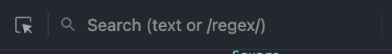
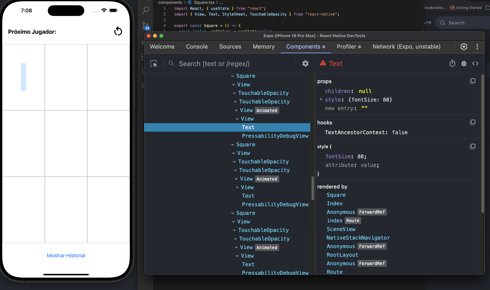
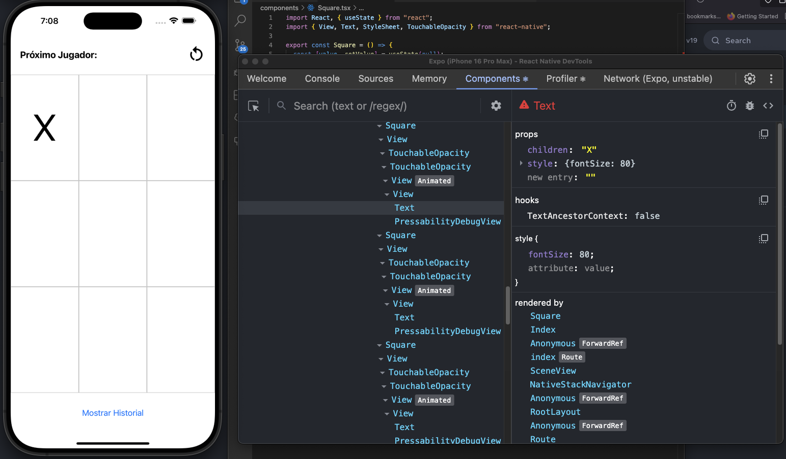
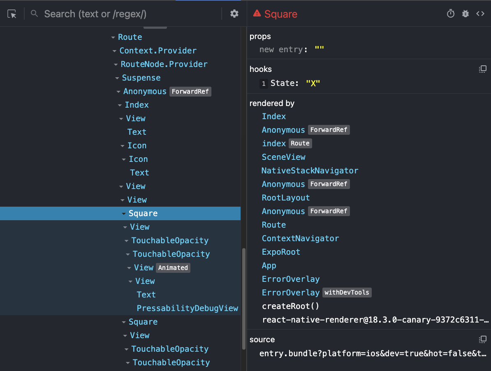

# React Native

- Este juego viene de la [documentación oficial de React](https://react.dev/learn/tutorial-tic-tac-toe) para enseñarnos a utilizarlo.
  -Dado que está armado para Web lo vamos a modificar para poder crear una aplicación React Native.
- Creamos un nuevo proyecto Expo con el nombre `tic_tac_toe`.
- Reseteamos el projecto Expo para que nos quede un proyecto limpio.

## Tic Tact Toe

### Reglas del Juego

- Se juega entre dos jugadores.
- Cada jugador tiene tres fichas iguales.
- Se alternan los turnos para colocar las fichas en el tablero.
- El objetivo es alinear tres fichas en línea, ya sea horizontal, vertical o diagonal.
- El juego termina cuando un jugador alinea sus tres fichas o el tablero se llena sin ganador.
  No se pueden colocar dos fichas en la misma casilla.

### Jugando

- El primer jugador coloca una ficha en cualquier casilla del tablero.
- El segundo jugador coloca su ficha.
- Se continúa alternando los turnos hasta que un jugador alinea sus tres fichas.
- Si el tablero se llena sin ganador, el juego termina en empate.

### A Codear

- Vamos a Codear pero no así:


- Me refiero más así:


- Dado que vamos a utilizar la pantalla enterea necesitamos sacar el header de la pantalla.
- Sabemos que podemos hacer esto en el archivo `_layout.tsx`.

```javascript
// _layout.tsx
import { Stack } from "expo-router";

export default function RootLayout() {
  return (
    <Stack>
      <Stack.Screen name="index" options={{ headerShown: false }} />
    </Stack>
  );
}
```

- Con este cambio sabemos que sacamos el header de nuestra aplicación.
- También no necesitamos que los componentes estén alineados en el centro de la pantalla.
- Podemos modificar el código de `index.tsx`:

```javascript
// index.tsx
import { Text, View } from "react-native";

export default function Index() {
  return (
    <View
      style={{
        flex: 1,
      }}
    >
      <Text>Edit app/index.tsx to edit this screen.</Text>
    </View>
  );
}
```

- Perfecto ahora podemos arrancar a programar.
- Para evitar problemas podemos agregar el componnte SafeAreaView.

```javascript
import { SafeAreaView, Text, View } from "react-native";

export default function Index() {
  return (
    <SafeAreaView
      style={{
        flex: 1,
      }}
    >
      <Text>Edit app/index.tsx to edit this screen.</Text>
    </SafeAreaView>
  );
}
```

- Ahora el contenido se ve bien de nuevo pero sin estar centrado.
- Para esta aplicación queremos utilizar un fondo blanco (white).
- `expo-router` nos permite hacer esto por medio de configurar el componente `Stack` y utilizar una propiedad que se llama `screenOptions`.
- `screenOptions` acepta un objeto que tiene la cofiguración que será compartida entre pantallas.
- Entre las propiedades que podemos utilizar se encuentra contentStyle que acepta estilos.
- Utilizamos la propiedad `backgroundColor` para establecer el color en `white`.

```javascript
import { Stack } from "expo-router";

export default function RootLayout() {
  return (
    <Stack screenOptions={{ contentStyle: { backgroundColor: "white" } }}>
      <Stack.Screen name="index" options={{ headerShown: false }} />
    </Stack>
  );
}
```

- Si queremos configurar propiedades para todas las pantallas lo podemos hacer en el componente `Stack`.
- En caso de querer tener otras propiedades para alguna pantalla en particular se puede sobrescribir en cada una de ellas como es el caso de `headerShown` donde sólo sacamos el header de index.
- El próximo paso es crear el layout inicial para nuestro juego.
- Para eso vamos a crear 3 componentes `View` que van a tener un estilo definido para cada sección así lo podemos ver en pantalla.

```javascript
export default function Index() {
  return (
    <SafeAreaView
      style={{
        flex: 1,
      }}
    >
      <View></View>
      <View></View>
      <View></View>
    </SafeAreaView>
  );
}
```

- También vamos a crear una objeto de estilos utilizando `StyleSheet` de React Native.

```javascript
import { SafeAreaView, StyleSheet, View } from "react-native";

// Debajo del componente
const styles = StyleSheet.create({
  header: {
    backgroundColor: "blue",
    flex: 0.1,
  },
  boardContainer: {
    flex: 0.8,
    backgroundColor: "red",
  },
  footer: {
    flex: 0.1,
    backgroundColor: "green",
  },
});
```

- También podemos mover el estilo del SafeAreaView al objeto de estilos como `container`.

```javascript
const styles = StyleSheet.create({
  container: {
    flex: 1,
  },
  header: {
    backgroundColor: "blue",
    flex: 0.1,
  },
  boardContainer: {
    flex: 0.8,
    backgroundColor: "red",
  },
  footer: {
    flex: 0.1,
    backgroundColor: "green",
  },
});
```

- Ahora podemos utilizar los estilos en los diferentes componntes.
- Al primer View le asignamos el estlo `header`.
- Al segundo View le asignamos el estilo `boardContainer`.
- Al tercer View le asignamos el estilo `footer`.
- También asignamos a la propiedad style del componente SafeAreaView el estilo definido en `container`.
- Si todo salió bien deberías tener una pantalla super colorida.
- Al `SafeAreaView` le asignamos la propiedad `flex: 1` lo cual le dice a React Native que ese componente va a ocupar todo el espacio disponible por lo cual puede crecer todo lo que sea necesario.
- Los otros componentes `View` tienen la propiedad `flex` y con un valor de `0.1` o `0.8`.
- En este caso estamos diciendo que el header y el footer van a ocupar 10% de la pantalla.
- El contenedor del board va a ocupar la mayoría del espacio con un 80% de la pantalla.
- Esto es dinámico por lo cual se debería ver bien en cualquier dispositivo.
- La idea del `header` es poder mostrar el turno de cada jugador más un botón de reset para iniciar el juego nuevamente.
- El footer nos va a permitir tener un botón que nos muestre el historial de jugadas y poder viajar en el tiempo.
- La sección que ahora está en rojo y ocupa la mayoría del espacio va a ser nuestro tablero para jugar.
- Utilizar colores diferentes como esto ayuda a ver bien las diferentes secciones de nuestra pantalla. No es obligatorio pero en algunos casos ayuda.
- Podemos borrar los colores de fondo de cada View ahora que sabemos el lugar ocupado por cada uno de ellos.

```javascript
const styles = StyleSheet.create({
  container: {
    flex: 1,
  },
  header: {
    flex: 0.1,
  },
  boardContainer: {
    flex: 0.8,
  },
  footer: {
    flex: 0.1,
  },
});
```

- Vamos a agregar un Text componente con el texto de `Próximo jugador:` y el siguiente [icono de restart o volver a compenzar](https://icons.expo.fyi/Index/MaterialCommunityIcons/restart)

```javascript
import { SafeAreaView, StyleSheet, View, Text } from "react-native";
import MaterialCommunityIcons from "@expo/vector-icons/MaterialCommunityIcons";

export default function Index() {
  return (
    <SafeAreaView style={styles.container}>
      <View style={styles.header}>
        <Text>Próximo Jugador: </Text>
        <MaterialCommunityIcons name="restart" size={24} color="black" />
      </View>
      <View style={styles.boardContainer}></View>
      <View style={styles.footer}></View>
    </SafeAreaView>
  );
}

const styles = StyleSheet.create({
  container: {
    flex: 1,
  },
  header: {
    flex: 0.1,
  },
  boardContainer: {
    flex: 0.8,
  },
  footer: {
    flex: 0.1,
  },
});
```

- En este caso estamos utilizando nuevamente los iconos que nos da `expo-icon` pero ahora de otra colección llamada `MaterialCommunityIcons`.
- Vemos que el contenido queda muy pegado a los costados por lo cual vamos a agregarle al contenedor un poco más de espacio.

```javascript
header: {
  flex: 0.1,
  paddingHorizontal: 20,
},
```

- `paddingHorizontal` agrega un aire interno (no es margen) al componente que se le aplica esta propiedad y lo hace de manera horizontal es decir que se lo asigna a `left (izquierda) y right (derecha)`.
- Dado que la alineación de items en flexbox es `column` tenemos que cambairlo para poder ver el texto y el icono uno al lado del otro.
- Para alinear los componentes uno al lado del otro utilizamos la propiedad `flexDirection: 'row'` donde le decimos a flex que este contenedor utiliza fila en lugar de columna.
- También vamos a utilizar `justifyContent` para hacer que cada componente esté en un extremo por medio del valor `space-between`.
- En este caso flexbox hace el cálculo de cuanto espacio tiene que dejar entre componentes y dado que son sólo 2 los alinea a los costados.
- También podemos agregar `alignItems: 'center'` para alinear los componentes de manera vertical.
- Agregamos `backgroundColor: '#DDD'` para ver como va quedando el header.
- Te recomiendo aplicar estas propiedades de a una para ir viendo que hace en cada paso.

```javascript
import { SafeAreaView, StyleSheet, View, Text } from "react-native";
import MaterialCommunityIcons from "@expo/vector-icons/MaterialCommunityIcons";

export default function Index() {
  return (
    <SafeAreaView style={styles.container}>
      <View style={styles.header}>
        <Text>Próximo Jugador: </Text>
        <MaterialCommunityIcons name="restart" size={24} color="black" />
      </View>
      <View style={styles.boardContainer}></View>
      <View style={styles.footer}></View>
    </SafeAreaView>
  );
}

const styles = StyleSheet.create({
  container: {
    flex: 1,
  },
  header: {
    flex: 0.1,
    flexDirection: "row",
    paddingHorizontal: 20,
    justifyContent: "space-between",
    alignItems: "center",
    backgroundColor: "#DDD",
  },
  boardContainer: {
    flex: 0.8,
  },
  footer: {
    flex: 0.1,
  },
});
```

- Para dejarlo un poco mejor podemos agrandar la tipografía asignando un nuevo estilo con el nombre de `headerText` y la propiedad `fontSize: 20`.
- También agregamos `fontWeight: 'bold'` para que el texto esté en negrita.
- Como nos queda chico el icon podemos modificar el tamaño cambiando el valor de la propiedad `size={40}`.

```javascript
<View style={styles.header}>
  <Text style={styles.headerText}>Próximo Jugador: </Text>
  <MaterialCommunityIcons name="restart" size={40} color="black" />
</View>

// objeto styles
headerText: {
  fontSize: 20,
  fontWeight: "bold",
},
```

- Otro cambio que podemos hacer es agregar un botón (Button), dentro del View footer, que al presionarlo va a mostrar un Modal con los pasos que se ejecutaron a lo largo del juego.
- Agregamos un componente `Button` con el title `Mostrar Historial` y le asignamos un event handler `onPress` con una arrow function por ahora.
- También alineamos verticalmente en el centro utilizando la propiedad `justifyContent: 'center'` en el objeto de estilo.

```javascript
import { SafeAreaView, StyleSheet, View, Text, Button } from "react-native";

// Dentro del componente
<View style={styles.footer}>
  <Button title="Mostrar Historial" onPress={() => {}} />
</View>;

// objeto styles
footer: {
  flex: 0.1,
  justifyContent: "center",
},
```

- Llegó el momento de crear el tablero / board.
- La idea es armar el dibujo de la grilla utilizando este concepto.
- El board tiene 9 espacios dividido en 3 filas horizontal y 3 vertical

```
   |   |
------------
   |   |
------------
   |   |
```

- Vamos a crear un componente `View` con un `Text` adentro con una `X`.
- La idea es que cada cuadrado va a ser un `View` con el `Text` adentro y el valor va a cambiar entre X y O para diferenciar los jugadores.

```javascript
<View style={styles.boardContainer}>
  <View>
    <Text>X</Text>
  </View>
</View>
```

- Por ahora no se parece a uno de los cuadrados por lo cual vamos a agregar un poco de estilo.
- Primero agregamos un nuevo estilo con el nombre de `square` y le asignamos las siguientes propiedades:

```javascript
square: {
  backgroundColor: "white",
  borderWidth: 1,
  borderColor: "#CCC",
  justifyContent: "center",
  alignItems: "center",
  width: 50,
  height: 50,
},
```

- Luego usamos el estilo en la View:

```javascript
<View style={styles.square}>
  <Text>X</Text>
</View>
```

- Para este diseño estamos estableciendo el color de fondo en blanco utilizando `backgroundColor:'white'`.
- Luego establecemos un borde de 1 pixel de ancho y color gris utilizando las propiedades `borderWidth: 1 y borderColor: "#CCC"`.
- Para que el dibujo quede bien necesitamos centrar el contenido en el centro tanto de manera vertical como horizontal y eso lo hacemos usando `justifyContent: "center" y alignItems: "center"`.
- Finalmente utilizamos `  width: 50 y height: 50` para hacer que la View sea un cuadrado con la X en el centro.
- Perfecto, ya tenemos el primer cuadrado, sólo nos faltan 8 más.
- Copia y pega 8 veces más el mismo componente `square`.

```javascript
<View style={styles.boardContainer}>
  <View style={styles.square}>
    <Text>X</Text>
  </View>
  <View style={styles.square}>
    <Text>X</Text>
  </View>
  <View style={styles.square}>
    <Text>X</Text>
  </View>
  <View style={styles.square}>
    <Text>X</Text>
  </View>
  <View style={styles.square}>
    <Text>X</Text>
  </View>
  <View style={styles.square}>
    <Text>X</Text>
  </View>
  <View style={styles.square}>
    <Text>X</Text>
  </View>
  <View style={styles.square}>
    <Text>X</Text>
  </View>
  <View style={styles.square}>
    <Text>X</Text>
  </View>
</View>
```

- Quedó genial pero ahora tenemos 9 cuadrados uno abajo del otro y claramente no es lo que queremos!.
- Lo que podemos utilizar ahora es otro componente `View` que actue como fila.
- La idea es agrupar de a 3 `square` dentro de un componente que lo vamos a lllamar `row`.
- Creamos un nuevo `View` y agrupamos de a 3 `square`.

```javascript
<View style={styles.boardContainer}>
  <View>
    <View style={styles.square}>
      <Text>X</Text>
    </View>
    <View style={styles.square}>
      <Text>X</Text>
    </View>
    <View style={styles.square}>
      <Text>X</Text>
    </View>
  </View>
  <View>
    <View style={styles.square}>
      <Text>X</Text>
    </View>
    <View style={styles.square}>
      <Text>X</Text>
    </View>
    <View style={styles.square}>
      <Text>X</Text>
    </View>
  </View>
  <View>
    <View style={styles.square}>
      <Text>X</Text>
    </View>
    <View style={styles.square}>
      <Text>X</Text>
    </View>
    <View style={styles.square}>
      <Text>X</Text>
    </View>
  </View>
</View>
```

- Bien, tenemos lo que necesitamos pero todavía se siguen viendo uno debajo del otro.
- Para hacer que se vean uno al lado del otro vamos a crear un estilo nuevo con el nombre `boardRow`.
- Asignamos el siguiente estilo:

```javascript
boardRow: {
  flexDirection: "row",
},
```

- Utilizamos el nuevo estiilo en los View que agregamos para ser filas.

```javascript
<View style={styles.boardContainer}>
  <View style={styles.boardRow}>
    <View style={styles.square}>
      <Text>X</Text>
    </View>
    <View style={styles.square}>
      <Text>X</Text>
    </View>
    <View style={styles.square}>
      <Text>X</Text>
    </View>
  </View>
  <View style={styles.boardRow}>
    <View style={styles.square}>
      <Text>X</Text>
    </View>
    <View style={styles.square}>
      <Text>X</Text>
    </View>
    <View style={styles.square}>
      <Text>X</Text>
    </View>
  </View>
  <View style={styles.boardRow}>
    <View style={styles.square}>
      <Text>X</Text>
    </View>
    <View style={styles.square}>
      <Text>X</Text>
    </View>
    <View style={styles.square}>
      <Text>X</Text>
    </View>
  </View>
</View>
```

- Ahora si!! un Tic Tac Toe!
- Pero nos quedó medio chiquito, no?
- Esto se da porque los `square` tienen un valor de `height y width` fijo de 50.
- Necesitamos que esto sea dinámico y que tome todo el ancho de la pantalla.
- Modificamos el estilo `square` borrando witdh y height.
- Agregamos la propiedad `flex: 1/3`.

```javascript
square: {
  backgroundColor: "white",
  borderWidth: 1,
  borderColor: "#CCC",
  justifyContent: "center",
  alignItems: "center",
  flex: 1 / 3,
},
```

- Bien, cubrimos todo el ancho utilizando 1 / 3.
- Lo que le dijimos a flex en este caso es que cada `square` tiene que utilizar 1/3 de la pantalla.
- Dado que son 3 cuadrados terminan ocupando todo el espacio disponible.
- Ahora para el alto tenemos que hacer algo parecido pero vamos a trabajar con el estilo de `boardRow`.
- Usamos el mismo concepto y agregamos `flex: 1/3` al estilo `boardRow`.

```javascript
boardRow: {
  flexDirection: "row",
  flex: 1 / 3,
},
```

- Hermoso! tablero y X's!!
- Quedaron medio chiquitoas las X's, no?
- Bueno eso lo podemos solucionar fácil, agregamos un estilo para agrandar el tamaño de la tipografía que tiene cada componente `Text`.
- Creamos un nuevo estilo con el nombre `squareText` y le agregamos la propiedad `fontSize: 80,` para hacer que la tipografía tenga tamaño 80.
- Luego tenemos que usar este estilo en los componentes Text en la propiedad style.

```javascript
<View style={styles.boardContainer}>
  <View style={styles.boardRow}>
    <View style={styles.square}>
      <Text style={styles.squareText}>X</Text>
    </View>
    <View style={styles.square}>
      <Text style={styles.squareText}>X</Text>
    </View>
    <View style={styles.square}>
      <Text style={styles.squareText}>X</Text>
    </View>
  </View>
  <View style={styles.boardRow}>
    <View style={styles.square}>
      <Text style={styles.squareText}>X</Text>
    </View>
    <View style={styles.square}>
      <Text style={styles.squareText}>X</Text>
    </View>
    <View style={styles.square}>
      <Text style={styles.squareText}>X</Text>
    </View>
  </View>
  <View style={styles.boardRow}>
    <View style={styles.square}>
      <Text style={styles.squareText}>X</Text>
    </View>
    <View style={styles.square}>
      <Text style={styles.squareText}>X</Text>
    </View>
    <View style={styles.square}>
      <Text style={styles.squareText}>X</Text>
    </View>
  </View>
</View>

// objeto styles
squareText: {
  fontSize: 80,
},
```

- Ahora si, esto parece un tablero de Tic Tac Toe!, felicitationes!!
- Para que se vea mejor cada cuadrado vamos a cambiar la X por un número del 1 al 9.

```javascript
<View style={styles.boardContainer}>
  <View style={styles.boardRow}>
    <View style={styles.square}>
      <Text style={styles.squareText}>1</Text>
    </View>
    <View style={styles.square}>
      <Text style={styles.squareText}>2</Text>
    </View>
    <View style={styles.square}>
      <Text style={styles.squareText}>3</Text>
    </View>
  </View>
  <View style={styles.boardRow}>
    <View style={styles.square}>
      <Text style={styles.squareText}>4</Text>
    </View>
    <View style={styles.square}>
      <Text style={styles.squareText}>5</Text>
    </View>
    <View style={styles.square}>
      <Text style={styles.squareText}>6</Text>
    </View>
  </View>
  <View style={styles.boardRow}>
    <View style={styles.square}>
      <Text style={styles.squareText}>7</Text>
    </View>
    <View style={styles.square}>
      <Text style={styles.squareText}>8</Text>
    </View>
    <View style={styles.square}>
      <Text style={styles.squareText}>9</Text>
    </View>
  </View>
</View>
```

- Si vemos todos los cuadrados (`square`) tienen la misma forma.
- Que tal si creamos un nuevo componente con el nombre `Square`.
- Crea una carpeta con el nombre de `components`.
- Dentro de la carpeta `components` crea un archivo con el nombre `Square.tsx`.

```javascript
import React from "react";
import { View, Text } from "react-native";

export const Square = () => {
  return (
    <View>
      <Text>Square</Text>
    </View>
  );
};
```

- Ya que tenemos el código base del componente ahora podemos copiar y pegar el código del componente `index.tsx`.

```javascript
import React from "react";
import { View, Text } from "react-native";

export const Square = () => {
  return (
    <View style={styles.square}>
      <Text style={styles.squareText}>1</Text>
    </View>
  );
};
```

- Esto está muy bien pero necesitamos copiar el estilo también.
- Importamos `StyleSheet` de React Native y creamos una variable con el nombre `styles` para asignar el nuevo estilo.
- Luego cortamos y pegamos los estilos que faltan de index al componente.

```javascript
import React from "react";
import { View, Text, StyleSheet } from "react-native";

export const Square = () => {
  return (
    <View style={styles.square}>
      <Text style={styles.squareText}>1</Text>
    </View>
  );
};

const styles = StyleSheet.create({
  square: {
    backgroundColor: "white",
    borderWidth: 1,
    borderColor: "#CCC",
    justifyContent: "center",
    alignItems: "center",
    flex: 1 / 3,
  },
  squareText: {
    fontSize: 80,
  },
});
```

- Ahora podemos importar este componente y utilizarlo en `index.tsx`.
- Agregamos el import y luego remplazamos los `View` con el style `square` por un componente `Square`

```javascript
import { Square } from "@/components/Square";

<View style={styles.boardContainer}>
  <View style={styles.boardRow}>
    <Square />
    <Square />
    <Square />
  </View>
  <View style={styles.boardRow}>
    <Square />
    <Square />
    <Square />
  </View>
  <View style={styles.boardRow}>
    <Square />
    <Square />
    <Square />
  </View>
</View>;
```

- Excelente, creamos un nuevo componente `Square` donde tenemos definido como se ve cada cuadrado.
- De esta forma si tenemos que hacer algún cambio al cuadrado lo hacemos en un solo lugar.
- Para solucionar el problema de que todos los cuadrados muestran el número 1 vamos a utilizar props para pasar cual es el valor que queremos mostrar en cada cuadrado.
- La idea es volver a mostrar los valores de 1 al 9.
- Para eso vamos a agregar una propiedad con el nombre de `value` al componente Square.
- En el componente `Text` vamos a mostrar el valor de la propiedad `value`.
- Recordamos que en JSX utilizamos `{}` para poder evaluar código JavaScript.
- En este caso vamos a usar `{value}` para mostrar el valor de cada propiedad.

```javascript
import React from "react";
import { View, Text, StyleSheet } from "react-native";

export const Square = ({ value }) => {
  return (
    <View style={styles.square}>
      <Text style={styles.squareText}>{value}</Text>
    </View>
  );
};

const styles = StyleSheet.create({
  square: {
    backgroundColor: "white",
    borderWidth: 1,
    borderColor: "#CCC",
    justifyContent: "center",
    alignItems: "center",
    flex: 1 / 3,
  },
  squareText: {
    fontSize: 80,
  },
});
```

- Al hacer esto perdemos todos los valores ya que `value` es undefined.
- Tenemos que pasarle a cada `Square` la propiedad `value` con valores de 1 al 9.

```javascript
<View style={styles.boardContainer}>
  <View style={styles.boardRow}>
    <Square value="1" />
    <Square value="2" />
    <Square value="3" />
  </View>
  <View style={styles.boardRow}>
    <Square value="4" />
    <Square value="5" />
    <Square value="6" />
  </View>
  <View style={styles.boardRow}>
    <Square value="7" />
    <Square value="8" />
    <Square value="9" />
  </View>
</View>
```

- Listo, ya tenemos el board y un componente que podemos reutilizar.
- Ahora vamos a agregar interactividad a nuestra aplicación.
- La idea es que cuando el usuario presione el cuadrado se marque con una X en el medio.
- Para esto necesitamos hacer algunos cambios al componente `Square` pero lo bueno es que al hacer el cambio en un solo lugar se refleja para todos los componentes `Square` que tenemos en pantalla.
- Es una buena oportunidad para utilizar un `TouchableOpacity` de React Native.
- `TouchableOpacity` nos permite manejar el evento `onPress` como `Pressable` o un `Button` pero viene sin estilo.
- Lo que si nos da `TouchableOpacity` es un efecto al presionar un componente.
- Vamos a crear un nuevo estilo con el nombre `pressable` con el siguiente estilo:

```javascript
pressable: {
  flex: 1,
  width: "100%",
  justifyContent: "center",
  alignItems: "center",
},
```

- Luego lo utilizamos en la propiedad style del componente TouchableOpacity de la siguiente manera:

```javascript
export const Square = ({ value }) => {
  return (
    <View style={styles.square}>
      <TouchableOpacity style={styles.pressable}>
        <Text style={styles.squareText}>{value}</Text>
      </TouchableOpacity>
    </View>
  );
};
```

- Ahora vamos a ver en detalle que es lo que hace el estilo que le agregamso al `TouchableOpacity`.
- `flex:1` hace que el componente ocupe el 100% del espacio que se le asigna. En este caso es el 1/3 que tiene el compnente `View` que es el padre. Con esto logramos que ocupe todo el espacio de manera vertical.
- Luego `width: '100%'` le dice a flexbox que el componente tiene que ocupar el 100% del ancho disponible.
- Luego tenemos que centrar el contenido como hicimos con el componente padre para que el número o X quede en el centro. Para eso utilizamos `    justifyContent: "center" y alignItems: "center"`.
- Ahora al presionar cada cuadrado se muestra una pequeña animación para dejarle saber al usuario que algo fué presionado.
- Todo el estilo que agregamos es más que nada para que el TouchableOpacity pueda ser presionado desde cualquier parte del cuadrado.
- Ahora nos queda manejar el evento Press.
- Para esto vamos a agregar la propiedad `onPress` al componente `TouchableOpacity` y le pasamos como valor el nombre de una función que va a ser `onPressHandler`.
- Luego creamos una nueva función con el nombre `onPressHandler` que al ejecutarse muestra en console al valor de la propiedad `value`.

```javascript
import React from "react";
import { View, Text, StyleSheet, TouchableOpacity } from "react-native";

export const Square = ({ value }) => {
  const onPressHandler = () => {
    console.log(value);
  };

  return (
    <View style={styles.square}>
      <TouchableOpacity style={styles.pressable} onPress={onPressHandler}>
        <Text style={styles.squareText}>{value}</Text>
      </TouchableOpacity>
    </View>
  );
};

const styles = StyleSheet.create({
  square: {
    backgroundColor: "white",
    borderWidth: 1,
    borderColor: "#CCC",
    justifyContent: "center",
    alignItems: "center",
    flex: 1 / 3,
  },
  pressable: {
    flex: 1,
    width: "100%",
    justifyContent: "center",
    alignItems: "center",
  },
  squareText: {
    fontSize: 80,
  },
});
```

- Cada cuadrado que presionamos ahora muestra en pantalla el número del botón presionado.
- El próximo paso es hacer que el botón recuerde si fue presionado o no.
- Inicialmente no tiene que estar presionado.
- Cuando el usuario presiona el cuadrado se muestra una X.
- Para esto podemos utilizar `useState` para que el componente recuerde el valor que tiene que mostrar.
- Inicialmente el valor del estado va a ser `null` para que se muestre el contenido vacio.
- Al presionar vamos a setear el nuvo estado con el valor que nosotros queremos.
- Importamos `useState` de React.
- Vamos a borrar el parámetro `value` por ahora.
- Agregamos el siguiente código para manejar el estado:

```javascript
import React, { useState } from "react";

const [value, setValue] = useState(null);
```

- Como sabemos `value` va a ser una variable utilizada como estado que React recuerda el valor entre render y render.
- La función `setValue` nos permite setear el valor de la variable `value` para que React sepa que hay un cambio de estado y que tiene que renderizar de nuevo.
- Recordemos que la idea no es mutar las variables del estado.

```javascript
import React, { useState } from "react";
import { View, Text, StyleSheet, TouchableOpacity } from "react-native";

export const Square = () => {
  const [value, setValue] = useState(null);

  const onPressHandler = () => {
    console.log(value);
  };

  return (
    <View style={styles.square}>
      <TouchableOpacity style={styles.pressable} onPress={onPressHandler}>
        <Text style={styles.squareText}>{value}</Text>
      </TouchableOpacity>
    </View>
  );
};

const styles = StyleSheet.create({
  square: {
    backgroundColor: "white",
    borderWidth: 1,
    borderColor: "#CCC",
    justifyContent: "center",
    alignItems: "center",
    flex: 1 / 3,
  },
  pressable: {
    flex: 1,
    width: "100%",
    justifyContent: "center",
    alignItems: "center",
  },
  squareText: {
    fontSize: 80,
  },
});
```

- Dado que ya no utilizamos la propiedad `value` podemos borrarla del componente index.tsx.
- De nuevo no vemos nada ya que el valor de `value` inicialmente lo establecimos en `null`.
- Ahora vamos a modificar el onPressHandler del componente `Square` y la idea es que al presionar el botón se cambie el estado del cuadrado y value tenga un valor de X.
- Podemos hacer esto utilizando `setValue('X')`.

```javascript
import React, { useState } from "react";
import { View, Text, StyleSheet, TouchableOpacity } from "react-native";

export const Square = () => {
  const [value, setValue] = useState(null);

  const onPressHandler = () => {
    setValue("X");
  };

  return (
    <View style={styles.square}>
      <TouchableOpacity style={styles.pressable} onPress={onPressHandler}>
        <Text style={styles.squareText}>{value}</Text>
      </TouchableOpacity>
    </View>
  );
};

const styles = StyleSheet.create({
  square: {
    backgroundColor: "white",
    borderWidth: 1,
    borderColor: "#CCC",
    justifyContent: "center",
    alignItems: "center",
    flex: 1 / 3,
  },
  pressable: {
    flex: 1,
    width: "100%",
    justifyContent: "center",
    alignItems: "center",
  },
  squareText: {
    fontSize: 80,
  },
});
```

- Si el usuario presiona el cuadrado, se dibuja una X en el medio como tiene que ser para que el juego funcione!
- Llamando a la función `setValue` y pasando el valor `x` se establece en el estado que `value` contiene X y es lo que se renderiza en pantalla.
- Cada cuadrado tiene su propio estado.
- Cuando cambia el estado React renderiza el cuadrado y al componente hijo (Text).
- Si Abrimos las `DevTools` de React Native podemos ver el árbol de componentes.
- Podemos buscar por nombre de componente `Square` o podemos utilizar la flechita para seleccionar un elemento de la pantalla.



- React Nos muestra las propiedades / estado que tiene cada componente:



- Si presionamos podemos ver como el componente cambia las propiedades.



- Si seleccionamos el componente `Square` vemos el valor de `state` que es el estado.



- Excelente llegamos hasta un punto donde ya tenemos muchas cosas funcionando.

### Completar el juego

- Llegado a este punto, ya tenes todos los elementos básicos de tu juego.
- Para tener un juego completo necesitamos altenrar valores entre X u O en el tablero.
- También se necesita una manera para definir quien es el ganador.
- Actualmente, cada componente `Square` mantiene una parte del estado del juego.
- Para comprobar si hay un ganador, el tablero tendría que conocer de algúna forma el estado de cada uno de los 9 componentes cuadrados.
- En este caso necesitamos que el concepto de Tablero / Board sea el que le diga a los cuadrados que valores tiene.
- De esta forma la lógica y estado está en el tablero y no en los cuadrados.
- Para que dos componentes o más se comuniquen entre si o si un componente padre necesita saber información de los hijos, el componente padre puede pasar el estado a los hijos utilizando props.
- Esto mantiene a los componentes hijos sincronizados entre sí y con su padre.
- Esta técnica se conoce como `lifting state up` dado que se mueve el estado del hijo al padre y es un cambio común a la hora de trabajar con React.
- Aprovechemos esta oportunidad para probarlo.
- Edita el componente Index para que declare una variable de estado llamada `squares` que por defecto sea un `array` de 9 valores `null` correspondientes a los 9 cuadrados.

```javascript
import { useState } from "react";

export default function Index() {
  const [squares, setSquares] = useState(Array(9).fill(null));
```

- `Array(9).fill(null)` crea un array con nueve elementos y establece cada uno de ellos a null.
- La llamada `useState()` declara una variable de estado `squares`.
- Cada item del array corresponde al valor de un cuadrado.
- Cuando rellenes el tablero más tarde, el array de cuadrados tendrá esta forma: `['O', null, 'X', 'X', 'X', 'O', 'O', null, null]`.
- Ahora tenemos que pasarle el valor a cada componente y para eso vamos a volver a pasar una propiedad `value` a cada componente `Square` con el valor del array `squares` correspondiente.

```javascript
<View style={styles.boardContainer}>
  <View style={styles.boardRow}>
    <Square value={squares[0]} />
    <Square value={squares[1]} />
    <Square value={squares[2]} />
  </View>
  <View style={styles.boardRow}>
    <Square value={squares[3]} />
    <Square value={squares[4]} />
    <Square value={squares[5]} />
  </View>
  <View style={styles.boardRow}>
    <Square value={squares[6]} />
    <Square value={squares[7]} />
    <Square value={squares[8]} />
  </View>
</View>
```

- A continuación, editá el componente `Square` para que reciba un valor por medio de la propiedad `value`.
- Ya no necesitamos el estado y podemos volver a la versión simple del componente `Square`.

```javascript
import { View, Text, StyleSheet, TouchableOpacity } from "react-native";

export const Square = ({ value }) => {
  const onPressHandler = () => {
    console.log(value);
  };

  return (
    <View style={styles.square}>
      <TouchableOpacity style={styles.pressable} onPress={onPressHandler}>
        <Text style={styles.squareText}>{value}</Text>
      </TouchableOpacity>
    </View>
  );
};

const styles = StyleSheet.create({
  square: {
    backgroundColor: "white",
    borderWidth: 1,
    borderColor: "#CCC",
    justifyContent: "center",
    alignItems: "center",
    flex: 1 / 3,
  },
  pressable: {
    flex: 1,
    width: "100%",
    justifyContent: "center",
    alignItems: "center",
  },
  squareText: {
    fontSize: 80,
  },
});
```

- Ahora cada `Square` recibirá ahora un valor usando las propiedades que será 'X', 'O', o null para cada cuadrado vacío.
- Luego tenemos que cambiar lo que sucede cuando se hace press en un cuadrado.
- El componente `Index` ahora mantiene qué cuadrados se fue presionado.
- Tenés que crear una forma para que el cuadrado actualice el estado en el componente `Index`.
- Dado que el estado es privado del componente que lo define, no se puede actualizar el estado directamente.
- En este caso le vamos a pasar un event handler como callback por medio de una propiedad del componente `Square`.
- Agregamos una nueva propiedad al componente `Square` con el nombre `onSquarePress`.
- Luego utilizamos esta propiedad en el event handler del `TouchableOpacity` onPress.

```javascript
import { View, Text, StyleSheet, TouchableOpacity } from "react-native";

export const Square = ({ value, onSquarePress }) => {
  return (
    <View style={styles.square}>
      <TouchableOpacity style={styles.pressable} onPress={onSquarePress}>
        <Text style={styles.squareText}>{value}</Text>
      </TouchableOpacity>
    </View>
  );
};

const styles = StyleSheet.create({
  square: {
    backgroundColor: "white",
    borderWidth: 1,
    borderColor: "#CCC",
    justifyContent: "center",
    alignItems: "center",
    flex: 1 / 3,
  },
  pressable: {
    flex: 1,
    width: "100%",
    justifyContent: "center",
    alignItems: "center",
  },
  squareText: {
    fontSize: 80,
  },
});
```

- Ahora tenemos que conectar la propiedad `onSquarePress` a una función en el componente `Index` que vamos a nombre `onPressHandler`.
- Para conectar `onSquarePress` a `onPressHandler` le vamos a pasar una función como propiedad `onSquarePress`` del primer componente Square.

```javascript
const onPressHandler = () => {};

return (
  <SafeAreaView style={styles.container}>
    <View style={styles.header}>
      <Text style={styles.headerText}>Próximo Jugador: </Text>
      <MaterialCommunityIcons name="restart" size={40} color="black" />
    </View>
    <View style={styles.boardContainer}>
      <View style={styles.boardRow}>
        <Square value={squares[0]} onSquarePress={onPressHandler} />
        <Square value={squares[1]} />
        <Square value={squares[2]} />
      </View>
      <View style={styles.boardRow}>
        <Square value={squares[3]} />
        <Square value={squares[4]} />
        <Square value={squares[5]} />
      </View>
      <View style={styles.boardRow}>
        <Square value={squares[6]} />
        <Square value={squares[7]} />
        <Square value={squares[8]} />
      </View>
    </View>
    <View style={styles.footer}>
      <Button title="Mostrar Historial" onPress={() => {}} />
    </View>
  </SafeAreaView>
);
```

- Ahora hay que actualizar el estado al presionar el primer cuadrado.
- Hacemos esto agregando código a la función `onPressHandler`.

```javascript
const onPressHandler = () => {
  const nextSquares = squares.slice();
  nextSquares[0] = "X";
  setSquares(nextSquares);
};
```

- En la función `onPressHandler` creamos una nueva copia del array `squares` (nextSquares) con el método `slice()`.
- Luego, `onPressHandler` actualiza el array nextSquares para añadir `X` al primer cuadrado utilizando índice 0.
- Gracias a `clousure` JavaScript permite que la función `onPressHandler` tenga acceso a la función `setSquares`.
- Esto está muy bien pero sólo funciona para el primer cuadrado.
- Para hacer esto dinámico podemos modificar el código de la siguiente manera:

```javascript
const onPressHandler = (index) => () => {
  const nextSquares = squares.slice();
  nextSquares[index] = "X";
  setSquares(nextSquares);
};

<View style={styles.boardContainer}>
  <View style={styles.boardRow}>
    <Square value={squares[0]} onSquarePress={onPressHandler(0)} />
    <Square value={squares[1]} onSquarePress={onPressHandler(1)} />
    <Square value={squares[2]} onSquarePress={onPressHandler(2)} />
  </View>
  <View style={styles.boardRow}>
    <Square value={squares[3]} onSquarePress={onPressHandler(3)} />
    <Square value={squares[4]} onSquarePress={onPressHandler(4)} />
    <Square value={squares[5]} onSquarePress={onPressHandler(5)} />
  </View>
  <View style={styles.boardRow}>
    <Square value={squares[6]} onSquarePress={onPressHandler(6)} />
    <Square value={squares[7]} onSquarePress={onPressHandler(7)} />
    <Square value={squares[8]} onSquarePress={onPressHandler(8)} />
  </View>
</View>;
```

- Ahora la función `onPressHandler` devuelve una función que es lo que se va a ejecutar cuando el usuario hace press en un cuadrado.
- Para en la función `onPressHandler` sepa cual es el cuadrado presionado se lo podemos pasar como parámetro.
- Ahora todos lo cuadrados deberían cambiar su contenido al ser presionados.
- Ahora el manejo de estado está en el componente `Index` que pasa props a los componentes `Square` hijos para que puedan mostrar el contenido esperado.
- Al presionar en un cuadrado, el componente `Square` hijo pide al componente `Index` padre que actualice el estado del tablero.
- Cuando el estado del tablero cambia, tanto el componente `Index` como cada `Square` hijo se vuelven a renderizar automáticamente.
- Mantener el estado de todos los cuadrados en el componente `Index` nos va a permitir determinar el ganador.

#### Repaso:

- Recapitulemos lo que pasa cuando un usuario presiona en el cuadrado superior izquierdo del tablero para añadirle una X:
  - Al precionar en el cuadrado superior izquierdo se ejecuta la función que el TouchableOpacity recibió como su propiedad onPress del componente Square.
  - El componente Square recibió esa función como propiedad onSquarePress del componente Index.
  - El componente Index definió esa función directamente en JSX.
  - Se llama onPressHandler con un argumento de 0.
  - onPressHandler utiliza el argumento (0) para actualizar el primer elemento del array de cuadrados pasando de un valor null a X.
  - El estado de los cuadrados del componente Index fue actualizado, por lo que el Index y todos sus hijos vuelven a renderizarse.
  - Esto hace que el valor de la propiedad del componente Square con índice 0 cambie de null a X.
  - Al final el usuario ve que el cuadrado superior izquierdo ha cambiado de estar vacío a tener una X después de presionarlo.

### Repasando inmutabilidad de React y porque importa

- Observa cómo en `onPressHandler`, llamamos a `.slice()` para crear una copia del array de `squares` en lugar de modificar el array existente.
- Esto tiene que ver con la inmutabilidad y lo vamos a repasar.
- Generalmente hay dos enfoques para cambiar los datos.
- El primer enfoque es mutar las variables cambiando directamente los valores.

```javascript
const squares = [null, null, null, null, null, null, null, null, null];

squares[0] = "X";
```

- Ahora `squares` tiene el siguiente valor: ["X", null, null, null, null, null, null, null, null];
- La segunda consiste en sustituir los datos por una copia nueva que contenga los cambios deseados.

```javascript
const squares = [null, null, null, null, null, null, null, null, null];
const nextSquares = ["X", null, null, null, null, null, null, null, null];
```

- Ahora `squares` se mantiene sin cambios, pero `nextSquares` tiene una 'X' en el primer item en lugar de null.
- El resultado es el mismo, pero al no mutar (cambiar los datos subyacentes) directamente, se obtienen varias ventajas.
- La inmutabilidad hace que las features complejas sean mucho más fáciles de implementar.
- Más adelante en este tutorial, implementarás una función de `viaje en el tiempo` que te permitirá revisar el historial del juego y `retroceder` a movimientos pasados.
- Esta funcionalidad no es específica solo de los juegos ya que la posibilidad de deshacer y rehacer ciertas acciones es un requisito común de las aplicaciones.
- Evitar la mutación directa de los datos permite mantener intactas las versiones anteriores y reutilizarlas más adelante.
- La inmutabilidad también tiene otra ventaja. Por defecto, todos los componentes hijos se vuelven a renderizar automáticamente cuando cambia el estado de un componente padre.
- Esto incluye incluso a los componentes hijos que no se han visto afectados por el cambio.
- Aunque la re-rendización no es en sí misma perceptible para el usuario deberíamos evitar operaciones que tengan alto costo por performance.
- La inmutabilidad hace que sea muy barato para los componentes comparar si sus datos han cambiado o no.

### Agregamos turnos

- Ha llegado el momento de agregar la función para que otro jugador pueda marcar `O` en el tablero.
- Por defecto, el primer movimiento será una `X`.
- Para saber de quien es el turno vamos a utilizar otra variable de estado en `Index`.
- En este caso la variable se llama `xIsNext` y la inicializamos con el valor `true`.

```javascript
export default function Index() {
  const [xIsNext, setXIsNext] = useState(true);
  const [squares, setSquares] = useState(Array(9).fill(null));
  // Codigo componente
}
```

- Cada vez que un jugador se mueve, `xIsNext` (boolean) caombia para determinar qué jugador va después y el estado del juego se guarda.
- Actualizamos la función `onPressHandler` de Index para cambiar el valor de xIsNext.

```javascript
const onPressHandler = (index) => () => {
  const nextSquares = squares.slice();
  nextSquares[index] = xIsNext ? "X" : "O";
  setSquares(nextSquares);
  setXIsNext(!xIsNext);
};
```

- Ahora, al presionar en diferentes cuadrados, alternarán entre X y O, ¡como debe ser!.
- Pero espera, hay un problema. Intenta hacer clic varias veces en el mismo cuadrado.
- ¡La X se sobrescribe con una O! Aunque esto añade un giro muy interesante al juego, de momento vamos a seguir las reglas originales.
- Cuando marcamos una casilla con una X o una O no estamos comprobando primero si la casilla ya tiene un valor X u O.
- Podemos arreglar esto validando el contenido de la posición para ese cuadrado y no ejecutando el resto de la función.
- De esta forma si el cuadrado ya tiene un valor que no sea `null` entonces no se actualiza el estado.

```javascript
const onPressHandler = (index) => () => {
  if (squares[index]) {
    return;
  }

  const nextSquares = squares.slice();
  nextSquares[index] = xIsNext ? "X" : "O";
  setSquares(nextSquares);
  setXIsNext(!xIsNext);
};
```

- Ahora sólo puedes añadir X's u O's a cuadrados vacíos.
- Así se debería ver tu código hasta acá:

```javascript
import { useState } from "react";
import { SafeAreaView, StyleSheet, View, Text, Button } from "react-native";
import MaterialCommunityIcons from "@expo/vector-icons/MaterialCommunityIcons";

import { Square } from "@/components/Square";

export default function Index() {
  const [xIsNext, setXIsNext] = useState(true);
  const [squares, setSquares] = useState(Array(9).fill(null));

  const onPressHandler = (index) => () => {
    if (squares[index]) {
      return;
    }

    const nextSquares = squares.slice();
    nextSquares[index] = xIsNext ? "X" : "O";
    setSquares(nextSquares);
    setXIsNext(!xIsNext);
  };

  return (
    <SafeAreaView style={styles.container}>
      <View style={styles.header}>
        <Text style={styles.headerText}>Próximo Jugador: </Text>
        <MaterialCommunityIcons name="restart" size={40} color="black" />
      </View>
      <View style={styles.boardContainer}>
        <View style={styles.boardRow}>
          <Square value={squares[0]} onSquarePress={onPressHandler(0)} />
          <Square value={squares[1]} onSquarePress={onPressHandler(1)} />
          <Square value={squares[2]} onSquarePress={onPressHandler(2)} />
        </View>
        <View style={styles.boardRow}>
          <Square value={squares[3]} onSquarePress={onPressHandler(3)} />
          <Square value={squares[4]} onSquarePress={onPressHandler(4)} />
          <Square value={squares[5]} onSquarePress={onPressHandler(5)} />
        </View>
        <View style={styles.boardRow}>
          <Square value={squares[6]} onSquarePress={onPressHandler(6)} />
          <Square value={squares[7]} onSquarePress={onPressHandler(7)} />
          <Square value={squares[8]} onSquarePress={onPressHandler(8)} />
        </View>
      </View>
      <View style={styles.footer}>
        <Button title="Mostrar Historial" onPress={() => {}} />
      </View>
    </SafeAreaView>
  );
}

const styles = StyleSheet.create({
  container: {
    flex: 1,
  },
  header: {
    flex: 0.1,
    flexDirection: "row",
    paddingHorizontal: 20,
    justifyContent: "space-between",
    alignItems: "center",
    // backgroundColor: "#DDD",
  },
  headerText: {
    fontSize: 20,
    fontWeight: "bold",
  },
  boardContainer: {
    flex: 0.8,
  },
  footer: {
    flex: 0.1,
    justifyContent: "center",
  },
  boardRow: {
    flexDirection: "row",
    flex: 1 / 3,
  },
  square: {
    backgroundColor: "white",
    borderWidth: 1,
    borderColor: "#CCC",
    justifyContent: "center",
    alignItems: "center",
    flex: 1 / 3,
  },
  squareText: {
    fontSize: 80,
  },
});
```

### Declarar un Ganador

- Ahora que los jugadores pueden tomar turnos, querrás mostrar cuando el juego termina, quién ganó si no hay más turnos que hacer.
- Para ello vamos a añadir una función llamada `calculateWinner` que toma un array de 9 casillas, comprueba si hay un ganador y devuelve 'X', 'O', o null según corresponda.
- No te preocupes demasiado por la función `calculateWinner` ya que no es específica de React. Si te interesa saber como funciona podes [leer acá](./calculatewinner.md).
- Vamos a crear una carpeta `utils` y dentro un archivo nuevo con el nombre `index.ts`
- Dentro de `index.ts` vamos a agregar el siguiente código:

```javascript
// utils/index.ts

export function calculateWinner(squares) {
  const lines = [
    [0, 1, 2],
    [3, 4, 5],
    [6, 7, 8],
    [0, 3, 6],
    [1, 4, 7],
    [2, 5, 8],
    [0, 4, 8],
    [2, 4, 6],
  ];
  for (let i = 0; i < lines.length; i++) {
    const [a, b, c] = lines[i];
    if (squares[a] && squares[a] === squares[b] && squares[a] === squares[c]) {
      return squares[a];
    }
  }
  return null;
}
```

- Ahora necesitamos importar esta función en el componente `Index`.

```javascript
import { calculateWinner } from "@/utils";
```

- Dado que el archivo se llama index.ts `node` sabe como importar este archivo sin tener que especificarlo.
- De esta forma nos queda el import como que viene sólo de `utils` cuando sabemos que hay un archivo con el nombre de `index.ts`.
- Como exportamos la función como named export utilizamos el nombre de la función entre `{}`.
- Vamos a llamar `calculateWinner(squares)` en la función `onPressHandler` del componente Index para comprobar si un jugador ha ganado.
- Puedes realizar esta comprobación al mismo tiempo que compruebas si un usuario presionó una casilla que ya tiene una X o una O.
- En ambos casos nos gustaría que no se actualize el estado nuevamente.

```javascript
const onPressHandler = (index) => () => {
  if (squares[index] || calculateWinner(squares)) {
    return;
  }

  const nextSquares = squares.slice();
  nextSquares[index] = xIsNext ? "X" : "O";
  setSquares(nextSquares);
  setXIsNext(!xIsNext);
};
```

- Para que los jugadores sepan cuándo ha terminado la partida, podemos mostrar un texto como `Ganador: X` o `Ganador: O`.
- Agregamos una variable de estado al componente Index.
- El estado mostrará el ganador si el juego ha terminado y si el juego está en curso mostrará qué jugador es el siguiente turno.

```javascript
const winner = calculateWinner(squares);
const status = winner
  ? `Ganador: ${winner}`
  : `Próximo Jugador: ${xIsNext ? "X" : "O"}`;

<Text style={styles.headerText}>{status}</Text>;
```

- Felicitaciones!!! Ya tienes un juego de Tic Tac Toe que funciona.
- Además acabas de aprender los fundamentos de React usando React Native.
- La verdad es que vos ganaste en esta oportunidad.
- Así se ve el código hasta acá:

```javascript
import { useState } from "react";
import { SafeAreaView, StyleSheet, View, Text, Button } from "react-native";
import MaterialCommunityIcons from "@expo/vector-icons/MaterialCommunityIcons";

import { Square } from "@/components/Square";
import { calculateWinner } from "@/utils";

export default function Index() {
  const [xIsNext, setXIsNext] = useState(true);
  const [squares, setSquares] = useState(Array(9).fill(null));

  const onPressHandler = (index) => () => {
    if (squares[index] || calculateWinner(squares)) {
      return;
    }

    const nextSquares = squares.slice();
    nextSquares[index] = xIsNext ? "X" : "O";
    setSquares(nextSquares);
    setXIsNext(!xIsNext);
  };

  const winner = calculateWinner(squares);
  const status = winner
    ? `Ganador: ${winner}`
    : `Próximo Jugador: ${xIsNext ? "X" : "O"}`;

  return (
    <SafeAreaView style={styles.container}>
      <View style={styles.header}>
        <Text style={styles.headerText}>{status}</Text>
        <MaterialCommunityIcons name="restart" size={40} color="black" />
      </View>
      <View style={styles.boardContainer}>
        <View style={styles.boardRow}>
          <Square value={squares[0]} onSquarePress={onPressHandler(0)} />
          <Square value={squares[1]} onSquarePress={onPressHandler(1)} />
          <Square value={squares[2]} onSquarePress={onPressHandler(2)} />
        </View>
        <View style={styles.boardRow}>
          <Square value={squares[3]} onSquarePress={onPressHandler(3)} />
          <Square value={squares[4]} onSquarePress={onPressHandler(4)} />
          <Square value={squares[5]} onSquarePress={onPressHandler(5)} />
        </View>
        <View style={styles.boardRow}>
          <Square value={squares[6]} onSquarePress={onPressHandler(6)} />
          <Square value={squares[7]} onSquarePress={onPressHandler(7)} />
          <Square value={squares[8]} onSquarePress={onPressHandler(8)} />
        </View>
      </View>
      <View style={styles.footer}>
        <Button title="Mostrar Historial" onPress={() => {}} />
      </View>
    </SafeAreaView>
  );
}

const styles = StyleSheet.create({
  container: {
    flex: 1,
  },
  header: {
    flex: 0.1,
    flexDirection: "row",
    paddingHorizontal: 20,
    justifyContent: "space-between",
    alignItems: "center",
    // backgroundColor: "#DDD",
  },
  headerText: {
    fontSize: 20,
    fontWeight: "bold",
  },
  boardContainer: {
    flex: 0.8,
  },
  footer: {
    flex: 0.1,
    justifyContent: "center",
  },
  boardRow: {
    flexDirection: "row",
    flex: 1 / 3,
  },
  square: {
    backgroundColor: "white",
    borderWidth: 1,
    borderColor: "#CCC",
    justifyContent: "center",
    alignItems: "center",
    flex: 1 / 3,
  },
  squareText: {
    fontSize: 80,
  },
});
```

### Resetear el juego

- Una vez finalizado el juego queremos resetearlo para volver a jugar.
- El usuario puede presionar el botón de `refresh` en el borde superior derecho y el juego debería re-iniciar.
- Para esto debemos agregar una forma de manejar el evento `onPress` del icono y resetear el estado para que el juego vuelva al inicio.
- Tenemos que importar `ToucableOpacity` de react native.

```javascript
// En alguna parte del componente Index
const onRestartHandler = () => {
  setXIsNext(true);
  setSquares(Array(9).fill(null));
};

// Modificar la parte donde utilizamo el icono.
<TouchableOpacity onPress={onRestartHandler}>
  <MaterialCommunityIcons name="restart" size={40} color="black" />
</TouchableOpacity>;
```

- Al presionar el icono restart estamos asignando a las variables del estado su valor original.
- De esta forma el juevo vuelve a su inicio y se puede volver a jugar.

### Refactor en componentes

- Si bien el código está bastante limpio todavía podemos hacer que `Index` se vea un poco mejor sobre todo si en algún momento queremos agregarle otras funcionalidades al juego.
- Por ejemplo podemos mover le `header` a su propio componente y hacer lo mismo con `footer`.
- Para poder hacer esto creamos dos archivos nuevos en la carpeta `components` con los nombres `Header.tsx` y `Footer.tsx`.
- Copiamos el componente con el estilo `header` en el archivo `Header.tsx`.
- Copiamos el componente con el estilo `footer` en el archivo `Footer.tsx`.
- La idea es mover los estilos también y hacer funcionar todos los imports.
- `components/Header.tsx`

```javascript
import React from "react";
import { View, Text, StyleSheet, TouchableOpacity } from "react-native";

import MaterialCommunityIcons from "@expo/vector-icons/MaterialCommunityIcons";

export const Header = ({ status, onRefreshPress }) => {
  return (
    <View style={styles.header}>
      <Text style={styles.headerText}>{status}</Text>
      <TouchableOpacity onPress={onRefreshPress}>
        <MaterialCommunityIcons name="restart" size={40} color="black" />
      </TouchableOpacity>
    </View>
  );
};

const styles = StyleSheet.create({
  header: {
    flex: 0.1,
    flexDirection: "row",
    paddingHorizontal: 20,
    justifyContent: "space-between",
    alignItems: "center",
  },
  headerText: {
    fontSize: 20,
    fontWeight: "bold",
  },
});
```

- `components/Footer.tsx`

```javascript
import React from "react";
import { StyleSheet, View, Button } from "react-native";

export const Footer = () => {
  return (
    <View style={styles.footer}>
      <Button title="Mostrar Historial" onPress={() => {}} />
    </View>
  );
};

const styles = StyleSheet.create({
  footer: {
    flex: 0.1,
    justifyContent: "center",
  },
});
```

- Finalmente `Index` quedó de la siguiente manera:

```javascript
import { useState } from "react";
import { SafeAreaView, StyleSheet, View } from "react-native";
import { Square } from "@/components/Square";
import { calculateWinner } from "@/utils";
import { Header } from "@/components/Header";
import { Footer } from "@/components/Footer";

export default function Index() {
  const [xIsNext, setXIsNext] = useState(true);
  const [squares, setSquares] = useState(Array(9).fill(null));

  const onPressHandler = (index) => () => {
    if (squares[index] || calculateWinner(squares)) {
      return;
    }

    const nextSquares = squares.slice();
    nextSquares[index] = xIsNext ? "X" : "O";
    setSquares(nextSquares);
    setXIsNext(!xIsNext);
  };

  const onRestartHandler = () => {
    setXIsNext(true);
    setSquares(Array(9).fill(null));
  };

  const winner = calculateWinner(squares);
  const status = winner
    ? `Ganador: ${winner}`
    : `Próximo Jugador: ${xIsNext ? "X" : "O"}`;

  return (
    <SafeAreaView style={styles.container}>
      <Header status={status} onRefreshPress={onRestartHandler} />
      <View style={styles.boardContainer}>
        <View style={styles.boardRow}>
          <Square value={squares[0]} onSquarePress={onPressHandler(0)} />
          <Square value={squares[1]} onSquarePress={onPressHandler(1)} />
          <Square value={squares[2]} onSquarePress={onPressHandler(2)} />
        </View>
        <View style={styles.boardRow}>
          <Square value={squares[3]} onSquarePress={onPressHandler(3)} />
          <Square value={squares[4]} onSquarePress={onPressHandler(4)} />
          <Square value={squares[5]} onSquarePress={onPressHandler(5)} />
        </View>
        <View style={styles.boardRow}>
          <Square value={squares[6]} onSquarePress={onPressHandler(6)} />
          <Square value={squares[7]} onSquarePress={onPressHandler(7)} />
          <Square value={squares[8]} onSquarePress={onPressHandler(8)} />
        </View>
      </View>
      <Footer />
    </SafeAreaView>
  );
}

const styles = StyleSheet.create({
  container: {
    flex: 1,
  },
  boardContainer: {
    flex: 0.8,
  },
  boardRow: {
    flexDirection: "row",
    flex: 1 / 3,
  },
});
```

- Todavía podemos limpiar esto aún un poco más.
- Cada componente `boardRow` podría ser su propio componente.
- Este componente `boardRow` puede tener el estilo que necesita y acepta como hijos la colección de `Squares`.
- Creamos un nuevo componente con el nombre `BoardRow` en el archivo `components/BoardRow.tsx` y copiamos la definición del componente más su estilo.

```javascript
import React from "react";
import { View, StyleSheet } from "react-native";

export const BoardRow = ({ children }) => {
  return <View style={styles.container}>{children}</View>;
};

const styles = StyleSheet.create({
  container: {
    flexDirection: "row",
    flex: 1 / 3,
  },
});
```

- Una vez creado el componente podemos remplazar el código de `Index` para que lo utilice.
- importamos el nuevo componente y remplazamos por el `View` que teníamos antes como `boardRow`.

```javascript
import { useState } from "react";
import { SafeAreaView, StyleSheet, View } from "react-native";
import { Square } from "@/components/Square";
import { calculateWinner } from "@/utils";
import { Header } from "@/components/Header";
import { Footer } from "@/components/Footer";
import { BoardRow } from "@/components/BoardRow";

export default function Index() {
  const [xIsNext, setXIsNext] = useState(true);
  const [squares, setSquares] = useState(Array(9).fill(null));

  const onPressHandler = (index) => () => {
    if (squares[index] || calculateWinner(squares)) {
      return;
    }

    const nextSquares = squares.slice();
    nextSquares[index] = xIsNext ? "X" : "O";
    setSquares(nextSquares);
    setXIsNext(!xIsNext);
  };

  const onRestartHandler = () => {
    setXIsNext(true);
    setSquares(Array(9).fill(null));
  };

  const winner = calculateWinner(squares);
  const status = winner
    ? `Ganador: ${winner}`
    : `Próximo Jugador: ${xIsNext ? "X" : "O"}`;

  return (
    <SafeAreaView style={styles.container}>
      <Header status={status} onRefreshPress={onRestartHandler} />
      <View style={styles.boardContainer}>
        <BoardRow>
          <Square value={squares[0]} onSquarePress={onPressHandler(0)} />
          <Square value={squares[1]} onSquarePress={onPressHandler(1)} />
          <Square value={squares[2]} onSquarePress={onPressHandler(2)} />
        </BoardRow>
        <BoardRow>
          <Square value={squares[3]} onSquarePress={onPressHandler(3)} />
          <Square value={squares[4]} onSquarePress={onPressHandler(4)} />
          <Square value={squares[5]} onSquarePress={onPressHandler(5)} />
        </BoardRow>
        <BoardRow>
          <Square value={squares[6]} onSquarePress={onPressHandler(6)} />
          <Square value={squares[7]} onSquarePress={onPressHandler(7)} />
          <Square value={squares[8]} onSquarePress={onPressHandler(8)} />
        </BoardRow>
      </View>
      <Footer />
    </SafeAreaView>
  );
}

const styles = StyleSheet.create({
  container: {
    flex: 1,
  },
  boardContainer: {
    flex: 0.8,
  },
});
```

- Probamos que todo siga funcionando / viendose bien después del refactor.
- Con estos cambios que hicimos separamos diferentes vistas donde cada componente sabe qué tiene que renderizar, sus estilos y hasta como manejar alguna funcionalidad.
- Los componentes ahora no depende de un estado o un evento ya que cualquier propiedad que le pasen van a mostrar lo que corresponde y si tienen que responder ante un evento van a dejar que otro componente se encargue.
- El estado está centrado en el componente `Index` que es el que está orquestando todo lo que pasa en el juego y le dice por medio de las propiedades que tiene que hacer o mostrar cada componente.
- Esta es una buena forma de pensar y trabajar en React.

### Viaje en el tiempo

- Como último ejercicio, podemos hacer posible `retroceder en el tiempo` a las jugadas anteriores del juego.

#### Guardando el historial de movimientos

- Si mutaramos el array de `squares`, implementar el viaje en el tiempo sería muy difícil.
- Sin embargo, usamos `slice()` para crear una nueva copia del array de `squares` después de cada movimiento, y lo tratamos como inmutable.
- Esto permite almacenar cada versión pasada del array `square`, y navegar entre los turnos que ya han ocurrido.
- Vamos a guardar los diferentes arrays de `squares` en otro array llamado `history`, que guardará como una nueva variable de estado.
- El array `history` representa todos los estados del tablero, del primero hasta el último movimiento, y tiene la siguiente forma:

```javascript
[
  // Antes del primer movimiento
  [null, null, null, null, null, null, null, null, null],
  // Luego del primer movimiento
  [null, null, null, null, "X", null, null, null, null],
  // Luego del segundo movimiento
  [null, null, null, null, "X", null, null, null, "O"],
  // ...
];
```

- En resumen guardamos en la variable de estado `history` cada uno de los estados que tiene el juego.

#### Levantando el estado de nuevo!

- Dado que vamos a manejar el historial del juego necesitamos crear una nueva variable de estado.
- De esta forma podemos decir que hay un concepto de `Juego o Game` y un concepto de `Tablero o Board`.
- Podemos representar esto en nuestro projecto creando un nuevo componente con el nombre de `Board` y nombre de archivo `Board.tsx` en la carpeta `components`.
- También podemos renombrar la pantalla para que en lugar de llamarse `Index` se llame `Game` para estar más acorder a la lógica de la app que estamos creando.
- Cambiamos ahora el nombre del componente `Index` por `Game`.

```javascript
import { useState } from "react";
import { SafeAreaView, StyleSheet, View } from "react-native";
import { Square } from "@/components/Square";
import { calculateWinner } from "@/utils";
import { Header } from "@/components/Header";
import { Footer } from "@/components/Footer";
import { BoardRow } from "@/components/BoardRow";

export default function Game() {
  const [xIsNext, setXIsNext] = useState(true);
  const [squares, setSquares] = useState(Array(9).fill(null));

  const onPressHandler = (index) => () => {
    if (squares[index] || calculateWinner(squares)) {
      return;
    }

    const nextSquares = squares.slice();
    nextSquares[index] = xIsNext ? "X" : "O";
    setSquares(nextSquares);
    setXIsNext(!xIsNext);
  };

  const onRestartHandler = () => {
    setXIsNext(true);
    setSquares(Array(9).fill(null));
  };

  const winner = calculateWinner(squares);
  const status = winner
    ? `Ganador: ${winner}`
    : `Próximo Jugador: ${xIsNext ? "X" : "O"}`;

  return (
    <SafeAreaView style={styles.container}>
      <Header status={status} onRefreshPress={onRestartHandler} />
      <View style={styles.boardContainer}>
        <BoardRow>
          <Square value={squares[0]} onSquarePress={onPressHandler(0)} />
          <Square value={squares[1]} onSquarePress={onPressHandler(1)} />
          <Square value={squares[2]} onSquarePress={onPressHandler(2)} />
        </BoardRow>
        <BoardRow>
          <Square value={squares[3]} onSquarePress={onPressHandler(3)} />
          <Square value={squares[4]} onSquarePress={onPressHandler(4)} />
          <Square value={squares[5]} onSquarePress={onPressHandler(5)} />
        </BoardRow>
        <BoardRow>
          <Square value={squares[6]} onSquarePress={onPressHandler(6)} />
          <Square value={squares[7]} onSquarePress={onPressHandler(7)} />
          <Square value={squares[8]} onSquarePress={onPressHandler(8)} />
        </BoardRow>
      </View>
      <Footer />
    </SafeAreaView>
  );
}

const styles = StyleSheet.create({
  container: {
    flex: 1,
  },
  boardContainer: {
    flex: 0.8,
  },
});
```

- Re iniciamos el servidor `Metro` que corre expo cuando ejecutamos `npx expo`.
- Probamos que todo siga funcionando como siempre.
- Ahora es un buen momneto para crear el nuevo compoente `Board` dentro de la carpeta `components` con el nombre de archivo `Board.tsx`.
- Por ahora vamos a dejar todo la definición de estado y la función de reset en el componente `Game` y movemos el resto al nuevo componente `Board`.
- `components/Board.tsx`

```javascript
import React from "react";
import { View, StyleSheet } from "react-native";

import { Header } from "@/components/Header";
import { Square } from "@/components/Square";
import { BoardRow } from "@/components/BoardRow";

import { calculateWinner } from "@/utils";

export const Board = ({ xIsNext, squares, onRestart }) => {
  const onPressHandler = (index) => () => {
    if (squares[index] || calculateWinner(squares)) {
      return;
    }

    const nextSquares = squares.slice();
    nextSquares[index] = xIsNext ? "X" : "O";
    // setSquares(nextSquares);
    // setXIsNext(!xIsNext);
  };

  const winner = calculateWinner(squares);
  const status = winner
    ? `Ganador: ${winner}`
    : `Próximo Jugador: ${xIsNext ? "X" : "O"}`;

  return (
    <>
      <Header status={status} onRefreshPress={onRestart} />
      <View style={styles.boardContainer}>
        <BoardRow>
          <Square value={squares[0]} onSquarePress={onPressHandler(0)} />
          <Square value={squares[1]} onSquarePress={onPressHandler(1)} />
          <Square value={squares[2]} onSquarePress={onPressHandler(2)} />
        </BoardRow>
        <BoardRow>
          <Square value={squares[3]} onSquarePress={onPressHandler(3)} />
          <Square value={squares[4]} onSquarePress={onPressHandler(4)} />
          <Square value={squares[5]} onSquarePress={onPressHandler(5)} />
        </BoardRow>
        <BoardRow>
          <Square value={squares[6]} onSquarePress={onPressHandler(6)} />
          <Square value={squares[7]} onSquarePress={onPressHandler(7)} />
          <Square value={squares[8]} onSquarePress={onPressHandler(8)} />
        </BoardRow>
      </View>
    </>
  );
};

const styles = StyleSheet.create({
  boardContainer: {
    flex: 0.8,
  },
});
```

- `app/index.tsx` - Game component

```javascript
import { useState } from "react";
import { SafeAreaView, StyleSheet } from "react-native";

import { Footer } from "@/components/Footer";
import { Board } from "@/components/Board";

export default function Game() {
  const [xIsNext, setXIsNext] = useState(true);
  const [squares, setSquares] = useState(Array(9).fill(null));

  const onRestartHandler = () => {
    setXIsNext(true);
    setSquares(Array(9).fill(null));
  };

  return (
    <SafeAreaView style={styles.container}>
      <Board xIsNext={xIsNext} squares={squares} onRestart={onRestartHandler} />
      <Footer />
    </SafeAreaView>
  );
}

const styles = StyleSheet.create({
  container: {
    flex: 1,
  },
});
```

- Si bien dividimos los componentes el juego ahora no funciona y tenemos que arreglarlo.
- Basicamente no estamos pudineod manejar el estado como necesitamos pero esto es un buen comienzo.
- Lo primero que vamos a hacer es cambiar la variable de estado `squares` por history.
- Ahora el estado es un array con otros arrays adentro donde cada uno representa un estado diferente.
- Sacamos la variable de estado `squares` y agregamos la siguiente linea en el componente `Game`.

```javascript
const [history, setHistory] = useState([Array(9).fill(null)]);
```

- Para renderizar los cuadrados del movimiento actual, podemos leer el último array de casillas del historial.
- No necesitamos useState para esto, ya tienes suficiente información para calcularlo durante el renderizado.

```javascript
const [xIsNext, setXIsNext] = useState(true);
const [history, setHistory] = useState([Array(9).fill(null)]);
const currentSquares = history[history.length - 1];
```

- Ahora la variable `currentSquares` contniene el array que está en la última posición del historial.
- De esta forma siempre vemos el último estado pero tenemos la flexibilidad de acceder luego a los estados anteriores.
- A continuación, creamos una función con el nombre `handlePlay` dentro del componente Game que será llamada por el componente Board para actualizar el juego.
- Ahora podemos pasarle a `Board` las siguientes propiedades: `xIsNext, currentSquares y handlePlay`.

```javascript
import { useState } from "react";
import { SafeAreaView, StyleSheet } from "react-native";

import { Footer } from "@/components/Footer";
import { Board } from "@/components/Board";

export default function Game() {
  const [xIsNext, setXIsNext] = useState(true);
  const [history, setHistory] = useState([Array(9).fill(null)]);
  const currentSquares = history[history.length - 1];

  const onRestartHandler = () => {
    setXIsNext(true);
    setHistory([Array(9).fill(null)]);
  };

  function handlePlay(nextSquares) {
    // TODO
  }

  return (
    <SafeAreaView style={styles.container}>
      <Board
        xIsNext={xIsNext}
        squares={currentSquares}
        onRestart={onRestartHandler}
        onPlay={handlePlay}
      />
      <Footer />
    </SafeAreaView>
  );
}

const styles = StyleSheet.create({
  container: {
    flex: 1,
  },
});
```

- Ahora podemos hacer que el componente `Board` esté totalmente controlado por los props que recibe.
- Modificamos el componente `Board` para que reciba cuatro props: `xIsNext, squares, onPlay y onRestart`.
- El componente `Board` tiene que poder llamar a la función `onPlay` con el array actualizado de `squares` cuando un jugador haga un movimiento.

```javascript
export const Board = ({ xIsNext, squares, onPlay, onRestart }) => {
  // Código del componente Board
};
```

- Ahora tenemos que reemplazar las llamadas `setSquares y setXIsNext` en la función `onPressHandler` con una sola llamada a tu nueva función `onPlay` para que el componente Game pueda actualizar el Board cuando el usuario presione en un cuadrado.

```javascript
const onPressHandler = (index) => () => {
  if (squares[index] || calculateWinner(squares)) {
    return;
  }

  const nextSquares = squares.slice();
  nextSquares[index] = xIsNext ? "X" : "O";
  onPlay(nextSquares);
};
```

- Ahora la función `onPressHandler` le comunica al componente `Game` que un cuadrado fue presionado y cual es el próximo estado pero sin cambiarlo.
- Podemos ver el nuevo estado usando console.log() en la función `handlePlay` del componente Game.

```javascript
function handlePlay(nextSquares) {
  console.log(nextSquares);
}
```

- Al presionar vemos cual va a ser el nuevo estado.
- Con este útlimo cambio el componente Board está totalmente controlado por las props que le pasa el componente Game.
- Es necesario implementar la función `handlePlay` en el componente Game para que el juego vuelva a funcionar.
- ¿Qué debe hacer `handlePlay` cuando es llamada? Recuerda que Board solía llamar a `setSquares` con un array actualizado. Ahora pasa el array de cuadrados actualizado a `onPlay`.
- La función `handlePlay` necesita actualizar el estado del juego para que React sepa que tiene que renderizar la pantalla de nuevo.
- Ya no tenemos una función `setSquares` que podamos llamar, ahora estamos usando la variable de estado `history` para almacenar esta información.
- En este caso queremos actualizar el historial añadiendo el nuevo array de `squares` actualizada como un nuevo item del array `history`.
- También necesitamos alternar `xIsNext`, tal como Board solía hacer.
- Modificamos la función `handlePlay` para que refleje estos cambios necesarios.

```javascript
function handlePlay(nextSquares) {
  setHistory([...history, nextSquares]);
  setXIsNext(!xIsNext);
}
```

- `setHistory([...history, nextSquares])` crea un nuevo array que contiene todos los elementos de `history`, seguidos de `nextSquares`.
- Por ejemplo, si history es `[[null,null,null], ['X',null,null]]` y nextSquares es `['X',null,'O']`, entonces la nueva matriz [...history, nextSquares] será `[[null,null,null], ['X',null,null], ['X',null, 'O']]`.
- En este punto, movimos el estado del componente Board al componente Game, y la UI debería estar funcionando completamente, tal y como estaba antes del refactor.
- Así tiene que estar el código:

```javascript
import { useState } from "react";
import { SafeAreaView, StyleSheet } from "react-native";

import { Footer } from "@/components/Footer";
import { Board } from "@/components/Board";

export default function Game() {
  const [xIsNext, setXIsNext] = useState(true);
  const [history, setHistory] = useState([Array(9).fill(null)]);
  const currentSquares = history[history.length - 1];

  const onRestartHandler = () => {
    setXIsNext(true);
    setHistory([Array(9).fill(null)]);
  };

  function handlePlay(nextSquares) {
    setHistory([...history, nextSquares]);
    setXIsNext(!xIsNext);
  }

  return (
    <SafeAreaView style={styles.container}>
      <Board
        xIsNext={xIsNext}
        squares={currentSquares}
        onRestart={onRestartHandler}
        onPlay={handlePlay}
      />
      <Footer />
    </SafeAreaView>
  );
}

const styles = StyleSheet.create({
  container: {
    flex: 1,
  },
});

``;
```

#### Mostrando los pasos anteriores

- Dado que estamos guardando todas las jugadas del partido, ahora se lo podemos mostrar a los jugadores.
- Dado que estamos en una dispositivo móvil y no tenemos mucho lugar en la pantalla podemos crear un Modal de React Native donde se muestre el listado del historial.
- La idea es que el usuario presione uno de los estados y que el juego vuelva atrás en el tiempo al estado seleccionado.
- Podemos hacer esto en React Native creando algúnos componentes que manejen el onPress event.
- Ya tenemos la colección de movimientos en la variable de estado `history` por lo cual sólo nos queda convertir eso en nuevos componentes de react para reflejar los cambios.
- Agreguemos el componente `Modal` y vamos a abrirlo cuando el usuario presione el botón `Mostrar Historial` que agregamos al principio cuando creamos nuestra UI en el footer de la pantalla.
- El modal tiene un apropiedad `visible` que acepta un valor `boolean` para saber si está visible o no.
- El componente `Game` tiene que controlar si el usuario ve el Modal o el Board.
- Para esto vamos a crear otra variable de estado con el nombre `isModalVisible`.

```javascript
export default function Game() {
  const [xIsNext, setXIsNext] = useState(true);
  const [history, setHistory] = useState([Array(9).fill(null)]);
  // Agregamos una nueva variable de estado:
  const [isModalVisible, setIsModalVisible] = useState(false);
  const currentSquares = history[history.length - 1];
  // Todo el resto del componente
}
```

- Inicialmente el Modal no se ve pero aparece al apretar el botón `Mostrar Historial` lo cual significa que tenemos que buscar la forma de que al presionar el botón del componente `Footer` se cambie el estado del componente `Game`.

```javascript
import React from "react";
import { StyleSheet, View, Button } from "react-native";

export const Footer = ({ onShowHistory }) => {
  return (
    <View style={styles.footer}>
      <Button title="Mostrar Historial" onPress={onShowHistory} />
    </View>
  );
};

const styles = StyleSheet.create({
  footer: {
    flex: 0.1,
    justifyContent: "center",
  },
});
```

- Primero modificamos el componente `Footer` para que acepte una propiedad con el nombre `onShowHistory`.
- Al presionar el botón se ejecuta el evento `onPress` que podemos pasarle la propiedad `onShowHistory` como valor.
- De esta forma dejamos que `Game` controle lo que pasa cuando se presiona el botton del Footer.
- De nuevo el control lo tiene `Game` y Footer solo sabe que lo presionaron, ni idea que más hace.
- Ahora tenemos que manejar cambiar el estado en el componente Game.

```javascript
const onShowHistoryModal = () => {
  setIsModalVisible(true);
};

const onHideHistoryModal = () => {
  setIsModalVisible(false);
};
```

- Creamos 2 funciones en el componente `Game` para mostrar / ocultar el Modal.
- Por ahora sólo lo vamos a poder mostrar pasando la función `onShowHistoryModal` al componente `Footer` en la propiedad `onShowHistory`.
- De alguna manera podemos leer: `onShowHistory={onShowHistoryModal}` que nos deja saber que al mostrar el history se muestra el Modal.

```javascript
<Footer onShowHistory={onShowHistoryModal} />
```

- Excelente, ya manejamos el estado del componente Game para mostrar / oculater el Modal y ahora nos queda crearlo.

```javascript
import { Text, Modal, SafeAreaView, StyleSheet, Pressable } from "react-native";

// Dentro del componente
<SafeAreaView style={styles.container}>
  <Board
    xIsNext={xIsNext}
    squares={currentSquares}
    onRestart={onRestartHandler}
    onPlay={handlePlay}
  />
  <Footer onShowHistory={onShowHistoryModal} />
  <Modal animationType="slide" visible={isModalVisible}>
    <SafeAreaView style={styles.container}>
      <Text>Contenido del Modal</Text>
      <Pressable onPress={() => onHideHistoryModal()}>
        <Text>Hide Modal</Text>
      </Pressable>
    </SafeAreaView>
  </Modal>
</SafeAreaView>;
```

- Por ahora esta es la versión más fácil que podemos crear del Modal.
- El componente `Modal` lo importamos de React Native.
- La propiedad `animationType` nos permite configurar de que manera vamos a mostrar el Modal. Las tres opciones son: `'none', 'slide', 'fade'`.
- La propiedad `visible` como sabemos le dice al `Modal` si está visible o no.
- De esta manera al presionar el botón Mostrar Historial cambiamos el valor de la variable `isModalVisible` a `true` y de esta manera `Modal` sabe que se tiene que mostrar.
- Probamos el ejemplo y vemos que se abre el modal.
- También agregamos un componente `Pressable` que permite llamar a la función `onHideHistoryModal` para cerrar el Modal.
- Ahora podemos abrir y cerrar el Modal como queremos.
- Nos queda mostrar los diferentes pasos.
- También para trabajar mejor podemos mover el Modal a su propio componente y pasarle las propiedades necesarias. De esta forma aislamos todo lo que tiene que ver con el Modal en su propio componente.
- Arranquemos por crear un nuevo archivo con el nombre `HistoryModal.tsx` dentro de la carpeta `components`.
- Movemos el contenido del Modal del componente `Game` al nuevo componente.

```javascript
import React from "react";
import { Text, Modal, SafeAreaView, StyleSheet, Pressable } from "react-native";

export const HistoryModal = ({ isVisible, onClose }) => {
  return (
    <Modal animationType="slide" visible={isVisible}>
      <SafeAreaView style={styles.modalContainer}>
        <Text>Contenido del Modal</Text>
        <Pressable onPress={onClose}>
          <Text>Hide Modal</Text>
        </Pressable>
      </SafeAreaView>
    </Modal>
  );
};

const styles = StyleSheet.create({
  modalContainer: {
    flex: 1,
  },
});
```

- Movimos todo el contenido del Modal y agregamos algunas propiedades para que `Game` pueda controlar a este componente.
- Le pasamos las propiedades `isVisible y onClose` para manejar si el modal está visible y también que hacer para cerrarlo.
- Después agregamos un estilo para el contenedor y no mucho más por ahora.
- Ahora toca el turno de utilizar este componente en el componente `Game`.
- Tenemos que importar el nuevo compnente como siempre y luego utilizarlo donde estaba antes el Modal.

```javascript
import { HistoryModal } from "@/components/HistoryModal";

// Dentro del componente Game:
return (
  <SafeAreaView style={styles.container}>
    <Board
      xIsNext={xIsNext}
      squares={currentSquares}
      onRestart={onRestartHandler}
      onPlay={handlePlay}
    />
    <Footer onShowHistory={onShowHistoryModal} />
    <HistoryModal isVisible={isModalVisible} onClose={onHideHistoryModal} />
  </SafeAreaView>
);
```

- Para utilizar el nuevo componente `HistoryModal` tenemos que pasarle las propiedades que usamos anteriormente.
- A `isVisible` le pasamos la variable de estado `isModalVisible` que sabemos controla si el Modal está visible o no.
- `onClose` es un event handler que controla cuando se tiene que cerrar el Modal cuando el usuario presiona un botón para hacerlo y le pasamos la función `onHideHistoryModal` que cambia el estado de la variable `isVisible`.
- Con esto el Modal debería estar funcionando correctamente.
- Ahora resta mostrar los diferentes estados, permitirle al usuario presionar uno y finalmente esconder el Modal para ver el tablero.
- También le vamos a agregar algún diseño al modal para que se vea mejor.

```javascript
import {
  Text,
  Modal,
  SafeAreaView,
  StyleSheet,
  Pressable,
  View,
  ScrollView,
} from "react-native";

import AntDesign from "@expo/vector-icons/AntDesign";

const HistoryButton = ({ title, onPress }) => {
  return (
    <Pressable
      onPress={onPress}
      style={({ pressed }) => [
        styles.button,
        pressed && { backgroundColor: "cornflowerblue" },
      ]}
    >
      {({ pressed }) => (
        <Text style={[styles.buttonText, pressed && { color: "white" }]}>
          {title}
        </Text>
      )}
    </Pressable>
  );
};

export const HistoryModal = ({ isVisible, onClose }) => {
  return (
    <Modal animationType="slide" visible={isVisible}>
      <SafeAreaView style={styles.modalContainer}>
        <View style={styles.header}>
          <Text style={styles.title}>Historial</Text>
          <Pressable onPress={onClose}>
            <AntDesign name="close" size={30} color="black" />
          </Pressable>
        </View>
        <ScrollView style={styles.list}>
          <HistoryButton title="Ir al comienzo del juego" onPress={() => {}} />
          <HistoryButton title="Ir al movimiento #2" onPress={() => {}} />
          <HistoryButton title="Ir al movimiento #3" onPress={() => {}} />
          <HistoryButton title="Ir al movimiento #4" onPress={() => {}} />
          <HistoryButton title="Ir al movimiento #5" onPress={() => {}} />
          <HistoryButton title="Ir al movimiento #6" onPress={() => {}} />
          <HistoryButton title="Ir al movimiento #7" onPress={() => {}} />
          <HistoryButton title="Ir al movimiento #8" onPress={() => {}} />
          <HistoryButton title="Ir al movimiento #9" onPress={() => {}} />
        </ScrollView>
      </SafeAreaView>
    </Modal>
  );
};

const styles = StyleSheet.create({
  modalContainer: {
    flex: 1,
  },
  header: {
    width: "100%",
    flexDirection: "row",
    justifyContent: "space-between",
    alignItems: "center",
    borderBottomColor: "#DDD",
    borderBottomWidth: 1,
    paddingHorizontal: 20,
    paddingBottom: 10,
    marginBottom: 20,
  },
  title: {
    fontSize: 30,
    fontWeight: "bold",
  },
  list: { flex: 1, width: "100%", paddingHorizontal: 40 },
  button: {
    width: "100%",
    backgroundColor: "#DDD",
    borderRadius: 10,
    padding: 20,
    marginBottom: 10,
  },
  buttonText: {
    fontSize: 18,
    fontWeight: "bold",
    textAlign: "center",
  },
});
```

- Agregamos este contenido y estilo al Modal.
  Vamos a ver por partes para ver que tenemos.

```javascript
import {
  Text,
  Modal,
  SafeAreaView,
  StyleSheet,
  Pressable,
  View,
  ScrollView,
} from "react-native";

import AntDesign from "@expo/vector-icons/AntDesign";
```

- Agregamos los imports de todos los componentes que necesitamos para crear el Modal.
- También agregamos `AntDesign` que es uno de la [familia de íconos que nos da expo-icon](https://icons.expo.fyi/Index/AntDesign/close).

```javascript
const HistoryButton = ({ title, onPress }) => {
  return (
    <Pressable
      onPress={onPress}
      style={({ pressed }) => [
        styles.button,
        pressed && { backgroundColor: "cornflowerblue" },
      ]}
    >
      {({ pressed }) => (
        <Text style={[styles.buttonText, pressed && { color: "white" }]}>
          {title}
        </Text>
      )}
    </Pressable>
  );
};
```

- Creamos un nuevo componente con el nombre `HistoryButton` que lo vamos a utilizar como botón para que el usuario presione al elegir a que parte de la historia de la partida quiere volver.
- Este componente recibe 2 parámetros `title y onPress` para mostrar un mensaje y un callback para manejar el evento `onPress`.
- Usamos `Pressable` para dejar que el usuario haga press.

```javascript
 style={({ pressed }) => [
  styles.button,
  pressed && { backgroundColor: "cornflowerblue" },
]}
```

- Dado que Pressable no tiene forma de mostrar al usuario cuando hace press podemos usar la función que nos da Pressable a la hora de usar estilos.
- En lugar de pasar un array o un objeto de estilos en este caso se pasa una función (callback) que tiene como parámetro si el botón fue presionado.
- Dado que `press` es una variable del tipo boolean podemos utilizarlo para por ejemplo cambiar el color de fondo.
- `[ styles.button, pressed && { backgroundColor: "cornflowerblue" }]` en este código establecemos primero que se utilice el estilo establecido en `styles.button` y luego sobrescribimos la propiedad bracgroundColor cuando el botón es presionado.
- Usamos el condicional `pressed && {}` pero también podríamos haber usado un ternario `pressed ? {} : {}`.

```javascript
{
  ({ pressed }) => (
    <Text style={[styles.buttonText, pressed && { color: "white" }]}>
      {title}
    </Text>
  );
}
```

- Pressable también nos permite utilizar una función como hijo para pasarle al hijo del botón si el padre fue presionado o no.
- De la misma forma que hicimos con el backgroundColor de Pressable ahora podemos cambiar el color de texto del componente Text.
- `[styles.buttonText, pressed && { color: "white" }]` otra vez sobrescribimos el estilo, primero asignando `buttonText` y luego pisando el color del texto para que sea blanco.
- Ahora veamos el contenido del Modal:

```javascript
export const HistoryModal = ({ isVisible, onClose }) => {
  return (
    <Modal animationType="slide" visible={isVisible}>
      <SafeAreaView style={styles.modalContainer}>
        <View style={styles.header}>
          <Text style={styles.title}>Historial</Text>
          <Pressable onPress={onClose}>
            <AntDesign name="close" size={30} color="black" />
          </Pressable>
        </View>
        <ScrollView style={styles.list}>
          <HistoryButton title="Ir al comienzo del juego" onPress={() => {}} />
          <HistoryButton title="Ir al movimiento #2" onPress={() => {}} />
          <HistoryButton title="Ir al movimiento #3" onPress={() => {}} />
          <HistoryButton title="Ir al movimiento #4" onPress={() => {}} />
          <HistoryButton title="Ir al movimiento #5" onPress={() => {}} />
          <HistoryButton title="Ir al movimiento #6" onPress={() => {}} />
          <HistoryButton title="Ir al movimiento #7" onPress={() => {}} />
          <HistoryButton title="Ir al movimiento #8" onPress={() => {}} />
          <HistoryButton title="Ir al movimiento #9" onPress={() => {}} />
        </ScrollView>
      </SafeAreaView>
    </Modal>
  );
};
```

- El componente se llama `HistoryModal` y por ahora acepta 2 propiedades `isVisible` para saber si el modal debe mostrarse y un callback con el nombre de `onClose` que le pasa el componente padre para decirle que lo ejecute cuando se cierra.

```javascript
<Modal animationType="slide" visible={isVisible}>
```

- Establecemos que esto es un Modal que va a aparecer usando una animación `slide` que viene de abajo para arriba.
- La propiedad `visible` es lo que hace que el Modal se vea o no y acepta un valor boolean.

```javascript
<SafeAreaView style={styles.modalContainer}>
```

- Agregamos un `SafeAreaView` para asegurarnos que el contenido del Modal se siga viendo bien en todos los dispositivos.

```javascript
<View style={styles.header}>
  <Text style={styles.title}>Historial</Text>
  <Pressable onPress={onClose}>
    <AntDesign name="close" size={30} color="black" />
  </Pressable>
</View>
```

- Este componente representa el Header del Modal.
- Tiene un título con el texto `Historial` y un ícono que al presionarlo llama a la función que pasó el componente padre para cambiar el valor de isVisible y de esta manera que se deje de ver el Modal.
- Usamos el nombre de icono `close` para mostrar un X y hacemos que se vea más grande estableciendo la propiedad `size` en 30 y de `color` negro (black).

```javascript
<ScrollView style={styles.list}>
  <HistoryButton title="Ir al comienzo del juego" onPress={() => {}} />
  <HistoryButton title="Ir al movimiento #2" onPress={() => {}} />
  <HistoryButton title="Ir al movimiento #3" onPress={() => {}} />
  <HistoryButton title="Ir al movimiento #4" onPress={() => {}} />
  <HistoryButton title="Ir al movimiento #5" onPress={() => {}} />
  <HistoryButton title="Ir al movimiento #6" onPress={() => {}} />
  <HistoryButton title="Ir al movimiento #7" onPress={() => {}} />
  <HistoryButton title="Ir al movimiento #8" onPress={() => {}} />
  <HistoryButton title="Ir al movimiento #9" onPress={() => {}} />
</ScrollView>
```

- En esta sección tenemos un ScrollView para que en caso de que la app corra en un dispositivo más chico se pueda seguir viendo bien.
- Por ahora tenemos una lista de botones que muestran las posibles jugadas.
- Esto se va a tener que convertir en algo dinámico porque sino podemos caer en que el usuario quiera ir a un estado que no existe todavía.

```javascript
const styles = StyleSheet.create({
  modalContainer: {
    flex: 1,
  },
  header: {
    width: "100%",
    flexDirection: "row",
    justifyContent: "space-between",
    alignItems: "center",
    borderBottomColor: "#DDD",
    borderBottomWidth: 1,
    paddingHorizontal: 20,
    paddingBottom: 10,
    marginBottom: 20,
  },
  title: {
    fontSize: 30,
    fontWeight: "bold",
  },
  list: { flex: 1, width: "100%", paddingHorizontal: 40 },
  button: {
    width: "100%",
    backgroundColor: "#DDD",
    borderRadius: 10,
    padding: 20,
    marginBottom: 10,
  },
  buttonText: {
    fontSize: 18,
    fontWeight: "bold",
    textAlign: "center",
  },
});
```

- El estilo `modalContainer` usa `flex:1` para tomar todo el espacio disponible de la pantalla.
- `header` tiene varias propiedades:
  - `width: "100%"`: establece que queremos utilizar el 100% del ancho de la pantalla.
  - `flexDirection: "row"`establece que queremos que los componentes estén uno al lado del otro en una fila.
  - `justifyContent: "space-between"`: dado que usamos `row` esta propiedad alinea de manera horizontal los componentes en para que estén cada uno en una punta del header.
  - `alignItems: "center"`: dado que usamos `row` esta propiedad alinea de manera vertical los componentes en el centro del header (así queda mejor el texto y el icono).
  - `borderBottomColor: "#DDD" y borderBottomWidth: 1`: establecen que vamso a unsar un borde inferior de 1 pixel y también que es de color gris claro como para poner una división entre el header y el contenido.
  - `paddingHorizontal: 20`: establece un aire interior de 20 para izquierda y derecha como para distanciar el text e icono de los bordes.
  - `paddingBottom: 10`: establece un aire inferior de 10 para generar espacio entre el texto / icono y el borde inferior.
  - `marginBottom: 20`: finalmente le agregamos un margen inferior que es un aire externo al borde para distanciarlo del contenido.
- ` title`: utiliza `fontSize: 30 y fontWeight: "bold"` para que el texto tenga 30 de tamaño de tipografía y fontWeight para decirle que muestre el texto en negrita.
- `list`: usa `flex: 1` y `width: "100%"` para cubrir el ancho y alto del espacio restante de la pantalla. También usa `paddingHorizontal: 40` para generar un aire de 40 en el lado izquiedo y derecho al mismo tiempo.
- `button`: tiene varias propiedades ya conocidoas:
  - `width: "100%"` establece el ancho al 100%.
  - `backgroundColor: "#DDD"`: hace que el fondo / background del componente sea gris.
  - `borderRadius: 10`: hace que el borde tenga las puntas redondeadas. Mayor es el número mayor es que tan redondeado es.
  - `padding: 20`: para establecer que tanto `top, bottom, left, right` tengan todos el mismo padding de 40 generando aire dentro del botón.
  - `marginBottom: 10` es un espacio para separar los botones.
- Ahora que tenemos el Modal funcionando y con un diseño que más o menos nos gusta podemos encargarnos de agregar lo que falta para que la feature de viajar en el tiempo funcione.
- Para poder mostrar los botones primero el Modal tiene que obtener los pasos disponibles, para esto podemos pasarle la colección `history` al Modal como parámetro y luego utilizar eso para crear los botones de manera dinámica.

```javascript
// index.tsx
<HistoryModal
  isVisible={isModalVisible}
  onClose={onHideHistoryModal}
  history={history}
/>;

// components/HistoryModal.tsx
export const HistoryModal = ({ isVisible, onClose, history }) => {
  // Codigo del component
};
```

- Ahora que ya tenemos el historial y que es una colección podemos utilizar map para crear los botones de manera dinámica.

```javascript
<ScrollView style={styles.list}>{history}</ScrollView>
```

- Sabemos que usando `{}` dentro de JSX podemos usar JavaScript.
- Para crear los botones usamos `map` que devuelve una colección nueva de compponentes usando los datos que tenemos del history.

```javascript
{
  history.map((squares, move) => {});
}
```

- Sabemso que `map` toma un callback como parámetro y que a esa función la llama con 2 parámetros. Primero pasa el item de la colección y en este casos sabemos que es el array `squares` que corresponde a un estado en particular. El segundo parámetro sabemos que es el ínidice y acá lo llamamos `move` por movimiento, es decir en que movimiento estamos.

```javascript
{
  history.map((squares, move) => {
    let description;
    if (move > 0) {
      description = "Ir al movimiento #" + move;
    } else {
      description = "Ir al comienzo del juego";
    }

    return <HistoryButton title={description} onPress={() => {}} />;
  });
}
```

- Iteramos la colección del historial y creamos una nueva variable `description` donde vamos a guardar el título del boton.
- Si es el primer movimiento le ponemos el texto `Ir al comienzo del juego` y sino `Ir al movimiento #` + el movimiendo que le corresponse.
- Todavía falta manejar el evento `onPress` de cada botón y tenemos que decirle al componente padre `Game` que cambie el historial.
- Para esto vamos a crear una nueva función en el componente `Game` con el nombre `jumpTo` y que va a aceptar un parámetro con el nombre de `nextMove`.
- También le vamos a pasar al Modal la función `jumpTo` para que pueda ser llamada al presionar el botón. Vamos a llamar a la propiedad del Modal `onHistoryButtonPress` y le pasamos `jumpTo` como valor.

```javascript
// app/index.tsx
<HistoryModal
  isVisible={isModalVisible}
  onClose={onHideHistoryModal}
  history={history}
  onHistoryButtonPress={jumpTo}
/>;

// components/HistoryModal.tsx
export const HistoryModal = ({
  isVisible,
  onClose,
  history,
  onHistoryButtonPress,
}) => {
  // resto del código del componente.
};
```

- Perfecto, ya tenemos el event handler ahora sólo queda llamarlo al presionar el botón.
- Tenemos un problema con esto y es que necesitamos saber qué botón fue presionado y a que historial quiere viajar el usuario o jugador.
- Para eso necesitamos que usando la función `onHistoryButtonPress` le podamos comunicar al componente `Game` cual es el `nextMove`.
- Podemos hacer esto utilizando el ínidex de `map` al cual nombramos `move` y usando la función `onHistoryButtonPress`.

```javascript
<HistoryButton title={description} onPress={() => onHistoryButtonPress(move)} />
```

- Ahora podemos agregar un console.log en la función `jumpTo` del componente Game para ver que esté llegando el valor correcto.

```javascript
function jumpTo(nextMove) {
  console.log(nextMove);
}
```

- Genial, ahora al presionar el botón se ve el estado seleccionado por el jugador y estamos conectando componentes por medio de sus propiedades. GRAN TRABAJO HASTA ACA!!!.
- Está muy bien lo que hicimos pero dado que tenemos el modal no podemos ver que pasa por lo cual necesitamos un paso extra y es que al seleccionar el nuevo estado tenemos que hacer dos cosas: `decirle al padre el paso seleccionado` y también `ocultar el modal`.
- Por suerte tenemos callbacks para ambos y decirle al componente padre estas cosas!
- Parece que necesitamos una nueva función con el nombre de `onPressHandler` que al llamarla le vamos a pasar el `move` seleccionado.
- También vamos a llamar a la función `onClose` para que se oculte el modal.

```javascript
const onPressHandler = (move) => () => {
  onHistoryButtonPress(move);
  onClose();
};

<HistoryButton title={description} onPress={onPressHandler(move)} />;
```

- En este código tenemos algo que ya conocemos pero que de alguna forma sigue siendo raro. Una función que devuelve otra función.
- El handler `onPress` acepta una función como parámetro que va a ser ejecutada al presionar el botón.
- Hasta ahí no hay problema ya que cualquier función puede ser ejecutada como sería el caso de llamar `onPress={onPressHandler}`, no?
- El tema es que necesitamos pasar un valor para que la función `onPress={onPressHandler` pueda decirle al padre cual es el movimiento seleccionado. Por eso es que la primer función recibe el parámetro move: `const onPressHandler = (move) => nuevaFuncion`.
- Entonces llamar a `onPressHandler()` devuelve una función y le pasamos el número de movimiento `onPressHandler(move)`.
- Dado que JavaScript tiene scope y las funciones hijas pueden acceder a los parámetros de las funciones padres podemos hacer esto:

```javascript
(move) => () => {
  onHistoryButtonPress(move);
  onClose();
};
```

- Que es lo mismo que hacer:

```javascript
(move) => {
  return () => {
    onHistoryButtonPress(move);
    onClose();
  };
};
```

- Por ahí queda más claro de esta forma lo que estamos haciendo.
- La función que es retornada es la que finalmente el componente llama cuando se despacha el evento onPress del botton.
- Dentro de la función retornada sabemos cual es el movimiento por el parametro `move` y llamamos a las dos funciones que necesitamos para mostrar el paso seleccionado y también ocultar el modal.
- UFFFFF.... eso fue MUCHO, tiempo de ir a comer o tomar algo que te guste como premio, pero no tardes mucho, hay que seguir.
- Algo que por ahí viste o no al mostrar el paso seleccionado presionando el botón es que React está tirando un error ` (NOBRIDGE) ERROR  Warning: Each child in a list should have a unique "key" prop.`.
- Al recorrer el array `history` dentro de la función que pasamos a map, el argumento `squares` recorre cada elemento de history, y el argumento `move` recorre cada índice del array: 0, 1, 2, .... (En la mayoría de los casos, necesitarías los elementos reales del array, pero para representar una lista de movimientos sólo necesitarás los índices).
- Para cada movimiento en la historia del juego, se crea un componente `HistoryButton` que contiene un botón. El botón tiene un event handler `onPress` que llama a una función llamada onPressHandler (que aún no implementamos).
- Por ahora, deberías ver una lista de los movimientos que ocurrieron en el juego y un error en la consola de herramientas del desarrollador. Vamos a discutir lo que significa el error.
- cuando renderizas una lista, React almacena cierta información sobre cada elemento renderizado.
- Cuando actualizamos una lista, React necesita determinar qué ha cambiado.
- No sabe si añadimos, eliminamos, cambiamos o actualizado algún componente de la lista.

```javascript
// No sabe si es esto:
<ScrollView style={styles.list}>
  <HistoryButton title="Ir al comienzo del juego" onPress={() => {}} />
</ScrollView>

// O esto
<ScrollView style={styles.list}>
  <HistoryButton title="Ir al movimiento #2" onPress={() => {}} />
  <HistoryButton title="Ir al comienzo del juego" onPress={() => {}} />
</ScrollView>
```

- Un humano se puede dar cuenta de los cambios realizados con tan solo verlo pero React no puede. -
- Es por esto que necesitamos especificar una propiedad `key` para cada elemento de la lista para diferenciar cada elemento de la lista.
- Podríamos genera un ID para cada movimento pero para este ejercicio estamos bien con tan sólo usar el índice del array.

```javascript
<HistoryButton title={description} onPress={onPressHandler(move)} key={move} />
```

- Cuando se vuelve a renderizar una lista, React toma la `key` de cada elemento de la lista y busca en los elementos de la lista anterior una clave que coincida.
  - Si la lista actual tiene una `key` que no existía antes, React crea un componente.
  - Si a la lista actual le falta una `key` que existía en la lista anterior, React destruye el componente anterior.
  - Si dos `key` coinciden, se mueve el componente correspondiente.
- Las `key` informan a React sobre la identidad de cada componente, lo que permite a React mantener el estado entre re-renders.
- Si la `key` de un componente cambia, el componente será destruido y recreado con un nuevo estado.
- `key` es una propiedad especial y reservada en React.
- Cuando se crea un elemento, React extrae la propiedad `key` y la almacena directamente en el elemento devuelto.
- Aunque parezca que `key` se pasa como props, React usa `key` automáticamente para decidir qué componentes actualizar.
- No hay forma de que un componente pregunte qué `key` especificó su padre.
- Es muy recomendable que asignes claves apropiadas siempre que construyas listas dinámicas. Si no tienes una clave apropiada, puedes considerar reestructurar tus datos para que la tengas.
- Si no se especifica ninguna `key`, React informará de un error y usará el índice del array como clave por defecto.
- Usar el índice del array como clave es problemático cuando se intenta reordenar los elementos de una lista o insertar/eliminar elementos de una lista.
- Pasar explícitamente key={i} silencia el error pero tiene los mismos problemas que los índices de array y no se recomienda en la mayoría de los casos.
- No es necesario que las `key` sean globalmente únicas; sólo deben ser únicas entre los componentes y sus hermanos.

### Finalmente implementamos el viaje en el tiempo

- En el historial del juego, cada jugada pasada tiene un ID único asociado: es el número secuencial de la jugada.
- Las jugadas nunca se reordenarán, eliminarán o insertarán en el medio, por lo que es seguro utilizar el índice de la jugada como clave.
- Antes de que podamos implementar la función `jumpTo`, necesitamos que el componente `Game` lleve la cuenta del paso que el usuario está viendo en ese momento.
- Para esto vamos a definir una nueva variable de estado llamada `currentMove` con el valor por defecto de 0.

```javascript
export default function Game() {
  const [xIsNext, setXIsNext] = useState(true);
  const [history, setHistory] = useState([Array(9).fill(null)]);
  const [isModalVisible, setIsModalVisible] = useState(true);
  const [currentMove, setCurrentMove] = useState(0);

  // Resto del código del componente
}
```

- A continuación, actualizamos la función `jumpTo` dentro del componente Game para actualizar ese `currentMove`.
- También establecemos `xIsNext` a `true` si el número al que está cambiando `currentMove` es par.
- Ahora vamos a hacer dos cambios a la función `handlePlay` del Game que es llamada cuando se presiona en una casilla.
- Si hay que `retrocedes en el tiempo` y luego hacer un nuevo movimiento desde ese punto, sólo queremos mantener la historia hasta ese punto.
- En lugar de añadir `nextSquares` después de todos los ítems `(... spread syntax)` en la historia, lo agregamos después de todos los ítems en `history.slice(0, currentMove + 1)` para que sólo mantenga esa porción de la historia antigua.
- Cada vez que se realiza un movimiento, es necesario actualizar `currentMove` para que apunte a la última entrada del historial.
- Por último, modificará el componente Juego para renderizar la jugada seleccionada en ese momento, en lugar de renderizar siempre la jugada final:

```javascript
// cambiamos
const currentSquares = history[history.length - 1];

// Por
const currentSquares = history[currentMove];
```

- Ahora si presionas en cualquier paso del historial del juego, el tablero debería actualizarse inmediatamente para mostrar el estado que tenía el tablero después de que se produjera ese paso.

#### Limpieza final

- Si miramos el código muy de cerca, podemos notar que `xIsNext === true` cuando `currentMove` es par y `xIsNext === false` cuando `currentMove` es impar. En otras palabras, si conoces el valor de currentMove, siempre puedes averiguar cuál debería ser xIsNext.
- No hay razón para guardar ambos valores en el estado. De hecho, siempre trata de evitar el estado redundante.
- Simplificar lo que guardamos en el estado reduce los errores y hace que tu código sea más fácil de entender.
- Cambiamos en el componente Game para que no se guarde `xIsNext` como una variable de estado separada y en su lugar lo calcule basándose en `currentMove`.

```javascript
export default function Game() {
  const [history, setHistory] = useState([Array(9).fill(null)]);
  const [isModalVisible, setIsModalVisible] = useState(true);
  const [currentMove, setCurrentMove] = useState(0);
  const xIsNext = currentMove % 2 === 0;
  const currentSquares = history[currentMove];

  const onRestartHandler = () => {
    setCurrentMove(0);
    setHistory([Array(9).fill(null)]);
  };

  function jumpTo(nextMove) {
    setCurrentMove(nextMove);
  }
  // Resto del código del componente
}
```

- Ya no necesitamos la variabel de estado `xIsNext` ni la función a `setXIsNext`.
- Ahora, no hay posibilidad de que xIsNext se desincronice con currentMove, incluso si cometes un error al codificar los componentes.

### Para terminar

- ¡Felicitaciones! creaste un juego de Tic Tact Toe / Ta Te Ti / Tres en raya!
- Permite jugar al Tic Tac Toe.
- Indica cuando un jugador ha ganado la partida.
- Guarda el historial de una partida a medida que ésta avanza.
- Permite a los jugadores revisar el historial de una partida y ver versiones anteriores del tablero.

Excelente trabajo. Espero que ahora sientas que entiendes mejor cómo funciona React.


[App de ejemplo](https://github.com/nisnardi/tic_tact_toe)
